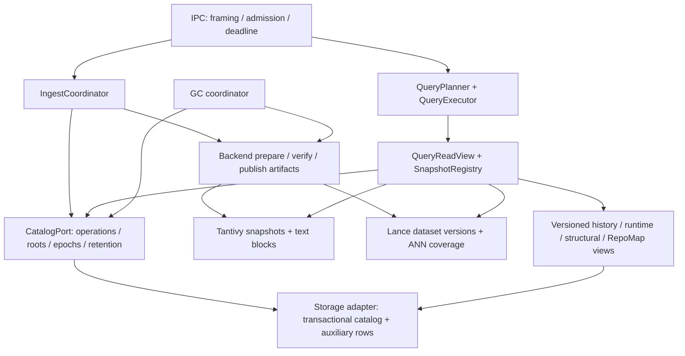

# quanta-index 구조 개선 최종안 — 2026-09-16

## 1. 결정 요약과 적용 경계

**Tantivy와 LanceDB는 유지한다. generation의 권위·수명 관리, query 실행 계약, 자원 관리 구조를 교체한다.** 32개 finding을 개별 우회 코드로 해결하지 않고 아래 8개 작업 묶음으로 수렴시킨다.

- 입력: [최종 findings](findings.md), P1 13 / P2 17 / P3 2. 이 문서의 coverage 표가 32개 모두를 추적한다.
- 테스트 상세: [owner-local / integration 테스트 계획](test-plan.md). owner-local 14개 묶음, integration 16개 시나리오와 finding별 최소 증거를 정의한다. 이는 실행된 test 수가 아니다.
- 실행 handoff: [전체 구조 개선 실행 프롬프트](implementation-agent-prompt.md). 다른 에이전트가 W0–W7/C1–C4 구현과 검증을 이어갈 때 사용한다.
- 검토 HEAD: `4914156f4191daa3e12998bdb38f2b821a057fdd`. 검토 시 `main`, 제품 source/config 변경 없음, `docs/bugbash/`만 untracked. 원격 fetch는 하지 않았다.
- 상태: **적대·객관 재검토를 반영한 최종 실행 설계**. 구조와 필수 계약은 이 문서로 고정하며 native backend 방식은 W0 증거 게이트를 통과해야 확정된다. 구현·벤치마크·장애 주입을 계획 작성에서 실행한 것으로 취급하지 않는다.
- 전제: 현재의 단일 호스트 searchd, 로컬 state root, 여러 repo/revision, 외부 producer의 ingest. 다중 호스트 공유 파일시스템이나 분산 검색은 이 계획의 목표가 아니다.
- 계약 변경은 breaking-first로 한 번에 정리한다. 구형/신형 wire 응답 동시 생성, 두 authority에 dual-write, 실패 시 구형 경로로 복귀하는 상시 fallback을 두지 않는다.
- “SOTA++”의 판정 기준은 이름이나 추상화 개수가 아니라 **정확성, 실제 증분 IO, bounded resource, 복구 가능성, 측정된 recall/latency**다. 수치 개선은 구현 이후 동일 조건의 측정으로만 주장한다.

### 유지·교체·검증 후 결정

| 구분 | 결정 | 이유 |
| --- | --- | --- |
| 유지 | Tantivy의 inverted index/BM25/segment/query execution | lexical 엔진 재구현은 현재 결함의 원인을 해결하지 않음 |
| 유지 | LanceDB, Arrow, 기존 typed error와 DSL capability registry | 저장·질의 라이브러리와 계약 기반은 재사용 가능 |
| 보존할 의미 | exact generation pin, digest conflict 거부, activation CAS, 불확실한 내구성의 fail-closed, 결정적 tie-break | 성능 개선 중 약화하면 안 되는 기존 보장 |
| 교체 | Ledger/activation/authority 파일의 분산된 상태 판단 | durable catalog 한 곳이 공개된 root와 lifecycle을 결정 |
| 교체 | query별 validate/open, route별 정책·materialization | verified snapshot registry와 canonical query plan 사용 |
| 교체 | full-copy generation, whole-ledger persist, unbounded vectors | native snapshot 재사용, 변경 key persist, 통합 budget |
| 선행 검증 | Tantivy snapshot 파일 재사용, Lance version 분기·pin·GC, SQLite write workload | API 존재만으로 안전성·성능을 확정하지 않음 |

## 2. Findings를 설계로 옮길 때 바로잡을 전제

| 항목 | 현재 코드에 대한 정확한 해석 | 설계에 주는 제약 |
| --- | --- | --- |
| QI-BB-029 | [ingest_dispatcher.rs](../../../crates/quanta-index-search-plane/src/ingest_dispatcher.rs)의 `preflight_sealed_generation_v1`과 `discard_incomplete_v1`에 비대칭 복구가 이미 있음 | “복구 부재”가 아니라 **공통 사전 검증과 durable operation 상태 부재**를 해결. 두 track 모두 InProgress인 정상 다중 batch 상태를 지우면 안 됨 |
| QI-BB-032 | 양쪽 physical state가 Exact면 `finalize_only`로 build를 생략함. batch 단위 body 결속·durable replay receipt는 없음 | generation replay와 batch replay를 구분. 외부 embedding 호출의 exactly-once까지 약속하지 않음 |
| QI-BB-017/030 | seal 증명과 query 준비가 불일치하며 deep validation이 반복됨 | 검증을 생략하는 캐시가 아니라 **검증 수준과 검증된 handle의 수명**을 정의 |
| QI-BB-031 | `L2Unit` 계약 불일치는 확정. cosine에서 non-unit만으로 순위 오류가 발생했다고 증명되지는 않음 | 정규화·공간 identity를 고정하되 ranking 개선 수치는 별도 평가 |
| QI-BB-027 | ANN manifest contract가 부족함. index 삭제 시 실제 backend 동작은 미검증 | 누락 시 scan 전환을 가정하지 않고 fault probe로 판정 |
| QI-BB-006 | delta 입력은 있으나 복사·재계산 비용이 큼 | 모든 update를 엄밀한 O(delta)로 약속하지 않음. compaction/index training 비용과 foreground delta를 분리 측정 |

현재 구현 근거는 [findings 상세](findings.md)에 남긴다. 이 계획은 finding의 재현 증거를 새 실행 결과로 승격하지 않는다.

### 초안 적대 검토 결과

아래 DA 번호는 **계획의 누락·모순**이다. 기존 제품 finding 32건의 수나 심각도를 변경하지 않는다. 반례는 설계상 실행 순서를 대입한 결과이며 새 Rust 재현 test를 실행했다는 의미가 아니다. 각 보완은 해당 본문에 통합했다.

| ID | 초안의 문제 / 반례 | 최종 결정 | 검증 owner |
| --- | --- | --- | --- |
| DA-01 | base GC 후 replay가 mutable preflight에서 먼저 실패 | 구문·권한·hash 검사 → receipt 조회 → 신규 작업만 base 검증 | W2 |
| DA-02 | receipt 삭제 후 동일 key를 새 요청과 구별할 durable 정보 없음 | producer session epoch + sequence + replay floor, retired session 거부 | W1/W2 |
| DA-03 | read resolve 후 pin 전 GC, 또는 삭제 중 object를 새 root가 재참조 | pin/retire/attach의 공통 원자적 전환점과 lock 순서 고정 | W2/W3/W4 |
| DA-04 | corpus seal에 aux 전체를 묶으면 history/RepoMap 장애가 lexical publish까지 차단 | route별 최소 dependency vector. aux별 publish와 compatibility 유지 | W1/W2/W4 |
| DA-05 | compaction 뒤 같은 generation pin이 다른 ANN artifact를 보고, scrub도 cached reader를 못 막음 | resolved read token에 physical ID, atomic remap·quarantine epoch 검증 | W1/W3/W4 |
| DA-06 | changed blocks만 검사해도 source/root 전체 결속을 증명한다는 근거 부족 | canonical input inventory + 증분 commitment와 full-rebuild oracle 대조 | W1/W3 |
| DA-07 | ANN top-k에서 tombstone을 제거하면 생존 후보가 있어도 부족한 결과 반환; 부족한 후보를 exact count로 오표시 가능 | visibility pushdown/제한된 refill, coverage·exhaustiveness·truncation 분리 | W3/W4/W6 |
| DA-08 | 모든 active를 loaded handle로 영구 pin하면 bounded cache가 실효 없음; decode 이전 bytes 상한도 빠짐 | durable retention pin과 resident handle 분리, 단계별 byte reservation | W4/W5 |
| DA-09 | finding 수정에 범용 cursor store·spill engine·lexical-only 신기능을 함께 도입 | initial scope 축소, 필요한 history/RepoMap keyset만 구현 | W1/W4/W6 |
| DA-10 | single-flight의 첫 caller 취소가 다른 caller까지 중단; timeout 뒤 mutation 소유권 불명확 | flight-owned cancel, durable claim 이후 작업은 operation owner가 종료 | W2/W4/W5 |
| DA-11 | W2 legacy 삭제와 W7 cutover가 모순; live DB/aux 복사 시 snapshot 경계 없음 | 구현 owner별 교체와 배포 cutover 분리, 일관된 frozen export·restore 검증 | W2/W7 |
| DA-12 | metric을 제출하는 것만으로 품질 gate 통과 가능; native probe 실패 후 자동 대체 설계로 확장 | 수치 threshold·기능 truth 사전 고정, 불통과 방식은 해당 작업 차단 | W0/W7 |

## 3. 목표 구조와 단일 책임

화살표는 처리·port 호출 관계이며 Rust crate의 직접 의존을 뜻하지 않는다.

| Owner | 구현 책임 | 현재 이동 원천 / 배치안 |
| --- | --- | --- |
| contract-base/contract/core | base identity, wire DTO, capability, validated plan/budget, backend-neutral ports | [contract-base](../../../crates/quanta-index-contract-base/src), [contract](../../../crates/quanta-index-contract/src), [core domains](../../../crates/quanta-index-core/src/domains) |
| 신설 `quanta-index-storage` adapter | catalog transaction, operation receipt, artifact reference, auxiliary row persistence, crash-safe file primitive | [readiness.rs](../../../crates/quanta-index-search-plane/src/readiness.rs)의 persistence/activation authority 추출. SQLite는 이 adapter 안에만 위치 |
| lexical/semantic adapters | native artifact format, prepare/open/verify, immutable object inventory, backend-specific deletion | [lexical](../../../crates/quanta-index-lexical/src), [semantic](../../../crates/quanta-index-semantic/src) |
| search-plane lifecycle | ingest state machine, publish/activate/retire orchestration, snapshot registry | [ingest_dispatcher.rs](../../../crates/quanta-index-search-plane/src/ingest_dispatcher.rs), [search_corpus_lifecycle.rs](../../../crates/quanta-index-search-plane/src/search_corpus_lifecycle.rs), [search_corpus_retention.rs](../../../crates/quanta-index-search-plane/src/search_corpus_retention.rs) |
| search-plane query | common lowering/plan, bounded execution, ranking/trace, read-view acquisition | [query_dispatcher.rs](../../../crates/quanta-index-search-plane/src/query_dispatcher.rs), [semantic_query.rs](../../../crates/quanta-index-search-plane/src/query_dispatcher/semantic_query.rs) |
| IPC/searchd | transport, scheduling, shared runtime, configured process envelope, composition | [IPC server](../../../crates/quanta-index-ipc/src/server.rs), [runtime](../../../crates/quanta-index-searchd/src/app/runtime.rs), [searchd](../../../crates/quanta-index-searchd/src/app/searchd.rs) |
| domain query services | text semantics, history/RepoMap/structural semantics, embedding profile/ranker | 기존 domain crate 및 [query_embedder.rs](../../../crates/quanta-index-search-plane/src/query_embedder.rs) |
| harness/benchmark | fault/replay/quality/load 증거와 exact-source artifact | [runtime tests](../../../crates/quanta-index-searchd-runtime/tests), [benchmark](../../../tools/benchmark) |

새 crate는 storage adapter 하나를 기본안으로 한다. `snapshot`, `cache`, `planner`마다 crate를 만들지 않는다. search-plane은 vendor crate에 의존하지 않고 core의 port로 조립한다. 파일 길이가 아니라 **독립적으로 바뀌는 정책과 자원 수명**을 기준으로 기존 큰 파일을 나눈다.

## 4. 먼저 고정할 불변식

1. **공개 권위는 catalog 한 곳이다.** backend seal marker, memory map, directory 존재만으로 generation을 serve하지 않는다.
2. **bytes가 durable해진 뒤 root를 commit한다.** catalog transaction이 여러 backend 파일 쓰기를 자동으로 원자화하지 않는다.
3. **identity를 혼용하지 않는다.** producer source digest, batch body hash, logical generation, physical artifact root, model profile, ANN profile, activation epoch를 별도 타입으로 둔다.
4. **query는 한 read view만 본다.** 해당 query가 요구하는 corpus/auxiliary/runtime dependency vector만 한 번 pin하고 요청 중 ambient latest를 다시 읽지 않는다. 필요 없는 domain의 readiness를 요구하지 않는다.
5. **sealed corpus는 불변이다.** 현재 mutable metadata는 versioned overlay로 이동한다. 동일 cache key 아래 sidecar를 덮어쓰지 않는다.
6. **readiness는 durable descriptor와 현재 open 가능 상태를 구분한다.** load한 handle은 같은 요청·activation에서 재사용한다. `validate -> () -> 다시 open`을 정상 serving 경로에서 없애되 모든 active handle을 영구 resident로 유지하지 않는다.
7. **한 요청에 하나의 budget ledger가 있다.** lane, collector, cache, response별 사용량이 같은 요청 및 process 상한에 포함된다.
8. **정확성 부족을 성공으로 감추지 않는다.** budget 초과, missing ANN, capability unavailable, integrity failure는 typed outcome이다. approximate/exact는 응답 의미에 명시한다.
9. **GC와 새 pin 획득이 원자적으로 조정된다.** active/rollback/read/build/operation/공유 객체 참조가 살아 있으면 삭제하지 않는다.
10. **retry는 durable operation identity에 수렴한다.** 같은 key·다른 body는 conflict, 완료된 같은 body는 저장된 receipt 반환이다.
11. **실패 후 상태를 설명할 수 있다.** aborted, incomplete, committed, activated, quarantined, retiring을 구분한다. timeout은 mutation 실패를 뜻하지 않는다.
12. **결정성의 범위를 명시한다.** 고정 candidate set의 total order와 logical identity는 보장한다. ANN 재학습 artifact의 byte 동일성은 라이브러리 지원과 증거 없이 주장하지 않는다.

## 5. 저장·publish·복구를 한 프로토콜로 만든다

### 5.1 Catalog 저장소

기본안은 **SQLite WAL + `synchronous=FULL`**이다. 아직 repo에 없는 의존성이므로 W0에서 현재 workload로 검증한 뒤 storage adapter에 추가한다. native Tantivy/Lance bytes를 SQLite blob으로 옮기거나 SQLite FTS로 검색 엔진을 하나 더 만들지는 않는다.

WAL은 read/write 동시 진행을 허용하지만 writer는 한 번에 하나다. 짧은 transaction, bounded writer queue, WAL 크기와 checkpoint 관리가 필요하다. 로컬 동일 호스트 사용을 전제로 하며 네트워크 파일시스템 공유 catalog는 범위 밖이다. [SQLite WAL](https://www.sqlite.org/wal.html), [synchronous 설정](https://www.sqlite.org/pragma.html#pragma_synchronous).

SQLite 도입 시 실제 링크된 engine version을 고정·기록한다. 기본 최소 버전은 WAL-reset 수정이 포함된 3.51.3이며, 과거 버전 backport는 수정 포함 증거가 있어야 한다. write와 checkpoint connection을 함께 쓰는 설계라 적용 대상이다. [공식 WAL-reset 수정 범위](https://www.sqlite.org/wal.html).

최소 저장 모델:

| 레코드 | key / 담는 내용 |
| --- | --- |
| build session | server-issued producer/stream/session epoch, repo/revision/target, attempt/fence, mode, exact base, capability/profile IDs, committed sequence와 replay floor |
| operation | producer/stream/session/sequence, caller operation key, canonical body hash, 상태, durable receipt, 결과 root |
| snapshot | logical generation + immutable artifact-set ID, source digest, 해당 publish 단위의 roots와 dependency map, schema/profile IDs |
| activation | repo/revision, monotonic epoch, 현재 artifact-set ID, rollback 대상 |
| artifacts/references | adapter namespace, immutable object 또는 version ID, logical/physical bytes, 소유·공유 참조, 삭제 상태 |
| auxiliary | repo/domain/key/version별 row와 tombstone, visible epoch, 관련 source root |
| maintenance | GC/compaction/quarantine 진행 상태, 재시작에 필요한 cursor |

catalog는 backend file layout을 해석하지 않는다. adapter가 typed descriptor와 object inventory를 제공한다. DB transaction 안에서 embedding, index build, fsync tree, 전체 map clone을 하지 않는다. catalog commit 결과가 불확실하면 memory state를 성공으로 갱신하지 않고 operation 조회/재시작 reconciliation으로 판정한다.

대형 aux batch는 invisible epoch에 bounded transaction으로 rows를 쓴 후, 완성된 epoch pointer와 receipt만 짧게 commit한다. 작은 mutation은 단일 transaction이다. `foreign_keys`, effective WAL/sync 설정을 connection별 확인하며 busy/retry는 request deadline 안에서 제한한다. DELETE 후 DB의 free pages와 OS에 반환된 bytes를 구분한다. WAL checkpoint·증분 reclamation·압축을 quota로 관리하고 query/ingest에서 full VACUUM을 실행하지 않는다.

### 5.2 Ingest와 generation publish

아래 이름은 구현할 내부 상태의 제안이며 현재 API 이름이 아니다.

1. **Decode/auth/hash**: frame·배열·문자열·vector bytes를 제한하고 caller 권한과 canonical body hash를 검사한다. hash는 hash 필드 자체를 제외하고 target/mode/base/profile/seal/순서 있는 payload에 결속한다. mutable generation 상태를 읽기 전에 이 검사를 끝낸다.
2. **Replay check**: producer/stream/session/sequence/key를 조회한다. 완료된 same-body는 저장된 receipt를 반환하며 base 또는 결과 artifact의 현재 존속 여부를 성공 조건으로 재검사하지 않는다. same-key/different-body는 conflict, 진행 중은 operation 상태를 반환한다. receipt는 과거 commit 증거이며 현재 query 가능성은 별도 조회다.
3. **Validate/claim new**: 신규 작업만 양 track의 mode/base/source/profile compatibility를 검증한다. exact base pin과 expected sequence claim을 lifecycle protocol 아래 결속한다. 검사 도중 base가 retire되거나 target/sequence가 바뀌면 재검사 또는 typed conflict다. malformed 요청으로 target directory를 생성하지 않는다.
4. **Prepare**: immutable base 위에 private attempt를 만든다. embedding/Arrow/write는 bounded stream으로 실행하고 필요한 source input 또는 checkpoint를 durable하게 보존한다. unsealed batch ack는 해당 batch의 결과와 receipt가 복구 가능해진 뒤 보낸다.
5. **Seal**: search-corpus의 lexical·semantic pair가 선언한 source contract를 만족하는지 검증한다. 별도 history/runtime/RepoMap readiness를 corpus seal에 추가하지 않는다. aux publish는 자체 dependency contract를 가진다. 파일·sidecar·native manifests를 durable하게 만들고 adapter가 descriptor/handle을 반환한다. ANN 존재·coverage도 포함한다.
6. **Publish**: 하나의 catalog transaction에서 준비된 root set, artifact references, operation result와 receipt를 commit한다. backend 한쪽만 준비되면 candidate일 뿐 query-visible generation이 아니다.
7. **Activate**: 별도 명령에서 expected activation epoch를 CAS한다. publish 성공은 activation 성공을 뜻하지 않는다. activation은 준비된 read view와 persisted pointer를 §5.5의 publication critical section으로 전환하고 그 후 ack한다.

동일 build session은 순차 적용한다. 각 accepted batch는 이전 checkpoint를 보존한 채 새 checkpoint를 publish한다. 적용 중 crash가 나면 마지막 committed sequence부터 재개하고, native write 완료만으로 sequence를 전진시키지 않는다. 마지막 seal은 누적 batch를 결속하며 이전 accepted batch를 버리지 않는다.

등록된 ingest stream별 current session epoch와 committed high-water/replay floor를 durable하게 남긴다. 한 producer도 별도 stream에서 독립 build를 진행할 수 있으며 session은 build scope에 결속된다. receipt pruning 후 floor 미만 sequence는 `ReplayWindowExpired`, retired session은 `SessionRetired`로 거부한다. stream/session은 별도 control 경로에서 server가 발급하며 수를 제한한다. unknown session을 ingest 시 자동 생성하지 않는다. 삭제 후에도 같은 namespace를 재발급하지 않도록 durable epoch allocator를 사용한다. retry 범위와 floor를 ack/status 계약에 노출한다.

다른 session의 compute는 budget 안에서 병렬화한다. attempt가 바뀌면 이전 worker는 private staging에만 쓸 수 있고 artifact attach/checkpoint/publish는 fence CAS가 거부한다. source input의 durable spool과 checkpoint를 GC root에 포함한다. 외부 provider가 idempotency를 제공하지 않으면 crash 후 같은 embedding 요청의 **중복 과금까지 제거할 수 없다**. 보장 범위는 at-most-one committed batch application과 stable receipt다.

### 5.3 복구·활성화 경계

| 실패 지점 | 재시작 결과 |
| --- | --- |
| claim 전 | operation 없음; 정상 새 요청으로 검증 |
| claim 후 일부 artifact 작성 | durable session/sequence에서 resume 또는 명시적 abort. active에는 노출되지 않음 |
| 두 track 준비 후 catalog commit 전 | orphan 후보. operation과 descriptor를 대조해 publish 재시도 또는 GC |
| publish commit 후 response 유실 | 같은 key 조회/replay로 저장된 receipt 반환 |
| activation commit 후 memory swap 전 crash | boot가 catalog pointer로 같은 root를 선택. process 생존 중 불확실하면 해당 scope serving fence |
| inactive artifact 손상 | quarantine 및 metric; 무관한 정상 active repo의 boot/serve를 막지 않음 |
| active root/필수 artifact 손상 | 해당 scope fail-closed; 다른 세대로 자동 downgrade하지 않음 |

DB 자체가 열리지 않으면 catalog authority를 복원할 수 없으므로 전체 serving 실패가 맞다. active-first boot가 catalog corruption도 무시한다는 뜻은 아니다. boot는 active descriptor를 식별하고 resident budget 안에서 demand-open/prewarm한다. 상태를 `descriptor-known / verified-open / quarantined`로 구분하며 lazy 미검증 상태를 ready 검증 완료로 표시하지 않는다. inactive deep scrub/GC는 제한된 background 작업이다.

### 5.4 GC와 공유 bytes

- root 집합: active, 명시적 rollback retention, in-flight query/보존 중 page token, build base/candidate, 미완료 operation의 source spool/checkpoint. state-root의 OS lock은 단일 process 소유권만 보장하며 query별 전역 mutex로 쓰지 않는다.
- retire transaction에서 새 pin 획득을 차단하고 registry cache 참조를 제거한다. 실행 중 Arc가 해제된 뒤 adapter의 정확한 object/version 삭제 port를 호출한다.
- snapshot row 제거만으로 끝내지 않는다. 공유 객체의 참조를 계산해 마지막 참조가 사라진 bytes만 회수한다. native backend의 version cleanup과 catalog refs를 함께 검증한다.
- 상태는 `Retiring -> artifacts removed -> catalog finalized`. 각 단계는 재시도 가능해야 하며 실패 중에도 root를 재활성화하지 않는다.
- metric은 logical snapshot bytes, unique physical bytes, shared bytes, staging/compaction bytes, pending reclaim을 구분한다. recursive size scan을 매 ingest/query의 전제 조건으로 만들지 않는다.
- disk admission에 active data 외 temp/WAL/cache/compaction 여유를 포함한다. 긴 query나 rollback pin 때문에 회수가 안 되면 ingest를 제한한다. pin을 무시하고 지우지 않는다.

### 5.5 Pin·activation·retire의 원자적 전환점

- scope별 lifecycle gate가 active resolution, logical pin 획득, activation/remap, quarantine, retire를 직렬화한다. gate 아래 짧은 catalog read/transaction으로 상태를 재확인하고 in-memory pin 등록까지 끝낸다. file open/verification/embedding은 gate 밖에서 실행한다.
- lock 순서는 **scope gate → catalog transaction**이다. catalog worker는 scope gate나 registry mutex를 역으로 획득하지 않는다. registry mutex를 쥔 채 DB·IO·worker 완료를 기다리지 않는다. 여러 scope가 필요한 작업은 stable key 순서로 gate를 잡는다.
- query는 resolve+pin을 마친 다음 open한다. retire가 먼저 이겼으면 새 pin을 거부하고, pin이 먼저 이겼으면 physical deletion은 release까지 기다린다. catalog의 SQLite 단일 writer queue 대기는 여전히 latency에 포함하며 W0에서 측정한다.
- 공유 object는 마지막 root 참조 해제와 `Live -> Deleting` 표시를 catalog transaction에서 함께 처리한다. 신규 snapshot attach는 `Live`만 참조할 수 있다. 파일 존재 여부만 보고 `Deleting` 객체를 다시 연결하지 않는다.
- drop/release는 pin을 감소시키고 reap 작업을 예약할 뿐 destructor에서 DB transaction이나 file deletion을 수행하지 않는다. process crash로 사라진 query pin과 durable operation pin을 restart에서 구분한다.

### 5.6 Auxiliary read dependency

현재 [query dispatcher](../../../crates/quanta-index-search-plane/src/query_dispatcher.rs)의 history/runtime/structural 경로는 서로 다른 authority를 읽으며 runtime query는 structural chunk universe도 필요하다. 모든 domain을 corpus seal의 필수 track으로 바꾸지 않는다.

W1에서 route×predicate별 `RequiredDomains`를 고정한다. plain lexical은 lexical 및 요청 predicate의 authority만, dense/hybrid는 선언된 semantic profile/roots, runtime predicate는 호환 overlay와 chunk universe, history는 해당 history generation을 요구한다. 기존 generation-scoped history를 근거 없이 repo-wide latest로 바꾸지 않는다.

하나의 catalog read에서 필요한 root/epoch vector를 선택하고 각각 logical pin을 잡는다. 외부 producer가 원자적으로 공급하지 않은 서로 다른 domain을 “같은 시점의 실제 세계”라고 주장하지 않는다. compatibility는 동일 source root 또는 명시적 dependency map으로 확인하며, 필요한 domain이 없으면 해당 route만 typed not-ready다. aux query의 visible rows는 immutable version/visibility interval로 선택하고 pin된 epoch에 보이던 값을 update-in-place하지 않는다.

## 6. 물리적 증분과 검증된 snapshot

### 6.1 Lexical

- Tantivy searchable segment는 기존 엔진에 맡긴다. native commit metadata는 searchable segment 집합을 담으므로 sealed snapshot descriptor의 입력으로 사용한다. [Tantivy 0.22.1 IndexMeta](https://docs.rs/tantivy/0.22.1/tantivy/index/struct.IndexMeta.html).
- base의 불변 segment를 재사용하고 writer 전용 metadata/staging은 분리한다. hardlink는 **불변임을 확인한 파일**에만 허용한다. delete bitset, merge 결과, mutable metadata, backend GC가 pinned snapshot에 미치는 영향은 W0 probe 대상이다.
- source text/trigram/position/metadata의 whole-corpus CBOR를 stable file/scope key 기반의 불변 block과 bounded manifest로 바꾼다. block은 묶어서 저장해 “chunk마다 작은 파일 하나”가 되지 않게 한다.
- leaf별 block 재사용과 persistent manifest update를 사용해 unchanged text를 다시 decode/reindex하지 않는다. generic 검색 엔진이나 범용 Merkle framework를 추가하는 작업으로 확장하지 않는다.
- 분석기·folding·token position schema version을 snapshot에 기록한다. 정책이 바뀌면 명시적 rebuild이며 기존 key 아래 재해석하지 않는다.

### 6.2 Semantic / ANN

- snapshot은 dataset 디렉터리 복사본이 아니라 **정확한 vector table version, membership version, model profile, ANN artifact/coverage**를 참조하는 방향으로 전환한다.
- lancedb 0.30.0에 version/checkout/tag API는 존재한다. 하지만 이것이 임의의 과거 base에서 안전한 분기 쓰기나 catalog pin을 존중하는 cleanup을 증명하지는 않는다. pinned read handle과 writer handle을 분리하고 W0에서 old-base delta·delete·restart·cleanup을 함께 재현한다. [LanceDB 0.30.0 NativeTable](https://docs.rs/lancedb/0.30.0/lancedb/table/struct.NativeTable.html).
- W0에서 native version/clone 방식이 요구 계약을 못 만족하면 **해당 W3 storage 전환을 차단**한다. bounded base+delta partition도 별도 비용·recall·GC probe를 통과해야 선택할 수 있는 후보일 뿐 자동 대체안이 아니다. 별도 ADR로 한 방식만 확정한다. base 계약을 latest-only로 축소하거나 자체 ANN 엔진 개발로 범위를 확대하지 않는다.
- manifest에 distance, vector dimension/dtype, normalization, index kind/parameters/version, indexed fragment coverage와 pending delta를 기록한다. default builder 변경이 같은 identity로 들어오지 않게 한다.
- ANN 미반영 delta가 있다면 visible base ANN + bounded delta exact search를 합친다. 같은 stable entity의 가장 최신 visible version만 남기고 scope tombstone/clear-surface를 먼저 반영한다. native filter/delete가 ANN 후보 선택 전에 적용되는지 probe한다. 후처리만 가능한 경우 삭제 row가 top-k를 소모하므로 capped refill/overfetch를 수행한다. cap으로 채우지 못하면 exhaustion 증명 없이 “결과가 이것뿐”이라고 표시하지 않는다.
- indexed coverage와 retrieval recall은 별개다. 모든 live row가 ANN 또는 exact-delta lane 중 하나에 포함돼야 하며 double-count도 없어야 한다. delta 상한 초과 시 build/compaction 또는 명시적 admission refusal이 필요하다. ANN 점수가 근사값인 경우 같은 metric의 exact rerank를 적용하거나 ranker에 lane별 score 의미를 명시한다.
- index 생성·compaction은 quota가 있는 유지보수 작업이다. 매 seal마다 full ANN rebuild를 강제하지 않는다. 작은 corpus의 exact mode와 ANN-required mode는 명시적으로 구분한다.
- logical row root, native artifact root, ANN layout root를 구분한다. compaction은 immutable replacement를 만든 뒤 logical root 동일성을 검증하고 expected old artifact ID로 catalog mapping을 CAS한다. 새 descriptor를 준비했다는 이유로 active mapping을 덮어쓰지 않는다.
- 현재 [GenerationPin](../../../crates/quanta-index-contract-base/src/query/pin.rs)은 physical artifact ID를 담지 않는다. vNext response에는 resolved read token을 추가해 exact artifact/aux epoch를 재지정할 수 있게 한다. logical selector는 시작 시 한 번 resolve하며 compaction 이후 새 artifact를 선택할 수 있다. 기존 in-flight token과 keyset page token은 이전 artifact를 retention 기간 동안 유지한다. 만료를 다른 artifact로 대체하지 않는다.

### 6.3 검증 수준과 handle 재사용

| 단계 | 해야 하는 검증 | 피해야 하는 반복 |
| --- | --- | --- |
| build/seal | 변경 bytes 검사, root 결속, 모든 query 필수 sidecar 포함, native commit/open, vector/membership/ANN coverage, durability | 변경이 없는 전체 원문·row를 매 batch 다시 집계 |
| cold open | exact catalog descriptor, schema/profile, 필수 artifact 존재/길이/metadata, backend open, 필요한 block의 integrity | inactive 세대 및 전체 semantic row scan |
| warm query | pinned identity, 실제 읽는 block의 integrity와 budget | 같은 handle의 재open/재decode/전체 commitment scan |
| scrub | bounded background deep checksum/coverage 검사, 손상 root 격리 | scrub 완료를 모든 repo의 매 boot 전제 조건으로 사용 |

checksum 파일이 있다고 읽지 않은 bytes의 현재 무결성이 증명되지는 않는다. 로컬 daemon만 쓰는 immutable state-root 소유권을 전제로 seal proof를 재사용하고, 이후 손상은 검증 가능한 block을 읽을 때 또는 scrub에서 발견한다. backend가 특정 artifact의 on-read integrity를 제공하지 않으면 cold open에서 그 artifact를 한 번 검증해 handle에 보관한다. 이 비용을 숨기고 “모든 손상을 찾는 O(1) boot”라고 주장하지 않는다.

`SnapshotRegistry`는 `(repo, revision, logical generation, artifact-set ID)`를 key로 single-flight open한다. **durable active/rollback pin은 bytes 보존이고 resident handle pin이 아니다.** idle active handle도 eviction 가능하며 재접근은 cold-open budget을 적용한다. resident entry 수·heap/mmap·FD·동시 cold-open 수를 제한한다. 새 block의 정상 demand-read까지 warm reopen 회귀로 세지 않는다.

flight는 opener 자체의 deadline과 pin을 소유한다. 한 waiter의 timeout은 그 waiter만 해제하고, 다른 waiter나 activation prewarm이 필요하면 open을 계속한다. 모든 waiter가 사라지면 협력적으로 중단하고 실패한 flight는 영구 cache하지 않는다. scrub/cold read가 손상을 발견하면 scope gate 아래 해당 artifact의 health epoch를 바꾸고 새 acquire를 거부한다. query는 최종 health 확인 시점을 결과 확정의 원자적 전환점으로 둔다. 그보다 먼저 관찰된 quarantine은 성공을 거부한다. 이미 확정·전송한 응답까지 소급 검증했다고 주장하지 않으며 socket write 동안 gate를 잡지 않는다.

semantic의 기존 8-entry cache와 lexical용 새 cache를 독립 권위로 쌓지 않는다. backend 내부 page cache는 유지하되 process envelope에 포함한다.

### 6.4 증분 commitment의 증명 의무

현재 [semantic build](../../../crates/quanta-index-semantic/src/build.rs)의 `build_manifest_bytes`는 row와 membership 전체 commitment를 구한다. 이를 없애려면 다음 증거가 필요하며 단순히 producer digest를 복사하는 것으로 대체하지 않는다.

- W1에 canonical input inventory schema를 정의한다. key는 surface/scope/stable entity ID, value는 검색에 영향을 주는 원문·metadata·schema/profile digest다. sort order, duplicate 거부, clear/replace/tombstone 의미와 float encoding을 고정한다.
- producer source digest와 search-owned input root를 구분하고 실제 payload inventory와 결속한다. source input에서 semantic row로 가는 eligibility/one-to-many mapping은 versioned derivation contract로 기록한다. lexical·semantic row count가 같아야 한다는 잘못된 가정을 하지 않는다.
- 새 root는 검증된 base의 persistent inventory에 canonical mutation을 적용해 계산한다. 변경 scope의 빠진 row, 중복 row, stale membership을 확인한다. compact된 native manifest hash만으로 logical 내용의 동일성을 주장하지 않는다.
- randomized multi-batch full/delta/clear/delete/reorder/restart fixture에서 **증분 root와 독립 full-rebuild root, query 결과**가 같아야 한다. 동일 count에서 content를 바꾸는 mutation도 잡아야 한다.
- persistent inventory의 IO가 매 batch 전체 목록 크기로 증가하면 QI-BB-006/017은 닫지 않는다. 이 조건을 만족시키지 못한 구현은 deep verification을 유지하고 성능 개선 미완료로 기록한다.

## 7. Query와 transport를 하나의 실행 계약으로 만든다

### 7.1 QueryReadView와 canonical plan

`decode/admit -> parse/normalize -> logical plan -> acquire dependency view -> physical plan -> execute -> bounded encode`를 공통 진입점으로 만든다. snapshot의 capability/profile을 모르는 상태에서 physical plan을 확정하지 않는다. syntax별 lowering은 기존 registry를 따르고 route가 top-k/filter/limit 정책을 재구현하지 않는다.

`QueryReadView`는 §5.6의 필요한 dependency vector만 고정한다. overlay는 source root와 호환성 검증 후 선택한다. query 동안 DB read transaction을 붙들어 WAL checkpoint를 방해하지 않도록 versioned rows와 논리 pin으로 보존한다. 단순히 transaction을 닫은 뒤 mutable row를 여러 번 조회하는 방식은 snapshot isolation이 아니다.

plan의 최소 요소:

- `ReadIdentity`: source/artifact roots, auxiliary epochs, capability/profile versions.
- `Operator`: candidates / exact count / bounded projection / history / RepoMap / presence / explain.
- `CandidatePlan`: lexical, dense, union 또는 lexical-scoped rerank; 각 lane cap과 pushdown filter.
- `ExecutionBudget`: deadline, visited rows, candidate/vector bytes, response bytes, regex work, provider batch bytes.
- `ResultContract`: public top-k, exactness, total-order key, cursor/trace semantics.

### 7.2 경계와 결과 의미

| 영역 | 확정할 동작 |
| --- | --- |
| `top_k` | candidate route는 `1..=10_000`; 0은 공통 typed refusal. `count`는 별도 operator. SDK/core/dispatcher 모두 같은 validator 사용 |
| continuation probe | public max와 별개인 내부 `k+1` capacity를 budget에 예약. 10,000이 내부 lookahead 때문에 거부되지 않음 |
| `scope_top_k` | lexical-scope 후보 생성 전에 적용. hard filter와 retrieval budget을 구분. unbounded candidate collect 후 거대한 `IN` 문자열을 만들지 않음 |
| exact count | count collector/aggregation 사용; 결과 doc 전체를 보관하지 않음. full visit 자체가 필요하면 scan budget을 적용하고 초과는 exact count 실패로 반환 |
| projection/distinct | 초기 버전은 bounded in-memory aggregation, 상한 초과 시 typed refusal. doc top-k를 먼저 잘라 distinct/file 결과를 누락시키지 않음. 범용 disk spill engine은 추가하지 않음 |
| response | 16 MiB wire 상한보다 envelope 여유를 둔 byte budget. 직렬화하며 제한하고 단일 oversized item도 typed 거부. 마지막에만 거대한 buffer를 버리지 않음 |
| regex | compile complexity와 verification work budget, byte-weighted cache. full matched-ID set clone 금지; bounded postings/stream 또는 캐시하지 않음 |
| pagination | 필요한 history/RepoMap에만 keyset page token을 추가. exact read identity/query hash/ranker/order/마지막 key에 결속. server가 검증 가능한 opaque token과 TTL·retained-generation cap 사용; 발급 전 retention 예약, expiry는 error |
| ANN pagination | 초기 버전은 continuation API 미지원. 결과 window와 조회 가능한 cursor를 혼동하지 않음. 범용 retained-result cursor store는 범위 밖 |

현재 [QueryResultWindowV1](../../../crates/quanta-index-contract-base/src/results/query_window.rs)은 exact/at-least와 `has_more`를 갖지만 cursor 자체는 아니다. vNext는 corpus 전체의 exhaustiveness와 bounded candidate window를 분리한다. ANN/filter refill budget이 끝나거나 union candidate만 관찰한 경우 전체 count를 `Exact`로 표시하지 않는다. exact exhaustion이 확인된 collector만 exact count를 발급한다. `has_more`의 알 수 없음과 실제 continuation 가능 여부를 별도 상태로 정의하고 SDK에도 반영한다.

scope filter는 native indexed scalar predicate로 pushdown하는 것을 우선한다. arbitrary ID scope는 cap과 expression-byte limit을 적용한다. Lance API에 존재한다고 확인하지 않은 bitmap/parameter binding을 core 계약으로 약속하지 않는다. filter 변환의 지원 여부와 escaping은 adapter의 책임이며 unsupported filter를 삭제해서 실행하지 않는다.

길이 선행 UDS frame은 bounded buffer에서 payload 크기를 확정한 뒤 전송한다. frame 일부를 보낸 뒤 oversized error로 바꾸는 방식은 허용하지 않는다. 대형 ingest의 durable spool과 query result spill은 별개이며 후자는 초기 범위에 넣지 않는다.

### 7.3 Concurrency·deadline·capacity

- socket accept/read는 connection별로 분리한다. body length와 read deadline을 먼저 제한하고 느린 peer가 worker slot을 장시간 독점하지 못하게 한다.
- worker 입장 전에도 connection/FD와 수신 frame bytes를 예약한다. 전체 decoded input·nested collection expansion·decompression이 있다면 그 결과까지 cap을 적용한다. 각 request의 최대치가 작아도 다수 connection의 합이 process cap을 넘을 수 없게 한다.
- global/per-repo admission, query/ingest/maintenance별 bounded queue를 둔다. control과 shutdown이 search backlog 뒤에 무한 대기하지 않게 reserved capacity를 둔다.
- blocking Tantivy/CPU 작업은 제한된 worker pool에서 실행한다. Lance/embedding runtime을 composition root가 소유하도록 정리해 adapter마다 runtime을 중첩 생성하지 않는다.
- request의 remaining time을 서버 상한으로 clamp해 로컬 monotonic deadline으로 변환한다. cancellation token을 collector/scan/materializer에 전달하고 disconnect 시 새 작업·새 batch 생성을 중단한다.
- 시작된 `spawn_blocking`은 abort로 중단되지 않는다. async timeout만 추가해서 dispatch cancellation 완료로 표시하지 않는다. 협력적 중단이 불가능한 backend 호출은 완료까지 slot/메모리 점유를 계속 계상한다. 강제 시간 상한이 필요하면 W0 결과에 따라 해당 작업을 worker process로 격리한다. [Tokio spawn_blocking](https://docs.rs/tokio/latest/tokio/task/fn.spawn_blocking.html).
- durable claim 전 disconnect는 요청을 폐기한다. claim 후 mutation은 operation owner가 완료 또는 durable abort까지 책임지고, client timeout과 독립적으로 slot을 보유한다. caller가 미리 아는 key/session으로 상태를 조회할 수 있어야 하며 유실된 응답에만 operation ID를 담지 않는다. timeout 직후 무조건 재빌드하지 않는다.
- admission 순서는 ingress bytes → 작업 class reservation → execution slot이다. 각 작업의 child lane/embedding/Arrow/candidate allocation은 예약 안에서 실행한다. 작은 permit을 모두 잡은 worker들이 추가 permit을 기다리는 deadlock을 피하도록 예상 peak를 먼저 확보하거나 try-reserve 실패 시 typed refusal한다. maintenance에 최소 진행 예산을 남겨 disk pressure 때문에 GC조차 실행 못 하는 상태를 방지한다.
- UDS directory/socket mode와 peer credential policy를 명시한다. single-instance lock을 먼저 획득하고 live endpoint 충돌은 실패한다. lock/소유권 확인 없이 기존 socket을 unlink하지 않는다. OS별 검증을 분리한다.

process budget은 writer buffers + open handles + query workers + embedding/Arrow + regex/result caches + DB/WAL buffers + headroom을 합쳐 정한다. mmap/page cache와 native 라이브러리 메모리는 단순 Rust allocation 합계로 hard RSS cap을 증명할 수 없으므로 실제 RSS/OS limit도 측정한다. 현재 writer당 15,000,000 bytes·최대 16개의 개별 상수를 설정값으로 바꾸는 것만으로 완료하지 않는다.

## 8. Retrieval 품질과 auxiliary 기능을 계약에 맞춘다

### 8.1 Embedding profile/cache

- `EmbeddingProfileId`는 provider/endpoint identity, immutable model revision 또는 명시적 deployment epoch, dimension, preprocessing/chunk schema, normalization, distance를 결속한다. corpus/query/cache 모두 같은 profile을 사용한다.
- provider가 immutable revision을 제공하지 않으면 그 한계를 배포 계약에 남긴다. 로컬 epoch 문자열만으로 공급자 내부 모델 불변성을 증명할 수 없다. version 없는 mutable profile을 “재현 가능한 production profile”로 인증하지 않는다.
- production semantic은 고정 profile의 learned model과 judged relevance gate가 필요하다. hash embedder는 명시적인 dev/test capability다. 이번 개선에서는 현재 mandatory semantic pair를 유지한다. 신규 lexical-only deployment mode는 별도 제품 결정이며 이 작업의 완료 조건에 추가하지 않는다.
- norm 정책은 ingress/query의 canonicalization에서 한 번 적용하고 cache read/native write에서 finite/dimension/unit tolerance를 검사한다. zero/NaN/Inf는 거부한다. profile 변경 시 새 index/cache namespace로 rebuild한다.
- cache key는 profile ID + canonical input hash. entry는 schema/dimension/checksum을 포함해 temp-write/fsync/atomic publish한다. 잘못된 entry는 격리하고 cache miss 재계산으로 처리하되 corruption metric을 남긴다.
- disk cache는 byte cap/eviction/pin 정책을 갖는다. provider samples는 ring buffer로 제한하고 본문 전체 보관을 기본값으로 삼지 않는다. cache·provider hit/miss·실제 요청 수를 구분해 계측한다.

### 8.2 Hybrid/ranker/explain

- `HybridRetrieve`: 동일 hard filter를 적용한 lexical과 독립 dense recall의 union을 canonical ranker가 결합한다.
- `LexicalScopedRerank`: lexical top scope 안에서 dense rerank한다. 기존 제한된 동작을 이 이름과 계약으로 유지할 수 있다.
- RRF 등 결합 함수는 버전과 lane budget을 고정한다. stable ID로 dedup하고 lane rank/score/contribution을 한 canonical candidate record에 기록한다. 필요한 dense lane이 unavailable/error이면 `HybridRetrieve` 성공으로 lexical 결과만 반환하지 않는다. 빈 정상 검색 결과와 lane 실행 실패도 구분한다.
- HybridSeed legacy/v2 이중 계산·이중 payload를 없애고 SDK/server가 같은 응답을 사용하게 한다. metric도 실제 반환한 candidate list에서 생성한다.
- explain은 동일 query 실행에서 나온 bounded trace를 사용한다. query/profile/filter/lane rank/score/tie-break/early-stop를 담고 snippet 검색으로 결과를 재구성하지 않는다. presence는 exact ID lookup으로 분리한다.
- gold set에 identifier, phrase, Unicode, semantic-only relevant, lexical false-positive, filters, rename/delete를 넣는다. BM25-only, dense-only, hybrid, rerank를 같은 corpus와 budget에서 비교한다.

### 8.3 Text / history / runtime / structural / RepoMap

- 정규화 정책을 한 registry에서 정의하되 raw regex, literal substring, tokenized phrase의 의미를 무리하게 같게 만들지 않는다. 각각의 casefold/token boundary/offset 계약을 명시하고 Unicode 다문자 casefold·combining mark·code identifier golden corpus로 확인한다.
- history는 명시적 `relevance` 또는 `recency` order를 제공한다. text relevance는 Tantivy index를 재사용하고 시간 조회는 indexed metadata로 처리한다. SHA는 최종 tie-break로만 사용한다.
- auxiliary 저장은 per-key/version rows로 옮기고 오래된 generation/epoch는 pin-aware GC한다. content row와 검색용 index root가 같은 published auxiliary epoch를 가리키게 한다.
- mutable runtime overlay는 별도 epoch를 유지한다. query의 시작 이후 들어온 overlay를 중간 단계에서 섞지 않는다. 작은 mutation은 row update/receipt/epoch를 한 transaction으로, 큰 mutation은 invisible staging 후 pointer/receipt를 한 transaction으로 공개한다.
- RepoMap은 immutable view와 필요한 column/index 조회를 사용한다. 요청마다 whole snapshot clone/sort를 제거하고 top-k/page/node/edge/byte cap을 함께 적용한다. 도메인 scoring은 기존 RepoMap crate가 소유한다.
- structural tree/adjacency도 visited-node/expansion budget을 적용한다. 단순히 map의 lock을 여러 개로 나누면서 whole-history persist를 남기지 않는다.

## 9. 실행 묶음과 의존 순서

작업은 한 묶음의 vertical slice가 실제 daemon front door를 통과하도록 나눈다. 같은 authority/DTO 파일의 병렬 수정을 피한다. 임시 연결부가 필요하면 같은 묶음의 삭제 목록과 종료 시점을 둔다.

| 작업 | 주 변경 책임 | 산출물 / 종료 조건 | 의존 |
| --- | --- | --- | --- |
| W0: 증거와 backend probe | harness/benchmark + 각 adapter 담당 | scan fixture 복구, frozen baseline, 아래 G0-L/G0-S/G0-C/G0-R 각각 pass/block 결정 | 없음 |
| W1: 공통 계약 | contract-base/contract/core + DSL/SDK 담당 1명 | identity/session/receipt/read-view/budget 계약, 오류·window 의미. route dependency와 consumer 목록 | W0 workload 전제; backend-neutral 계약은 native probe와 병행 |
| W2: catalog와 lifecycle | storage + search-plane lifecycle | session journal, pair publish, activation, pin/retire protocol, auxiliary row/epoch. crash/replay vertical slice | W1, G0-C |
| W3: immutable storage와 GC | lexical/semantic adapter, GC integration 1명 | native snapshots, incremental commitment, ANN visibility, bounded ingest, physical GC | W1/W2 ports, G0-L/G0-S 각 해당 lane |
| W4: read/query 실행 | search-plane query | registry/read-view, 공통 plan/limit/count/projection/regex/window. 모든 route 연결 | W1; end-to-end는 W2/W3 |
| W5: transport와 process 자원 | IPC/searchd | bounded scheduling, cancellation/operation ownership, UDS policy, process budgets/metrics | W1, G0-R; 실제 부하 판정은 W3/W4 |
| W6: retrieval/domain 품질 | embedding/hybrid, history/RepoMap/text 담당 | production profiles, true hybrid/rerank, canonical seed/explain, domain ranking/normalization | W2/W3/W4; profile 설계는 W1 뒤 선행 가능 |
| W7: 전환·삭제·최종 qualification | integration owner | 아래 legacy 삭제, 문서 수정, 동일 source의 기능/장애/성능/품질 증거, 외부 producer roundtrip | W0–W6 |

### W0 결정 게이트

| Gate | 반드시 제출할 증거 | 불통과 시 |
| --- | --- | --- |
| G0-L: Tantivy snapshot | pinned base read 중 add/delete/merge, old/new 동시 read, backend GC/crash open; 파일별 immutable 여부와 새 bytes; 단일 Tantivy snapshot의 scoring/statistics 보존 | lexical file reuse 전환 차단. 임의 독립 shard score 합산으로 대체 금지 |
| G0-S: Lance snapshot | older-than-latest base 분기, vector/membership 결속, ANN append/delete/refill, pinned version cleanup/restart; 사용하는 0.30.0 native API 목록 | semantic layout 전환 차단. 대체 layout은 별도 probe·ADR 필요 |
| G0-C: catalog | 실제 auxiliary workload의 commit p95, queue, WAL, per-key row/query plan, crash/export/restore; engine version·effective pragmas | DB 선택 또는 schema/transaction 크기를 재검토. 검증 전 전체 aux 이동 금지 |
| G0-R: runtime | 가장 긴 native 연산의 중단 지점, canceled flight의 다른 waiter 생존, worker 점유 시간, frame decode peak, shutdown drain | hard-cancel 보장 차단. process isolation 필요 여부를 근거로 결정 |

probe는 temporary fixture와 `./scripts/cargow` rail을 사용한다. production state-root를 실험 대상으로 쓰지 않는다. 빠른 toy 성공을 full corpus qualification으로 취급하지 않는다.

Gate 산출물은 사용 API/파일 수명, 최소 재현 fixture, source/config digest, 측정 결과, 선택·기각 이유가 있는 ADR다. 문서 조사만으로 PASS하지 않는다. G0-S가 막혀도 W1 공통 boundary나 W5 transport 등 독립 작업은 진행할 수 있다. W0의 모든 미확정을 이유로 전체 작업을 정지시키지 않는다.

### 구현 checkpoint와 배포 checkpoint

1. **C1 — 계약 및 최소 catalog slice**: W1/W2의 한 corpus에 `publish -> acquire -> query -> restart -> replay`를 연결한다. adapter의 기존 물리 복사 비용은 이 checkpoint에 한해 유지 가능하지만 QI-BB-006은 미완료다. 기존 authority와 신형 catalog의 dual-write로 연결하지 않는다.
2. **C2 — 수명과 delta 완성**: W2 auxiliary, W3 GC/commitment/native delta, W4 전 route read-view를 연결한다. source·artifact·query pin이 하나의 protocol을 쓰는지 확인한다.
3. **C3 — 부하와 품질**: W5/W6, domain regression, DA 반례 fixture와 성능/recall gate를 통과한다.
4. **C4 — 실제 전환**: W7 consumer/migration/rollback receipt와 legacy 삭제를 검증한다. C1–C3 build는 별도 state format의 개발 checkpoint이며 운영 root에 점진적으로 섞어 쓰는 rollout이 아니다.

일시적으로 유지한 기존 물리 writer도 단일 backend implementation이어야 한다. C2에서 제거할 함수와 gate를 tracking하고 장기 fallback feature로 남기지 않는다. 이 순서는 책임을 나눠 구현하기 위한 것으로 최종 기능 축소를 허용하지 않는다.

### 병렬 진행 가능 범위

- W1 공통 계약을 먼저 한 owner가 고정한다. `readiness.rs`, contract exports, runtime composition 변경은 integration owner가 순차 반영한다.
- 이후 lexical snapshot / semantic snapshot / catalog persistence / IPC transport는 서로 다른 write set으로 진행 가능하다.
- QueryPlanner와 ranker는 같은 DTO를 다시 정의하지 않고 W1 계약을 사용한다. 새 요구는 공통 계약에 한 번 반영한다.
- correctness fixture는 필요한 범위에서 병렬화할 수 있지만, 같은 호스트의 큰 Rust build/link와 성능 runner는 직렬 실행한다.

## 10. 32개 Finding 전체 추적

각 row의 주 작업은 하나다. 연계 작업은 별도로 표기한다. “코드 추가”가 아니라 마지막 열의 증거와 §11 삭제가 완료돼야 close한다.

| Finding | 주 작업 | 구조적 해결 / 연계 | 필수 종료 증거 |
| --- | --- | --- | --- |
| QI-BB-001 | W4 | single-flight SnapshotRegistry / W3 | cache-fit warm metadata reopen·whole-sidecar decode 0, 동시 miss 1회, eviction+pin 안전 |
| QI-BB-002 | W5 | bounded connection/worker/cancel | slow peer와 long query 옆 정상 요청, 취소 후 실제 작업량/slot 검증 |
| QI-BB-003 | W3 | catalog refs 기반 physical GC / W2 | 공유 bytes·pin·crash·restart 후 실제 disk 회수 |
| QI-BB-004 | W4 | scoped candidate plan | `scope_top_k`별 backend 입력 cap/결과 검증 |
| QI-BB-005 | W4 | aggregation·materialization·encode budget | count/projection 정확성 및 peak memory/oversize 거부 |
| QI-BB-006 | W3 | native snapshots + immutable blocks | 1-file delta의 read/write/temp bytes와 compaction 별도 기록 |
| QI-BB-007 | W6 | explicit learned/dev profile | 고정 production profile의 judged relevance, hash mode 격리 |
| QI-BB-008 | W6 | indexed bounded RepoMap / W2/W4 | page/node/edge cap, atomic epoch, whole clone 제거 |
| QI-BB-009 | W6 | embedding cache byte cap / W5 | bounded disk/sample soak와 concurrent eviction 안전 |
| QI-BB-010 | W0 | current fixture와 source-bound evidence / W7 | scan 실행, exact-source cold/warm/load/quality artifact |
| QI-BB-011 | W6 | versioned text semantics registry | Unicode/phrase/raw/regex 의미·offset golden corpus |
| QI-BB-012 | W7 | 구현 기반 README/architecture 갱신 | 기존 broken path 포함 doc lint PASS |
| QI-BB-013 | W7 | 책임 이전과 구형 owner 삭제 / W2–W6 | façade만 남은 dispatch/readiness, dependency/API guard |
| QI-BB-014 | W5 | single-instance + peer/socket policy | live socket 충돌·권한·OS별 peer test |
| QI-BB-015 | W5 | bounded diagnostics + exporter | label cardinality/벡터 cap, queue/open/GC/cancel 관측 |
| QI-BB-016 | W5 | process envelope 기반 writer admission | 동시 ingest/query/compaction의 peak RSS와 설정 거부 |
| QI-BB-017 | W4 | verification levels + reusable handle / W3 | warm semantic scan 0, active-first boot scan 계측 |
| QI-BB-018 | W6 | independent dense union vs explicit rerank | semantic-only relevant hit가 hybrid에서 도달 |
| QI-BB-019 | W6 | canonical seed candidate/metric | dense 호출 1회, payload/metric/window 일치 |
| QI-BB-020 | W2 | per-key auxiliary transaction/epoch / W3 | unrelated history whole rewrite 0, pinned epoch visibility, invisible staging crash 검증 |
| QI-BB-021 | W3 | streamed derive/Arrow/write / W5 | oversized batch 거부, bounded resident vectors, retry 정합성 |
| QI-BB-022 | W6 | execution trace + exact presence / W4 | 원 query의 실제 rank contribution 재현 |
| QI-BB-023 | W6 | explicit history ranking/cursor | relevance/recency golden order, 중복·누락 없는 page |
| QI-BB-024 | W4 | byte-weighted regex cache/stream | huge match set에서 memory cap, 불필요한 full set clone 0 |
| QI-BB-025 | W1 | 공통 limit contract / W4 | SDK→UDS 모든 route에서 0/1/9,999/10,000/10,001 |
| QI-BB-026 | W2 | active-first open + quarantine / W4 | corrupt inactive가 정상 active boot를 막지 않음 |
| QI-BB-027 | W3 | versioned ANN artifact/coverage / W6 | index 삭제·손상·unindexed delta의 typed 동작과 recall |
| QI-BB-028 | W6 | immutable profile + checked atomic cache | same-name/different-version 격리, corrupt cache 거부 |
| QI-BB-029 | W2 | preflight + journaled prepare/publish | invalid cross-track 입력에 mutation 0, 모든 failpoint 수렴 |
| QI-BB-030 | W3 | complete artifact seal + openable handle / W2 | 필수 sidecar 삭제/잘림·fsync fault 때 publish 거부 |
| QI-BB-031 | W6 | canonical norm policy | corpus/query/cache의 finite/dim/norm golden test |
| QI-BB-032 | W2 | session/sequence/key/hash/receipt / W1 | base GC 후 replay, pruning 후 expiry, retired session, unsealed/sealed/ack 유실 |

## 11. 전환과 삭제 계획 — 패치 누적 방지 조건

### 교체 완료 시 남기면 안 되는 경로

| 제거 대상 | 대체 owner | 구현상 교체 checkpoint |
| --- | --- | --- |
| Ledger에서 전 세대 history/runtime/structural clone 후 여러 CBOR 파일 persist | catalog auxiliary transaction | C2 / W2 aux slice |
| 파일 activation/authority와 DB의 병렬 권위·dual-write | catalog root/epoch | C1에서 신형 단일 writer, C2에서 old owner 사용처 0 |
| 일반 query의 `validate_generation_identity -> () -> open` | acquire verified read view | W4 모든 route 전환 |
| lexical full-directory copy / whole-text-sidecar rebuild | native snapshot + immutable block update | W3 delta rail 통과 |
| semantic dataset directory full-copy / 무조건 full ANN rebuild | native version layout + coverage/maintenance | W3 probe와 recall gate 통과 |
| dispatcher별 top-k/lookahead/count/scope cap 구현 | validated query plan | W4 boundary matrix 통과 |
| serial inline connection dispatch / adapter별 중첩 runtime | bounded executor + shared composition | W5 cancellation/load gate |
| Legacy/v2 HybridSeed 동시 payload 및 중복 vector 호출 | canonical response/ranker | W6 SDK/consumer 전환 |
| snippet 기반 explain, SHA-first history top-k, whole RepoMap clone | query trace / indexed domain queries | W6 domain golden 통과 |
| old cache identity/raw vector overwrite, 무제한 samples/error vectors | profile-aware bounded cache/diagnostics | W5/W6 |

기존 fault/replay test는 새 owner로 이동해 보장을 유지한다. old implementation을 test-only alternate backend로 영구 보존해 버그 수정 지점을 두 개로 만들지 않는다. 정적 금지 guard는 제거한 실제 legacy 호출·중복 계약에 한정하고 구현 문자열을 그대로 미러링하는 테스트는 만들지 않는다.

위 checkpoint는 개발 branch의 코드 교체다. 운영 binary·state root 전환은 C4 한 곳에서 수행한다. 기존 binary artifact와 root는 rollback window까지 따로 보존하며, 이를 이유로 신형 daemon에 legacy write path를 남기지 않는다. native 방식이 미확정이면 관련 physical writer 삭제를 앞당기지 않는다.

### State/wire migration

1. 새 catalog/snapshot format은 별도 version과 **별도 state root**에서 만든다. W1 consumer inventory에 producer/SDK/CLI/daemon 버전, 모든 ingest/control/query opcode, 각 artifact format과 재생산 가능 여부를 기록한다. source rebuild 비용에 embedding 호출·시간·추가 disk를 포함한다.
2. 기본 전환 방식은 **유지보수 시간의 offline freeze/export/import**다. producer와 모든 mutation/GC를 drain하고 durable high-water를 기록한 뒤 old daemon을 종료한다. 살아 있는 Ledger/sidecar 파일을 각각 복사해 하나의 snapshot이라고 부르지 않는다. zero-downtime 요구가 확인되기 전 online replication을 만들지 않는다.
3. producer 원본으로 rebuild 가능한 track은 같은 high-water까지 rebuild하고, 재생산 불가능한 history/runtime/operation dedup 정보는 명시적 offline importer로 보존한다. legacy가 새 sequence를 제공하지 못하면 old client/session을 종료하고 명시적 새 session을 발급한다. 불명확한 과거 ack를 새 ingest로 추정하지 않는다.
4. importer가 만든 별도 root의 source/domain counts·roots·query 결과·replay 상태를 대조하고 새 root에서 restart/restore를 실행한다. 이미 SQLite인 root의 후속 backup도 DB 파일만 live-copy하지 않고 writer를 중지해 일관된 DB/WAL/artifact 집합을 보존한다. catalog backup과 native artifacts의 root/pin 경계는 같아야 한다.
5. wire 변경은 server/SDK/producer를 함께 version cut한다. 구버전 요청은 명시적 version mismatch로 거부한다. 기존 generation digest와 batch digest의 필드 혼용도 제거한다. 구형 응답을 신형에서 계속 합성하지 않는다.
6. cutover는 binary/config/root를 함께 바꾸고 read-only smoke를 수행한 뒤 writes를 연다. 이 시점 전 rollback은 old binary + untouched old root로 가능하다. writes를 연 뒤 rollback하려면 **old contract로도 재생 가능한** producer log/변환·검증 경로가 있어야 한다. 단순 log 보유만으로 보장하지 않는다. 그 경로가 없으면 쓰기 개방 이후는 roll-forward만 가능하다고 cutover receipt에 명시한다.
7. W7 외부 roundtrip·복구·성능 gate 뒤 legacy source 사용처를 0으로 확인하고, 보존 root는 rollback window 종료 후 별도 폐기한다. 이 계획 작성은 기존 데이터 삭제나 배포 실행이 아니다.

## 12. 측정·검증·완료 판정

### 12.1 먼저 계측할 구조적 gate

| 축 | 비교/주입 조건 | 통과 기준 |
| --- | --- | --- |
| reader 재사용 | cache에 맞는 같은 query/root 1/8/32; cold-open burst 별도 | 최초 single-flight 외 metadata reopen/whole-sidecar decode 없음, warm full semantic scan 없음; cold 재개방은 별도 계측 |
| 증분 | 고정 한 파일 수정, corpus 1x/10x, append/delete/rename 별도 | unchanged native bytes의 foreground full-copy 0; IO 증가 원인을 manifest/changed blocks/compaction으로 설명 |
| auxiliary scale | unrelated history 1x/10x, 동일 key mutation | 전체 snapshot clone/rewrite 0; indexed query plan과 변경 key 비용 증거 |
| boot | active root 고정·증가 두 축, inactive 10/100/1,000 + corruption | inactive full scan 없음; active 수 증가에도 resident budget 준수; descriptor/readiness와 prewarm 비용 분리 |
| concurrency | 정상/long query/slow peer/ingest/GC 혼합 | unrelated connection의 직렬 blocking 제거, queue cap/overload/cancel 계측 |
| resource | regex all-match, huge projection, large vectors, pinned old roots | queue/cache/RSS/temp disk/WAL 상한 및 admission refusal 검증 |
| durability | artifact write/fsync/rename/catalog commit/activation/GC failpoint | ack 의미 일치, wrong root serve 0, replay 수렴, live pin 삭제 0 |
| retrieval | 고정 judged holdout와 exact vector baseline | nDCG@10/MRR/recall@k 및 ANN recall/latency가 W0에서 고정한 threshold 통과. 지표 제출만으로 PASS하지 않음 |

시작 시점에 production corpus/host/SLO가 주어지지 않았으므로 임의의 “p99 10ms” 같은 release 숫자를 확정하지 않는다. W0 산출물에 corpus tiers, CPU/RAM/SSD/OS, profile/dimension, QPS mix, latency/recall/space 목표를 고정하고 이후 gate를 완화하려면 근거를 남긴다. foreground delta와 amortized compaction 비용을 모두 보고한다.

최소 evidence manifest에는 모든 필수 case의 expected result/error, latency/RSS/disk/recall threshold, noise tolerance, sample/repeat 수가 non-null이어야 한다. 입력이 없는 항목은 `blocked: threshold not established`이며 skipped-green으로 통과시키지 않는다. 기능이 바뀐 true hybrid는 기존 rerank와 별도 baseline을 두고, 동일 기능 최적화는 동일 결과·동일 offered load에서 비교한다.

warm/cold는 직렬로 여러 회 측정하고 backend/OS cache 조건을 기록한다. 20-sample cold rail은 smoke·회귀 탐지용이며 production p99 증거로 쓰지 않는다. tail qualification은 사전 정한 충분한 sample과 분포/신뢰구간을 제출한다. overload/error를 빠른 성공 latency에 섞지 않고 offered/accepted/completed QPS, error율, queue time을 함께 보고한다. relevance는 tuning set과 held-out set을 분리하고 삭제/필터 정확성은 평균 ranking 지표에 묻지 않는다.

### 12.2 설계 반례를 고정하는 필수 fixture

| Fixture | 재현 순서와 oracle |
| --- | --- |
| replay/retention | batch commit → base GC → same-body replay는 동일 receipt; floor prune 후에는 expired, 다른 body는 보존 범위 내 conflict |
| pin/retire/attach | barrier로 resolve/pin/retire를 엇갈리게 실행하고 old query 생존·새 pin 거부·Deleting object 재참조 거부 확인 |
| staged batch/fence | lexical만 durable/aux invisible epoch 중 crash → 이전 checkpoint 유지; stale worker의 늦은 publish 거부 |
| compaction/quarantine | old read token을 유지한 채 replacement CAS와 scrub fault; old token identity 유지, quarantine 이후 결과 확정 거부 |
| single-flight/capacity | 같은 root waiter 32개 중 최초 caller만 취소; 나머지 정상 완료. active root 수 증가·동시 frame 수신에서도 bytes cap 유지 |
| aux dependencies | runtime overlay 교체 중 query는 한 epoch만 관찰; history 미준비가 plain lexical을 막지 않으며 runtime의 chunk authority 누락은 거부 |
| ANN visibility/window | base top-k 다수가 삭제/교체되고 live 후보는 뒤에 존재; refill/coverage/정확성 표시를 exact live-row oracle와 대조 |
| commitment | full 대 incremental의 임의 batch 분할·순서·clear/delete/restart; same-count content mutation에도 root mismatch 검출 |
| migration | frozen high-water export/import → restart → query/replay 비교; read-only cutover rollback과 post-write rollback 제한 검증 |

### 12.3 실행 rail

기존 명령은 [Justfile](../../../Justfile)과 [benchmark README](../../../tools/benchmark/README.md) 기준이다. 아래는 **후속 구현의 검증 계획**이며 이번 turn에서 실행했다는 뜻이 아니다.

| 명령/rail | 적용 범위 | 제외되는 증거 |
| --- | --- | --- |
| `just rust-profile test-fast` | 소유 crate contract/정책/기능 회귀 | 실제 daemon/대규모 성능 |
| `just rust-profile test-integration` | 현재 선택된 contract/core/lexical/RepoMap 7개 target | semantic persisted/model, 신규 storage target은 별도 실행·등록 필요 |
| `just rust-profile test-daemon` | daemon lifecycle/UDS/restart/replay | ignored real provider와 외부 producer |
| `just rust-verify-hellgate-fast` | golden query/DSL/guard | 전체 lifecycle/성능 |
| `just rust-verify-hellgate-broad` | 실제 daemon 광범위 복구/serving | 외부 producer activation |
| `just rust-verify-hellgate-cross-repo` | producer→ingress→serve 통합 | 다른 SHA·배포 환경 |
| `just rust-public-api` | contract/SDK public surface | 동작 정확성 |
| `just rust-fuzz-smoke` | 바뀐 wire DTO/error/decoder | stateful storage fault |
| `just rust-hexagonal`, `just rust-cargo-modules` | 새 storage adapter/port/module 경계 | 성능 |
| `just rust-test-authority`, `just rust-ignored-test-policy` | target/CI rail/proof-role 등록, ignored 정책 | 실제 테스트 실행과 결과 |
| `just rust-bench-dsl-truth` | benchmark fixture의 실제 기능 truth | timing |
| `just rust-bench-dsl-refresh 20`, `just rust-bench-dsl-compare` | 기존 warm/cold authority와 비교 | 새 load/GC/relevance matrix는 추가 구현 필요 |
| `just lint-doc-paths`, `just lint-root-hygiene` | 문서/저장 위치 | 제품 코드 |

새 fault/IO/relevance/load case는 기존 harness/benchmark owner에 추가하고 recipe를 등록한다. 존재하지 않는 테스트 이름을 실행 완료로 기록하지 않는다. public facade/compile boundary가 바뀌면 wrapper를 통한 workspace check/test도 수행한다. activation/pin/ingress 변경은 해당 U/E/C/H-SP scenario와 외부 consumer 경계를 함께 확인한다.

durability qualification은 process kill, injected fsync/rename failure, disk-full/inode exhaustion을 구분한다. process crash test만으로 power-loss 내구성을 증명하지 않는다. 지원 filesystem별 directory sync/native backend commit 의미와 fault-recovery 결과를 남기고, 실제 power-loss 검증이 없으면 그 범위를 release receipt에 명시한다.

성능 artifact에는 40-char HEAD, dirty/source digest, corpus/config/model/index digests, toolchain/feature flags, host, warm/cold 정의, concurrency, 샘플 수와 raw 결과 경로를 담는다. 새 process의 cold start와 OS page-cache cold를 구분한다. host contention이나 skipped fixture가 있는 artifact는 release 성능 증거로 사용하지 않는다. 구조적 gate와 숫자 회귀 gate를 둘 다 통과해야 한다.

### 12.4 Owner-local와 integration 실행 계획

[테스트 계획](test-plan.md)을 이 설계의 필수 검증 부속 문서로 적용한다.

- [Owner-local 14개 묶음](test-plan.md#3-owner-local-테스트-묶음): owner/기존 파일, 정상·거부·경합·복구 oracle, native backend 필요 여부, 실행 명령 형식.
- [Integration 16개 시나리오](test-plan.md#4-integration-시나리오): SDK/UDS, 실제 backend, child process, production profile/부하의 증거를 구분한다.
- [32개 finding별 최소 증거](test-plan.md#5-finding별-최소-증거-연결): 모든 finding에 OL/IT 연결. 문서/경계 항목은 해당 static guard 병행.
- [등록·승격 조건](test-plan.md#6-등록실행-순서와-승격-조건): C1–C4별 필수 suite, test authority 등록, receipt 형식, zero-test/ignored-only 거부.

현재 `test-fast`는 lib/bin만 실행하며 `test-integration`은 선택된 target만 실행한다. `test-daemon`에도 `composite_generation_authority_restart`, `semantic_boot_report`는 포함돼 있지 않으므로 명시적 target 실행과 recipe 편입이 필요하다. 기존 넓은 명령의 PASS만으로 새 owner-local/integration coverage를 닫지 않는다.

### 12.5 최종 완료 조건

- §10의 32개 row가 각각 구현·회귀·운영/품질 증거를 가진다. 부분 구현과 외부 proof blocked를 구분한다.
- §11의 legacy 경로가 실제 삭제되고 단일 owner/계약만 남는다.
- 동일 최종 source에서 기능·fault/replay·resource·relevance·performance를 검증한다. 앞 단계의 green을 변경된 최종 HEAD에 재사용하지 않는다.
- active/rollback/pin/도메인 page token/operation/GC가 하나의 lifecycle 프로토콜로 수렴한다.
- 변경 producer/SDK와 exact-head roundtrip이 남아 있으면 코드 작업 완료와 release 완료를 분리한다.
- 테스트 계획의 OL/IT minimum mapping과 변경 P0/P1의 owner-local positive/negative·recovery·consumer proof가 실제 실행 receipt로 채워져야 한다. 미실행 시나리오를 파일 존재나 catalog 등록으로 대체하지 않는다.

## 13. 이번 계획 작성의 검증 기록

- 수행: 32개 finding과 현재 ingest/recovery/catalog/query/backend 경계 재대조, pinned library 문서 확인, 주 작업/종료 증거 전수 매핑. 추가 적대 검토에서 DA-01–12를 도출해 replay 순서·pin/GC·aux dependency·ANN window·migration·scope·qualification 계약을 본문 수정했다.
- 테스트 계획 추가: 기존 owner test, runtime child-process fixture, Justfile 선택 target, test-authority catalog를 대조해 OL 14개/IT 16개와 32개 finding의 최소 연결을 작성했다. 테스트 구현·실행 완료를 뜻하지 않는다.
- 제품 코드·테스트·의존성 변경: 없음. 구현 상태는 여전히 미완료다.
- 실행하지 않음: Rust build/test, 새로운 benchmark, 실제 provider 호출, state migration, 배포, backend feasibility probe.
- 기존 findings의 과거 실행 결과는 [감사 실행 증거](findings.md#8-이번-감사의-실행-증거)에서 별도로 유지한다.

| 이번 실행 | 결과 | 범위 / 한계 |
| --- | --- | --- |
| `python3` inline mapping/link/anchor checker | PASS: finding 32/32, 설계 검토 12건, 작업 8개, 결정 gate 4개, 반례 fixture 명세 9개, OL 14개/IT 16개, bugbash 문서 4개 local links 212개, anchors 6개 | ID 누락·중복, OL/IT 최소 연결, 경로/anchor, code fence, whitespace 확인. fixture/OL/IT는 실행한 test 수가 아님 |
| `python3` command/recipe/authority checker | PASS: 구체 실행 예시 5개가 실제 target 및 authority catalog에 존재, 현행 integration target 7개와 daemon recipe 누락 2개 확인 | 명령·등록 경로 정적 검사이며 Rust test 실행 아님 |
| 원 findings 본문 SHA-256 대조 | PASS | 계획 안내 2개 문단을 제외한 원 감사 내용이 `7036aa7bcca83544080a7557dd86f81b0affd80890d2b94cee61e684216bfed3`로 동일함 |
| `git diff --no-index --check /dev/null <각 문서>` | whitespace diagnostic 0 | 세 파일 모두 untracked라 content difference exit 1 허용; diagnostic 없음 확인 |
| `just lint-root-hygiene` | PASS | root 저장 위치 |
| `just lint-doc-paths` | **FAIL: 기존 broken paths 2건** | `docs/plans/jun-2-dsl-final-cut/README.md:149`, `docs/plans/jun-2-dsl-final-cut/tickets/HISTORICAL-MAP.md:9`. 이번 bugbash 문서의 broken local path는 0 |

최종 상태: **적대 검토를 반영한 최종안 작성 완료, 제품 개선 미구현, G0-L/S/C/R은 미실행, repo 전체 doc lint는 기존 부채로 실패**. 이전 감사의 기능 PASS나 이 문서의 정적 검사를 새 구조의 구현 증거로 사용하지 않는다.
