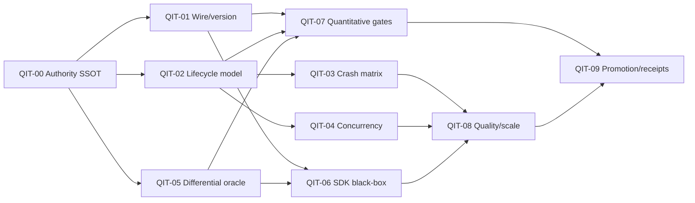

# QIT Dependency DAG

## Parallel lanes

After QIT-00's catalog contract is stable, QIT-01, QIT-02, and QIT-05 may run
in parallel because their primary owners do not overlap. QIT-03 and QIT-04 must
wait for the lifecycle state model: otherwise crash/concurrency tests encode
unreviewed state semantics. QIT-06 is consumer closure, not an alternative
implementation path. QIT-07 instruments already defined risk owners. QIT-08
starts only after correctness closure; QIT-09 promotes receipts, not intent.

## Stop conditions

- If an invariant has no exact owner, stop and add the ownership decision before
  a test implementation.
- If a desired behavior changes public wire/lifecycle semantics, stop for a
  contract decision; do not silently adapt the reference model.
- If a required platform, corpus, or external service is unavailable, publish a
  bounded blocked receipt. Do not replace it with an unrelated local green run.
