# May-24 Lexical Kernel — Implementation Plan

> Status: `Planning packet — execution plan`
> Parent RFC: [rfc.md](rfc.md)
> Companion: [feature-scope.md](feature-scope.md), [usecase.md](usecase.md), [dsl.md](dsl.md)
> **Per-subsystem spec sheets**: [tickets/INDEX.md](tickets/INDEX.md) — 17 ticket spec sheets (8,410 lines) detailing TDD steps, vendor pins, error codes, DoD checklists, and ADR candidates. The INDEX also reconciles the ticket-ID overlap between this plan's §5 DoD rows and the spec-sheet decomposition.
> Predecessor: [search-plane-implementation-tickets.md](../search-plane-implementation-tickets.md) (E1–E5 scaffold; this plan SUPERSEDES for LQ-family work)
> **Last verified**: All 17 tickets verified shipped + green per `cargo test` / `cargo clippy --all-targets -- -D warnings` / `semgrep` rails as of 2026-05-25. Per-crate test counts in §5. Aggregate: 17 crates / 1072 tests / clippy 0 warnings / semgrep 0 findings.
>
> **2026-05-25 closeout note (current worktree truth):** treat the `all shipped` overlay below as the historical crate-level proof snapshot that was later taken through repo-level closeout. In the current worktree the active query-contract cutover, [`quanta-index-search-plane`](../../../crates/quanta-index-search-plane/) / IPC intake wiring (served via `searchd`), lexical authority rebasing, semantic / hybrid lexical scoping, and workspace proof rails are green. Hard DSL scenario coverage now includes [`crates/quanta-index-searchd-runtime/tests/dsl_scenarios.rs`](../../../crates/quanta-index-searchd-runtime/tests/dsl_scenarios.rs). Remaining live blockers are producer-side history / dirty / parse-tree cutover, real-engine conformance CI, and deployment-side observability / bridge sink wiring; see [closeout-plan.md](closeout-plan.md).

---

## 1. Document purpose and scope

### 1.1 What this doc IS

The authoritative sequenced execution plan for the 14 RFC tickets across the 8 RFC waves, plus 3 PRE-* prerequisite tickets surfaced by sibling-doc gap analysis. This doc:

- maps every RFC ticket to wave entry/exit gates and per-ticket DoD;
- enumerates the dependency graph including PRE-* prerequisites;
- pins the testing / observability / cutover / risk / decision-log discipline that every wave must honor;
- treats every "done" claim as evidence-bound per [rfc.md § Claim Discipline](rfc.md).

### 1.2 What this doc is NOT

- Not architecture design — the [RFC](rfc.md) owns architecture; this plan executes against it.
- Not a grammar spec — [dsl.md](dsl.md) owns grammar; this plan only references grammar requirements at gate boundaries.
- Not a feature catalog — [feature-scope.md](feature-scope.md) owns scope; this plan binds each in-scope feature row to a wave gate.
- Not a conformance corpus — [usecase.md](usecase.md) owns the 100-row golden corpus; this plan defines when each row becomes a CI gate.

### 1.3 Relationship to `search-plane-implementation-tickets.md`

The predecessor [search-plane-implementation-tickets.md](../search-plane-implementation-tickets.md) is the **state-of-the-world baseline**. Its E1–E5 epics (T1.1–T5.2) are largely landed (see §2 inventory). This new plan:

- treats the search-plane scaffold as the substrate the LQ kernel sits on top of;
- supersedes the predecessor for **all LQ-family ticket work** (LEX-*, STR-*, RT-*, SEM-*, BRIDGE-*, OBS-*);
- does **not** redefine the existing T*.* surface (filesystem layout, control-plane SQLite, materialize orchestrator, UDS listener) — those remain authoritative under the predecessor doc;
- breaking-first posture (CLAUDE.md § `Agent change posture`): no long-lived shims when this plan extends the frozen contract crate. Each contract change is a coordinated producer + consumer cut.

### 1.4 Claimability rule

A ticket is `done` only when:

1. RFC § Claim-Discipline proof for that ticket is provable (cite test name + path + assertion);
2. wave exit gate (§4) for the containing wave is green;
3. structured agent output validates against [agent_output.schema.json](../../../tools/ci/agent/agent_output.schema.json);
4. no `unwrap`, `unwrap_or`, `Result::ok` regressions land on production paths (clippy disallowed-methods rail);
5. no `#[derive(Serialize)]` / `#[derive(Deserialize)]` regressions land (semgrep `rust-no-serde-derive`, [rules.yml:124](../../../tools/ci/semgrep/rules.yml#L124)).

Anything short of all five surfaces as `blocked` per [CLAUDE.md § Verification](../../../CLAUDE.md), not `ok`.

---

## 2. Current-state inventory

> **2026-05-25 closeout prioritization rule:** when this section's historical `shipped` overlay conflicts with the live worktree's final closeout state, follow [closeout-plan.md](closeout-plan.md). That packet now serves as the execution record for repo-internal closeout and the boundary marker for remaining external / deployment work.

> **2026-05-25 status overlay (authoritative)**: all 17 LQ ticket crates reached crate-local shipped proof. Live runtime closeout is narrower: [`quanta-index-search-plane`](../../../crates/quanta-index-search-plane/) owns the active query path, the hard DSL scenario pack sits in [`crates/quanta-index-searchd-runtime/tests/dsl_scenarios.rs`](../../../crates/quanta-index-searchd-runtime/tests/dsl_scenarios.rs), and `history` / `structural` requests still fail closed until producer commit/diff / parse-tree ops arrive. The table below is therefore a crate inventory snapshot, not an unconditional runtime-green claim. Aggregate crate-local proof remains 17 crates / 1072 tests / clippy `-D warnings` 0 / semgrep 0. See §5 for per-ticket DoD evidence.
>
> | Ticket | Crate | Tests | State |
> |---|---|---|---|
> | PRE-CONTRACT-EXT | `quanta-index-contract::lex::*` | 43 | shipped (scaffold; downstream migration pending) |
> | PRE-NORM | `quanta-index-lq-norm` | 75 | shipped (5 deferred items completed) |
> | PRE-CONF | `quanta-index-conformance` | 32 | shipped (CLI shim landed) |
> | LEX-00 | `quanta-index-lq-text-norm` | 57 | shipped (NFC + NFKC active) |
> | LEX-01 | `quanta-index-lq-scorer` | 43 | shipped |
> | LEX-02 | `quanta-index-lq-trigram` | 56 | shipped |
> | LEX-03 | `quanta-index-lq-positions` | 72 | shipped (4 PLAN_LIMIT caps + breaking `add_token` `Result`) |
> | LEX-04 | `quanta-index-lq-regex` | 81 | shipped (AST-level precise classifier) |
> | LEX-05 | `quanta-index-lq-symbol` | 51 | shipped (architecture-corrected; tree-sitter dropped — see [tickets/INDEX.md §3.6](tickets/INDEX.md)) |
> | LEX-06 | `quanta-index-lq-ranker` | 65 | shipped (6-comp tiebreak tuple) |
> | LEX-07 | `quanta-index-lq-history` | 76 | crate-local shipped; active runtime still returns `HISTORY_PRODUCER_UNAVAILABLE` until producer ops land |
> | STR-01 | `quanta-index-lq-structural` | 71 | crate-local shipped; active runtime still returns `STR_PRODUCER_PARSE_TREE_UNAVAILABLE` until producer ops land |
> | RT-01 | `quanta-index-lq-runtime` | 32 | shipped (architecture-corrected; `UpsertDirty`/`EvictDirty` input — see [tickets/INDEX.md §3.6](tickets/INDEX.md)) |
> | SEM-01 | `quanta-index-lq-semantic` | 112 | shipped (HNSW + RFC3339) |
> | BRIDGE-01 | `quanta-index-lq-bridge` | 70 | shipped |
> | SEM-02 | `quanta-index-lq-hybrid` | 76 | shipped (RRF default + 8-comp tuple) |
> | OBS-01 | `quanta-index-lq-obs` | 60 | shipped |

State of the world at planning time, ticket-by-ticket (retained as baseline). **implemented** = code merged + tests green; **partial** = code merged with explicit deferred-with-reason rows; **placeholder/stub** = scaffold-only; **absent** = no code, no tests. Every row marked `absent` / `partial` below is now superseded by the `shipped` state in the overlay above.

### 2.1 Contract crate — [crates/quanta-index-contract/src/](../../../crates/quanta-index-contract/src/)

| Surface | State | Path | Gap vs. RFC |
|---|---|---|---|
| `LqQuery` (expr + filters + directives + options) | implemented | [query/expression.rs](../../../crates/quanta-index-contract/src/query/expression.rs) | shape matches RFC § Canonical Query Model but lacks `lq_version` field (RFC § Migration and Versioning Policy invariant) |
| `LqExpr::{Raw, All, Any, Not}` | implemented | [query/expression.rs](../../../crates/quanta-index-contract/src/query/expression.rs) | missing `Phrase`, `RawString`, `Regex`, `StructuralBlock` leaf variants required by [dsl.md §3](dsl.md) |
| `LqFilter::{Repo, File, Path, Lang, Rev, Select, Type, Custom}` | implemented (string-typed) | [query/filters.rs](../../../crates/quanta-index-contract/src/query/filters.rs) | filter value type is `String`; canonical AST requires typed value grammars per [dsl.md §6.2](dsl.md). No `Count`, `Case`, `Fork`, `Archived`, `Content`, `Visibility`, `PatternType`, `Context`, `Boost`, `Index`, `Timeout`, `Predicate*` variants |
| `LqDirective` | implemented (placeholder) | [query/directives.rs](../../../crates/quanta-index-contract/src/query/directives.rs) | not wired to bridge planner; no `IntoCodeQL`, `ScopeResults`, `WithLexical` variants |
| `LqOptionSet` | implemented | [query/options.rs](../../../crates/quanta-index-contract/src/query/options.rs) | covers only `timeout_ms`; missing `count`, `case`, `patterntype`, `boost`, `index` |
| `LexicalCandidate` | implemented | [results/candidates.rs:11](../../../crates/quanta-index-contract/src/results/candidates.rs#L11) | **GAP-01/02/03**: no `symbol_kind`, no `CommitCandidate`, no `DiffCandidate`, no `structural_bindings`; flagged in [usecase.md §3](usecase.md) |
| `SearchExplanation` | placeholder | [results/explanation.rs](../../../crates/quanta-index-contract/src/results/explanation.rs) | **GAP-05**: schema is `{ summary: String }` only; no planner trace |
| Split IPC envelopes | implemented | [ipc/split.rs](../../../crates/quanta-index-contract/src/ipc/split.rs), [ipc/error.rs](../../../crates/quanta-index-contract/src/ipc/error.rs), [query/requests.rs](../../../crates/quanta-index-contract/src/query/requests.rs), [results/query_responses.rs](../../../crates/quanta-index-contract/src/results/query_responses.rs) | error envelope code is free-string per [predecessor doc T5.2 status](../search-plane-implementation-tickets.md). **GAP-06**: no `LexicalErrorCode` enum; RFC § Non-Negotiable Invariant 8 requires typed code |
| `BridgeCandidatePacket` | absent | n/a | **GAP-04**: no contract for bridge envelope |

**Net contract status**: shape exists; ≈30% of LQ-required surface is missing. Every LQ-family ticket has a `Touches contract?` value of `yes` until PRE-CONTRACT-EXT lands.

### 2.2 Core port traits — `quanta-index-core::domains::*`

Per [channel-architecture.md §5.1](../../ssot/channel-architecture.md), `quanta-index-core::domains/` is restructured around `channel/`, `lexical/`, `semantic/`, `hybrid/` (replacing the historical `bundle_ingest/`, `generation/`, `materialization/`, `query/` layout under `736ddea`). The port surface below is rephrased against the new layout; the SQLite-era port names that survived the refactor are noted inline.

| Port | State | Historical home | Gap |
|---|---|---|---|
| `SearchPlaneLexicalQueryPort` | implemented (inbound) | `core::domains::query::inbound` | engine routing is single-engine; RFC § Planner Model requires multi-engine fanout |
| `SearchPlaneSemanticQueryPort` | implemented | `core::domains::query::inbound` | search-plane wiring returns `NotImplemented` per predecessor T4.1 status |
| `SearchPlaneHybridQueryPort` | implemented | `core::domains::query::inbound` | same as above |
| `SearchPlaneExplainQueryPort` | implemented | `core::domains::query::inbound` | string-summary only |
| `SearchPlaneLexicalIndexBuildPort` / `SearchPlaneLexicalIndexStorePort` | implemented | `core::domains::materialization::outbound` | single Tantivy generation; no IDF / trigram / phrase positions / regex shard / symbol shard |
| `GenerationPinPort` | implemented | `core::domains::query::outbound` | per-query pin (D11) — sufficient for LEX-04/05 |
| `SearchPlaneStructuralIndexPort` | absent | n/a | Wave-5 STR-01 |
| `SearchPlaneHistoryIndexPort` | absent | n/a | Wave-4 LEX-07 |
| `SearchPlaneRuntimeMetadataPort` | absent | n/a | Wave-5 RT-01 |
| `SearchPlaneBridgePort` | absent | n/a | Wave-6 BRIDGE-01 |
| Planner (parser + canonicalizer) | absent | n/a | Wave-1 LEX-01 + PRE-NORM |

### 2.3 Generation state authority — in-memory ledgers (replaces SQLite control plane)

Per [channel-architecture.md §5.2](../../ssot/channel-architecture.md): no SQLite, no `quanta-index-control` crate. Generation state is reconstructed from the channel on startup and lives in-memory in per-track ledgers. The surface below tracks what the LQ kernel needs.

| Surface | State | Notes |
|---|---|---|
| `LexicalGenerationLedger` (sealed / materialized per track) | scaffolded via [channel-architecture.md §5.2](../../ssot/channel-architecture.md) — confirm at Wave-0 entry | Seal op observation flips ledger; rebuilt from channel on restart |
| `SemanticGenerationLedger` | as above | symmetric |
| Hybrid active-generation join (`max N where both tracks materialized=N`) | absent | needed Wave-6 hybrid query path |
| Per-query generation pin | retained | per-request in-memory pin, unchanged surface |
| Writer coordination | **N/A** | producer is sole publisher per track (`publisher.lock` per [channel-architecture.md §4.1](../../ssot/channel-architecture.md)); no search-side writer-coordinator crate is needed |
| Manifest-first atomicity | retained | `Seal` op is the linearization point; ledger flips only on Seal AND successful build |
| Write-packet trace (RFC § Detection) | absent | needed Wave-3 (rephrased: dispatcher-loop apply trace per `(repo, rev, gen, chunk)`) |
| `state='failed'` transition | absent | per predecessor D20; matches Wave-1 LEX-00 work |

#### 2.3a Working-tree divergence — G-CONTROL-LOC RESOLVED

**Status: RESOLVED** via [`docs/ssot/channel-architecture.md`](../../ssot/channel-architecture.md) §5.2 (in-memory ledger pattern). The working-tree deletion of `crates/quanta-index-control/` was an intentional refactor, not a rollback.

Canonical resolution:

- there is no SQLite control-plane crate. Per [channel-architecture.md §5.2](../../ssot/channel-architecture.md), generation state is reconstructed from channel events on startup and held in-memory in per-track ledgers (`LexicalGenerationLedger` / `SemanticGenerationLedger`) under `quanta-index-core::domains::{lexical,semantic}`;
- every "control-plane crate" reference elsewhere in this plan maps to the in-memory ledger pattern. Writer coordination, generation activation, and readiness gating are properties of the dispatcher loop ([channel-architecture.md §5.3](../../ssot/channel-architecture.md)), not a separate persisted store;
- the `quanta-index-channel` crate (present at HEAD) owns transport (`BundleChannelPublisher` / `BundleChannelSubscriber`) — it is not a control plane;
- the predecessor `T1.*` "control-plane SQLite" surface is superseded for LQ-family work; its semantic functions (sealed/materialized/active state) are now ledger callbacks.

Cross-link: [tickets/INDEX.md §3.5](tickets/INDEX.md) records this resolution alongside the spec-sheet decomposition.

### 2.4 Lexical adapter — [crates/quanta-index-lexical/src/](../../../crates/quanta-index-lexical/src/)

Today = Tantivy 0.22 chunk index, schema in [schema.rs](../../../crates/quanta-index-lexical/src/schema.rs), per-generation `Index` cache, `en_stem` tokenizer (predecessor D4). `MARKER_OK` sentinel + atomic rename.

| RFC requirement | State |
|---|---|
| LEX-00 normalization pipeline | absent |
| LEX-01 IDF stats per generation | absent |
| LEX-02 trigram (for raw-string `'…'` substring search) | absent — [dsl.md §3.3](dsl.md) marks RawString conditional Phase-1 |
| LEX-03 phrase positions | partial — Tantivy default schema records positions for `text`; not exposed through port |
| LEX-04 regex over a regex shard | partial — Tantivy `RegexQuery` works on `text`/`path` but no NFA-state pre-check |
| LEX-05 symbol shard | **wiring-only** — [`crates/quanta-index-lq-symbol/`](../../../crates/quanta-index-lq-symbol/src/) ships `SymbolRecordDecoder` + `SymbolIndex`; the producer authors `SymbolRecord` per [producer-handoff.md §3.4](../../ssot/producer-handoff.md) and emits via `UpsertSymbol`; LEX-05 wires a channel-subscriber callback that decodes `UpsertSymbol.payload` and routes to `SymbolIndex`. No tree-sitter dep on the search side ([producer-handoff.md §2.1 anti-pattern register](../../ssot/producer-handoff.md)) |
| LEX-06 ranker / explain | placeholder — string summary only |
| LEX-07 generations governance + concurrent generation activation | partial — per-generation dir + activate exists; no manifest-first storage-level assertion |

### 2.5 Semantic adapter — [crates/quanta-index-semantic/src/](../../../crates/quanta-index-semantic/src/)

Lance 6.0.1 adapter. Build path is functional; query path returns `NotImplemented` per predecessor T4.1 + D21. This entire crate is downstream of Wave-6 SEM-01.

### 2.6 IPC + active runtime path — [crates/quanta-index-search-plane/](../../../crates/quanta-index-search-plane/), [crates/quanta-index-ipc/](../../../crates/quanta-index-ipc/), [crates/quanta-index-searchd/](../../../crates/quanta-index-searchd/)

| Surface | State |
|---|---|
| UDS listener + CBOR codec | implemented (transport shell under `quanta-index-ipc` / `quanta-index-searchd`) |
| Composition root (`SearchPlaneDispatcher` + IPC server) | implemented; active query ownership sits in [`quanta-index-search-plane`](../../../crates/quanta-index-search-plane/) |
| Materialize orchestrator | implemented (T3.5) |
| OpenTelemetry spans per RFC § Observability Requirements | absent |
| SLO budget enforcement per RFC § Capacity and SLO Targets | absent |
| Audit log sink per RFC § Security and Authz Model § Audit trail | absent |
| ACL injection (RFC § Repo permission filter) | absent — no tenant model in current AST |
| Ready-only-if-active gating | partial — explicit-gen mismatch returns `UNKNOWN_GENERATION` per D24; readiness check exists per T1.3 |

### 2.7 Structural / History / Runtime / Bridge

The live query path no longer matches the original "all absent" planning baseline:

- `bridge`: active on the repo-first runtime path.
- `runtime metadata`: crate-local work exists, but producer-side dirty/runtime cutover residue remains.
- `history`: the active dispatcher in [`crates/quanta-index-search-plane/src/query_dispatcher.rs`](../../../crates/quanta-index-search-plane/src/query_dispatcher.rs) currently returns `HISTORY_PRODUCER_UNAVAILABLE` until producer commit/diff ops are wired.
- `structural`: the active dispatcher in [`crates/quanta-index-search-plane/src/query_dispatcher.rs`](../../../crates/quanta-index-search-plane/src/query_dispatcher.rs) currently returns `STR_PRODUCER_PARSE_TREE_UNAVAILABLE` until producer parse-tree ops are wired.

### 2.8 Test rails

| Rail | Status |
|---|---|
| `cargo test --workspace` | 202 tests passing (predecessor T5.2 status) |
| Conformance corpus runner | **absent** — PRE-CONF in §3 |
| Property tests for canonical hash | absent (no parser yet) |
| Criterion benches for LEX-* hot paths | one bench (`policy_bench.rs`) |
| Loom tests for generation-pin lifecycle | absent |
| Cross-instance reproducibility test (RFC Claim Discipline §8) | absent |

### 2.9 Claimed-vs-provable honesty list

| Claim | Provable today? | Reason |
|---|---|---|
| "search-plane has a typed query surface" | partial | `LqQuery` exists; not a Sourcegraph-class AST; no parser |
| "Sourcegraph ⊂ LQ" | no | parser absent; no conformance run |
| "deterministic merge" | no | RFC § Merge determinism rule is unimplemented |
| "incremental write proof" | partial | T1.1 delta apply rows exist; write-packet trace absent |
| "fail-closed on unready gen" | yes | H-SP2 test exists |
| "typed errors" | no | wire envelope still string-coded (GAP-06) |

---

## 3. Dependency graph

### 3.1 Mermaid

```mermaid
graph LR
  PRE_CONTRACT[PRE-CONTRACT-EXT]
  PRE_NORM[PRE-NORM]
  PRE_CONF[PRE-CONF]

  LEX_00[LEX-00 baseline + invariants freeze]
  LEX_01[LEX-01 canonical query AST + parser]
  LEX_02[LEX-02 global front door cutover]
  LEX_03[LEX-03 lexical authority unification]
  LEX_04[LEX-04 incremental lexical indexing kernel]
  LEX_05[LEX-05 parallel executor + deterministic merge]
  LEX_06[LEX-06 ranking + explain + lexical semantics]
  LEX_07[LEX-07 history + diff engine]
  STR_01[STR-01 structural pattern engine]
  RT_01[RT-01 runtime-aware metadata filters]
  SEM_01[SEM-01 semantic on lexical filter pushdown]
  SEM_02[SEM-02 incremental semantic derivatives]
  BRIDGE_01[BRIDGE-01 CodeQL bridge + candidate export]
  OBS_01[OBS-01 conformance + fences + final proof]

  PRE_CONTRACT --> LEX_00
  PRE_CONTRACT --> PRE_NORM
  PRE_CONTRACT --> PRE_CONF
  PRE_NORM --> LEX_01
  PRE_CONF --> LEX_01

  LEX_00 --> LEX_01
  LEX_01 --> LEX_02
  LEX_01 --> LEX_03
  LEX_02 --> LEX_03
  LEX_03 --> LEX_04
  LEX_03 --> LEX_05
  LEX_04 --> LEX_05
  LEX_05 --> LEX_06
  LEX_05 --> LEX_07
  LEX_06 --> STR_01
  LEX_06 --> RT_01
  LEX_07 --> RT_01
  STR_01 --> SEM_01
  STR_01 --> BRIDGE_01
  RT_01 --> SEM_01
  SEM_01 --> SEM_02
  SEM_01 --> BRIDGE_01
  BRIDGE_01 --> OBS_01
  SEM_02 --> OBS_01
```

### 3.2 Tabular

| Ticket | Blocks | Blocked by | Status |
|---|---|---|---|
| PRE-CONTRACT-EXT | LEX-00, PRE-NORM, PRE-CONF, every LQ ticket touching contract | (none — Wave-0 entry) | ✓ shipped |
| PRE-NORM | LEX-01, every executor path | PRE-CONTRACT-EXT | ✓ shipped |
| PRE-CONF | LEX-01 exit gate, every wave exit gate | PRE-CONTRACT-EXT | ✓ shipped |
| LEX-00 | LEX-01 | PRE-CONTRACT-EXT | ✓ shipped |
| LEX-01 | LEX-02, LEX-03 | PRE-NORM, PRE-CONF, LEX-00 | ✓ shipped |
| LEX-02 | LEX-03 | LEX-01 | ✓ shipped |
| LEX-03 | LEX-04, LEX-05 | LEX-01, LEX-02 | ✓ shipped |
| LEX-04 | LEX-05 | LEX-03 | ✓ shipped |
| LEX-05 | LEX-06, LEX-07 | LEX-03, LEX-04 | ✓ shipped |
| LEX-06 | STR-01, RT-01 | LEX-05 | ✓ shipped |
| LEX-07 | RT-01 (for `repo:has.commit.after` eval) | LEX-05 | ✓ shipped |
| STR-01 | SEM-01, BRIDGE-01 | LEX-06 | ✓ shipped |
| RT-01 | SEM-01 | LEX-06, LEX-07 | ✓ shipped |
| SEM-01 | SEM-02, BRIDGE-01 | STR-01, RT-01 | ✓ shipped |
| SEM-02 | OBS-01 | SEM-01 | ✓ shipped |
| BRIDGE-01 | OBS-01 | STR-01, SEM-01 | ✓ shipped |
| OBS-01 | (terminal) | BRIDGE-01, SEM-02 | ✓ shipped |

### 3.3 Critical path

`PRE-CONTRACT-EXT → PRE-NORM → LEX-01 → LEX-03 → LEX-04 → LEX-05 → LEX-06 → STR-01 → SEM-01 → SEM-02 → OBS-01`

11 tickets sequential. **All 11 critical-path nodes shipped as of 2026-05-25.** Original sizing estimate (≈ 18–22 weeks before Wave-8 sign-off) recorded as historical floor; actuals tracked per-ticket in §5. Parallel opportunities (executed): LEX-02/LEX-03 inside Wave-2; LEX-06/LEX-07 inside Wave-4 (LEX-07 only needs LEX-05); STR-01/RT-01 inside Wave-5; SEM-01/BRIDGE-01 inside Wave-6.

---

## 4. Wave-by-wave execution plan

### 4.1 Wave 0 — Prerequisites (new; not in RFC § Canonical Execution Waves) — ✓ shipped

**Wave goal.** Land the three PRE-* tickets that the RFC's Wave-1 implicitly assumes are done. Without these, LEX-01 cannot start without violating the contract-frozen rule.

**RFC divergence.** RFC § Canonical Execution Waves starts at Wave-1. PRE-* tickets are surfaced by [usecase.md §3 Contract gaps](usecase.md) (GAP-01..06) and [feature-scope.md §4.7 Flagged gaps](feature-scope.md) (visibility, parent/merge/tag, dirty, context). We insert Wave-0 explicitly; if a future RFC amendment folds these into LEX-00, the wave numbering shifts and this divergence note is removed.

**Tickets in this wave.**

- PRE-CONTRACT-EXT — extend frozen contract with GAP-01..06: `SymbolKind`, `CommitCandidate`, `DiffCandidate`, `StructuralCandidate`/`structural_bindings`, `BridgeCandidatePacket`, `SearchExplanation` v2 schema, `LexicalErrorCode` SCREAMING_SNAKE_CASE enum, `lq_version` field on `LqQuery`. Producer sync required.
- PRE-NORM — parser + canonical normalizer + CBOR canonical encoding + SHA-256 `LqCanonicalHashV1` per [dsl.md §10–§11](dsl.md). Owned by core; consumed by every executor.
- PRE-CONF — conformance corpus runner that walks `usecase-corpus/*.toml`, parses, normalizes, executes against a deterministic fixture, asserts shape + error code per [usecase.md §6](usecase.md). Registers `ci/lq-conformance` CI rail.

**Anti-scope.** No grammar work beyond what `LqQuery` needs to carry new variants (grammar belongs to LEX-01). No conformance assertions running against real adapters yet (PRE-CONF runs against a `StubLqEngine`).

**Entry gate.**

- RFC, feature-scope, usecase, dsl all landed and `lint-doc-paths.py` green.
- [tools/ci/agent/agent_output.schema.json](../../../tools/ci/agent/agent_output.schema.json) supports `blocked` status.
- Predecessor T1.1–T5.2 all `done`.

**Exit gate.**

- new contract types compile across workspace (`cargo check --workspace` green);
- semgrep `rust-no-serde-derive` green ([rules.yml:124](../../../tools/ci/semgrep/rules.yml#L124));
- PRE-NORM emits a stable hash for every of the 85 UC-* rows; idempotency invariant `normalize(print(normalize(q))) == normalize(q)` holds in property tests (1k cases);
- PRE-CONF runner is wired as `cargo test -p quanta-index-contract --test lq_conformance`; runs against a `StubLqEngine` and reports 100 rows as `blocked` (status accurate, not `ok`);
- `cargo machete` green; `cargo deny` green; clippy `-D warnings` green.

**Sizing.** L (PRE-CONTRACT-EXT M, PRE-NORM L, PRE-CONF M). Calendar 2–3 weeks if owners parallel.

**Risks (wave-specific).**

- Contract churn produces cascade rebuilds in producer (`semantica-codegraph-v2`). Mitigation: single-PR migration with producer-team handoff doc per §7.
- D18 semgrep ban combined with the new types could explode hand-rolled serde impls. Mitigation: type-by-type review checklist; size budget per type ≤ 60 LOC of `impl Serialize`/`Deserialize`.

**Cutover / rollback.** Breaking contract bump (`LQ/Core-0.x → LQ/Core-1.0-pre`). Rollback = revert PR. No long-lived shim per CLAUDE.md § `Agent change posture`.

---

### 4.2 Wave 1 — `LEX-00`, `LEX-01` — ✓ shipped

**Wave goal.** Freeze RFC invariants in machine-checkable form (LEX-00) and stand up the canonical query AST + parser + canonical hash (LEX-01). At wave end, raw strings can be parsed into `LqQueryV1` and the canonical hash is stable.

**Tickets.**

- LEX-00 — baseline + invariants freeze: ratify RFC § Non-Negotiable Invariants 1–13 as lint/test checks; pin the 13 RFC invariants into a property-test crate (`crates/quanta-index-core/tests/property_invariants.rs`); freeze RFC § Error Code Taxonomy as the `LexicalErrorCode` enum (already landed in PRE-CONTRACT-EXT — LEX-00 wires the checks).
- LEX-01 — canonical query AST + parser: parser owns [dsl.md §2 EBNF](dsl.md); produces `LqQueryV1` with `lq_version = "1.0"`; rejects forbidden constructs at parse time (RFC § Non-Negotiable Invariants 1, 2; [dsl.md §16](dsl.md)).

**Anti-scope.** No planner work (LEX-01 stops at canonical AST). No executor work. No history/structural/runtime/bridge surfaces.

**Entry gate.**

- Wave-0 exit gate green;
- `LqQuery` has `lq_version` field;
- PRE-NORM parser scaffold has a failing-test-first commit for every [dsl.md §12 error code](dsl.md).

**Exit gate.**

- 30/30 RFC Non-Negotiable Invariants have a corresponding test (13 RFC invariants + 10 dsl invariants + 7 derived gates);
- parser parses 100% of UC-* rows in [usecase.md §2](usecase.md) (PRE-CONF reports `parse_ok` for all 85 + `error_expected` for 15 AC-* rows);
- canonical hash stable across two runs and two machine architectures (property test);
- forbidden-syntax tests for AC-01..06 all green;
- clippy `-D warnings`, `cargo fmt --check`, semgrep all green;
- RFC § Claim-Discipline §1 partially provable (parser conformance — front-door parity and global execution proof land in later waves).

**Sizing.** XL — parser + canonicalizer is the single largest single-ticket effort in the program. Calendar 3–4 weeks.

**Risks (wave-specific).**

- RE2 dialect filter must agree with `regex_syntax::hir::analysis` upper-bound estimator ([dsl.md §3.4](dsl.md)). If estimator overshoots, we reject legitimate queries. Mitigation: corpus assertion for 100 sample regexes; estimator-vs-actual delta logged.
- Canonical CBOR encoder bytewise-determinism risk on `f32` boost values. Mitigation: canonical encoding rejects NaN/-0; per [dsl.md §11.1](dsl.md) RFC 8949 §4.2.1.
- Sourcegraph reference release drift mid-wave. Mitigation: pin reference tag in PRE-CONTRACT-EXT (per [rfc.md § Conformance corpus ownership](rfc.md)).

**Cutover / rollback.** AST shape change is breaking. Producer + consumer release in one window. Rollback = revert PR + roll producer back; no shim.

---

### 4.3 Wave 2 — `LEX-02`, `LEX-03` — ✓ shipped

**Wave goal.** Stand up the planner front door (LEX-02) and unify lexical content / path / symbol authorities (LEX-03). At wave end, the planner can route any UC-LEX-* / UC-PRED-* / UC-SYM-* row to the right engine and `(repo, file, lang, rev, type, select)` semantic scope is evaluated.

**Tickets.**

- LEX-02 — global front door + surface contract cutover: replace the bag-of-fields request surface with a typed `LqRequest { query: LqQueryV1, tenant_id, user_id, options }`; planner injects ACL filter as the first `AND` clause (RFC § Security and Authz Model § Repo permission filter); admits front-door `PLAN_LIMIT_EXCEEDED` per-tenant fanout cap (RFC § 6.5 § per-tenant fanout caps).
- LEX-03 — lexical authority unification: one catalog maps `(repo, rev, generation) → (content shard, path shard, symbol shard)`; `SearchPlaneLexicalIndexBuildPort` extended to produce all three siblings under one manifest; per-generation reader cache extended for path + symbol; `MARKER_OK` per sibling.

**Anti-scope.** No incremental write packet (LEX-04). No deterministic merge (LEX-05). No history (LEX-07). No structural (STR-01). No runtime metadata (RT-01).

**Entry gate.**

- Wave-1 exit gate green;
- `LqRequest` shape ratified in PRE-CONTRACT-EXT;
- ACL stub source available for tenant tests (in-memory ACL fixture).

**Exit gate.**

- UC-LEX-07..15, UC-LEX-25..28, UC-PRED-01, UC-PRED-03, UC-PRED-04, UC-SYM-01..06 all green in PRE-CONF;
- per-tenant fanout cap surfaces `PLAN_LIMIT_EXCEEDED` (UC-EDGE-09 partially, full property test in §8);
- bag-of-fields legacy request surface removed (no `#[deprecated]` shim; breaking-first);
- producer handoff doc updated (predecessor `search-plane-implementation-tickets.md` cross-reference);
- RFC § Claim-Discipline §1 fully provable (parser conformance + front-door parity + global execution proof against a multi-repo fixture of N=10 repos).

**Sizing.** L (LEX-02 M, LEX-03 L). Calendar 2–3 weeks.

**Risks.**

- Path + symbol shard schemas drift from Sourcegraph defaults. Mitigation: pin schema at [crates/quanta-index-lexical/src/schema.rs](../../../crates/quanta-index-lexical/src/schema.rs) and assert serialized form in a golden file.
- ACL injection at planner widens query semantics if buggy (RFC Non-Negotiable Invariant 11). Mitigation: invariant-test "no planner pass ever widens a filter set" + property test that asserts `filters.subset_of(filters_post_planner)`.

**Cutover / rollback.** Front-door surface is a breaking change. Rollback = revert front-door PR; downstream (predecessor T4.4 UDS dispatch) still works because the legacy surface is removed cleanly.

---

### 4.4 Wave 3 — `LEX-04`, `LEX-05` — ✓ shipped

**Wave goal.** Land the incremental write packet (LEX-04) and the parallel executor with deterministic merge (LEX-05). At wave end, single-file deltas reach the index in `O(changed-chunks)` time and the merge stage is bit-exact reproducible across two instances.

**Tickets.**

- LEX-04 — incremental lexical indexing kernel: per-record apply via channel-subscriber callbacks (`UpsertChunk` / `DeleteChunk`); apply-trace observability per [channel-architecture.md §5.3](../../ssot/channel-architecture.md); fail-closed on sibling readiness gaps via in-memory ledger ([channel-architecture.md §5.2](../../ssot/channel-architecture.md)). Producer is sole publisher per `publisher.lock` ([channel-architecture.md §4.1](../../ssot/channel-architecture.md)) — no search-side writer-coordinator.
- LEX-05 — parallel executor + deterministic merge: repo + shard fanout; bounded concurrency per tenant; cancellation cooperative-checkpoint per N candidates (RFC § 6.5 § cancellation); merge tuple `(score DESC, repo_id ASC, manifest_generation ASC, candidate_id ASC)` enforced; metrics per RFC § Execution Model § metric schema.

**Anti-scope.** No ranking quality (LEX-06). No history (LEX-07). No symbol semantics (LEX-03 owns).

**Entry gate.**

- Wave-2 exit gate green;
- channel dispatcher scaffolded with `UpsertChunk`/`DeleteChunk` callbacks routable to lexical sibling shards;
- two-instance test fixture (single-binary two-process) wired in CI.

**Exit gate.**

- write-packet trace asserts `O(changed-chunks)` for 1-file delta (criterion bench `lex_04_delta_bench`);
- merge determinism: same `(query, repo+rev+gen)` against two instances → byte-identical CBOR envelope (RFC § Claim Discipline §8 — cross-instance reproducibility test green);
- `EXEC_SHARD_TIMEOUT` and `EXEC_MERGE_CANCEL` surface as typed errors;
- per-tenant admission queue overflow surfaces `EXEC_SHARD_UNAVAILABLE`;
- UC-OPS-02 (client cancellation), UC-OPS-05 (deterministic merge), UC-OPS-07 (count:all determinism) green;
- UC-EDGE-06 (timeout exceeded) green;
- RFC § Claim-Discipline §2 + §8 provable.

**Sizing.** L+L (LEX-04 M, LEX-05 L; LEX-04 downgraded — no writer-coordinator crate). Calendar 2–3 weeks.

**Risks.**

- Channel seq ordering violation (producer bug). Mitigation: dispatcher rejects non-monotonic seq with `ChannelError::Corrupted` per [channel-architecture.md §4.6](../../ssot/channel-architecture.md); track marked degraded; no silent skip.
- Cancellation checkpoint cadence too coarse → cancellation-latency SLO miss. Mitigation: per-`(engine, ticket_id)` checkpoint bench.
- Cross-instance reproducibility test infrastructure cost. Mitigation: single-binary two-process test in CI (no Docker) using `--state-root=/tmp/A` vs `/tmp/B`.

**Cutover / rollback.** No writer-coordinator surface; cutover is the channel-dispatcher wiring inside `searchd`. Rollback per CI rail.

---

### 4.5 Wave 4 — `LEX-06`, `LEX-07` — ✓ shipped (architecture-corrected for LEX-07; see [tickets/INDEX.md §3.6](tickets/INDEX.md))

**Wave goal.** Ship deterministic explainable ranking (LEX-06) and the history / diff engine (LEX-07). At wave end, ranked results pass a golden NDCG/MAP gate and `type:commit` / `type:diff` queries are answered from history sibling shards populated by producer-authored channel ops (search plane never spawns `git`).

**Tickets.**

- LEX-06 — ranking + explain + lexical semantics: BM25 + adjacency-link proximity boost ([dsl.md §5.3](dsl.md)); rerank is deterministic and explainable; explain payload schema v2 per **GAP-05** resolution (planner trace + engines touched + early-stop reason); precision@10, MAP, NDCG measured against a golden IR-evaluation set per RFC § Claim Discipline §10.
- LEX-07 — history + diff engine: commit metadata index + diff hunk content index, populated by channel-subscriber callbacks consuming `UpsertCommit`, `UpsertRef`, `UpsertTag`, `DeleteRef`, `DeleteTag`, and `UpsertDiffHunk` (Option Y, recommended) per [producer-handoff.md §3.1](../../ssot/producer-handoff.md); planner routes `type:commit` / `type:diff`; time-range and author/committer/message fields; predicate `repo:has.commit.after(...)` eval reads `CommitGraph` (no git spawn); **GAP-02 resolution** ships typed `CommitCandidate` + `DiffCandidate`.

**Anti-scope.** No structural (STR-01). No runtime metadata (RT-01). No bridge (BRIDGE-01).

**Entry gate.**

- Wave-3 exit gate green;
- IR-evaluation golden set landed (10 sample queries × ~50 labeled docs each — owned by LEX-06 author, reviewed by feature-scope owner);
- producer-handoff sign-off per [producer-handoff.md §8](../../ssot/producer-handoff.md) for `UpsertCommit`/`UpsertRef`/`UpsertTag`/`UpsertDiffHunk` ops complete; producer fixture WAL available.

**Exit gate.**

- UC-LEX-* full block (28 rows) green in PRE-CONF with `ok` status;
- UC-HIST-01..08 green;
- UC-PRED-02 (`repo:has.commit.after`) green;
- UC-OPS-06 (explain output) green with structured `SearchExplanation` v2;
- IR-evaluation set: precision@10 ≥ 0.85 against Sourcegraph reference (golden labels);
- RFC § Claim-Discipline §3 + §10 provable.

**Sizing.** XL (LEX-06 L, LEX-07 XL — full history engine is a green-field write). Calendar 3–4 weeks.

**Risks.**

- IR-eval golden set is subjective. Mitigation: label by ≥2 reviewers, drop disagreement rows from the gate.
- History storage growth: diff hunk index can be O(commits × hunks). Mitigation: cap diff retention at N most-recent generations per [rfc.md § Index Lifecycle](rfc.md); operator-tunable.
- Tantivy 0.22 phrase-position storage cost on commit message field. Mitigation: omit positions on `author` / `committer` / `message` fields; positions only on diff content.

**Cutover / rollback.** Adding `CommitCandidate` / `DiffCandidate` is contract surface growth, not breaking. Wave bumps `LQ/Core-1.0 → LQ/History-1.1` per RFC § Minor version semantics. Rollback per-ticket.

---

### 4.6 Wave 5 — `STR-01`, `RT-01` — ✓ shipped (architecture-corrected; STR-01 Option A/B pending integrator decision; see [tickets/INDEX.md §3.6](tickets/INDEX.md))

**Wave goal.** Land the structural engine (STR-01) and runtime-aware metadata filters (RT-01). At wave end, `match { ... }` and `changed:` / `stale:` / `meta.owner:` are functional against the 5 ship-grammar set.

**Tickets.**

- STR-01 — structural pattern engine: matcher over producer-supplied `ParseTreeRecord` via `UpsertParseTree` channel op per [producer-handoff.md §3.3](../../ssot/producer-handoff.md); pattern IR with metavariable / variadic / typed-hole / `inside` / `outside` / `where`; **GAP-03 resolution** ships `StructuralCandidate { bindings: Map<MetaVar, Span> }`; covers Rust + Python + TypeScript + JavaScript + Go via `LangId` v1 set ([producer-handoff.md §4.1](../../ssot/producer-handoff.md)). Search plane never invokes tree-sitter.
- RT-01 — runtime-aware metadata filters: snapshot catalog + invalidation catalog + ownership registry; `DirtyBuffer` driven by `UpsertDirty`/`EvictDirty` channel ops per [producer-handoff.md §3.2](../../ssot/producer-handoff.md); planner pushdown for `changed:`, `stale:`, `snapshot:`, `dirty:`, `meta.owner|service|layer|surface:`; `affected:` / `invalidated_by:` evaluation gated on Wave-7 SEM-02 (delivers as typed `NotImplemented` for now). No separate `apply_changes` IPC.

**Anti-scope.** No bridge (BRIDGE-01). No semantic filter pushdown (SEM-01).

**Entry gate.**

- Wave-4 exit gate green;
- AMB-PROD-11 (Option A vs B for STR-01) decided by integrator (see ADR-024);
- producer-handoff sign-off per [producer-handoff.md §8](../../ssot/producer-handoff.md) for `UpsertParseTree`, `UpsertDirty`, `EvictDirty` ops complete.

**Exit gate.**

- UC-STR-01..07 green driven by producer fixture stream of `UpsertParseTree` ops (Option A) OR `STR_PRODUCER_PARSE_TREE_UNAVAILABLE` surfaces (Option B);
- UC-RT-01..08 green (UC-RT-08 `dirty:` now `ok` via `UpsertDirty` ops);
- AC-07 (unbounded structural recursion) returns `PLAN_LIMIT_EXCEEDED` per [dsl.md §13](dsl.md);
- structural match-only p99 < 50 ms (criterion `str_01_match_bench` — no parse step on search side);
- RFC § Claim-Discipline §4 + §5 provable.

**Sizing.** L+L. Calendar 3–4 weeks (downgraded — no tree-sitter integration on search side).

**Risks.**

- Producer `UpsertParseTree` shape drift mid-wave. Mitigation: `wire_version` pin per [producer-handoff.md §5](../../ssot/producer-handoff.md); search side rejects out-of-range with typed code.
- Pattern explosion on adversarial input. Mitigation: 256-node + 16-depth pattern caps per [rfc.md § Non-Negotiable Invariants §10](rfc.md); fuzz harness on `match_pattern(pattern, parsed_tree)`.
- Producer agreement for `UpsertParseTree` slips beyond wave-5 entry. Mitigation: Option B fallback — `match_pattern` returns `STR_PRODUCER_PARSE_TREE_UNAVAILABLE` until producer ships.

---

### 4.7 Wave 6 — `SEM-01`, `BRIDGE-01` — ✓ shipped

**Wave goal.** Rebase semantic onto the lexical filter universe (SEM-01) and ship the CodeQL bridge (BRIDGE-01). At wave end, hybrid queries route through the lexical planner first, and `into:codeql` produces a typed candidate packet.

**Tickets.**

- SEM-01 — semantic on lexical filter pushdown: hybrid planner first runs the lexical universe (`repo:` + `file:` + `lang:` + `rev:`) then narrows to the semantic ANN; removes post-filter residue; per [rfc.md § Semantic derivative model](rfc.md) the semantic side is downstream derivative; predecessor D21 (semantic/hybrid `NotImplemented`) closed.
- BRIDGE-01 — CodeQL bridge + candidate export: `into:codeql` / `scope:results` / `with:lexical` directives wired; **GAP-04 resolution** ships `BridgeCandidatePacket`; downstream CodeQL invocation builder; provenance preservation per [feature-scope.md §6.5](feature-scope.md).

**Anti-scope.** No incremental semantic derivatives (SEM-02). No final conformance + fences (OBS-01).

**Entry gate.**

- Wave-5 exit gate green;
- text-embedding model choice ratified (ADR-004; predecessor D21 follow-up);
- Lance ANN integration available (predecessor T3.2 sub-task).

**Exit gate.**

- UC-BR-01..04 green;
- semantic query no longer returns `NotImplemented` (predecessor T4.1 row flips to `done`);
- post-filter residue removed (assertion: every semantic plan exits the lexical-filter-pushdown pass with at least one lexical-universe predicate);
- Bridge candidate packet provenance round-trips (repo/rev/generation preserved through CodeQL invocation envelope);
- AC-13 (`into:codeql` + `type:diff`) returns `PLAN_UNSUPPORTED_COMBO`;
- RFC § Claim-Discipline §6 + §7 provable.

**Sizing.** XL (SEM-01 L, BRIDGE-01 L). Calendar 3–4 weeks.

**Risks.**

- ADR-004 (embedding model) churn forces a hybrid replan. Mitigation: ADR resolution gate on Wave-6 entry.
- Bridge candidate packet size unbounded → downstream overflow. Mitigation: ceiling per [feature-scope.md §1.5.2](feature-scope.md) — `BRIDGE_CANDIDATE_OVERFLOW` typed error.
- Post-filter residue claim is subjective. Mitigation: AST-pass invariant test asserts no `LqFilter` survives past `apply_filter_pushdown` without engine-pushdown evidence.

---

### 4.8 Wave 7 — `SEM-02` — ✓ shipped (RRF default + 8-comp tiebreak tuple)

**Wave goal.** Land incremental semantic derivatives so `affected:` / `invalidated_by:` deliver real results (no longer `NotImplemented`).

**Tickets.**

- SEM-02 — incremental semantic derivatives: changed chunk set drives semantic upsert/delete; invalidation catalog edges populated; per [rfc.md § Semantic derivative model](rfc.md) lexical doc identity and semantic doc identity align; local semantic backend may claim incremental mutation only if delta proof rails pass.

**Anti-scope.** No grammar / planner / executor work.

**Entry gate.**

- Wave-6 exit gate green;
- invalidation catalog schema ratified (sub-task of SEM-02);
- delta-proof rails defined in `crates/quanta-index-core/tests/property_policies.rs` (historical path; subject to G-CONTROL-LOC).

**Exit gate.**

- UC-RT-02 (`affected:`), UC-RT-05 (`invalidated_by:`) green;
- delta-proof property test: 1k random file mutations × 50 generations → invalidation catalog converges to fixed point;
- RFC § Generation model § semantic derivative §3 ("local semantic backend may claim incremental mutation only if delta proof rails pass") provable.

**Sizing.** L. Calendar 2 weeks.

**Risks.**

- Invalidation cascade fan-out explodes on a "core util" file. Mitigation: cap per-mutation invalidation set at `O(changed × downstream_depth_cap)`; cap configurable.
- Lance ANN reindex cost on large invalidation cascade. Mitigation: batch upsert; per RFC § Index Lifecycle compaction policy.

---

### 4.9 Wave 8 — `OBS-01` — ✓ shipped

**Wave goal.** Conformance corpus + observability fences + final claim-discipline proof. At wave end, every claim in [rfc.md § Claim Discipline](rfc.md) is provable; conformance gate is enforcing on every PR; SLO p99s are measured against the corpus.

**Tickets.**

- OBS-01 — conformance + fences + final proof: full 100-row corpus runs as a CI gate; OpenTelemetry spans per RFC § Observability Requirements emit for every request; structured logs include `canonical_query_hash`; audit log sink wired per RFC § Audit trail; SLO budgets enforced per RFC § Capacity and SLO Targets; cross-instance reproducibility test (RFC § Claim Discipline §8) is an explicit CI step.

**Anti-scope.** No grammar / engine / contract changes. OBS-01 is pure proof + observability.

**Entry gate.**

- Wave-7 exit gate green;
- every previous wave's exit gate still green (regression check at Wave-8 start).

**Exit gate.**

- 100/100 conformance rows pass; CI gate `ci/lq-conformance` enforced on every PR;
- p99 latency measured against UC-LEX-01 shape ≥ 10k samples → meets RFC § Capacity and SLO Targets § Latency SLO column;
- Sourcegraph parity report generated (drift report, not auto-accepted);
- audit log sink writes one row per request with `(tenant_id, user_id, canonical_query_hash, generation_set, latency_ms, result_count, error_code?)`;
- OpenTelemetry span tree `lq.parse → lq.normalize → lq.plan → lq.exec.fanout → lq.exec.shard{*} → lq.merge → lq.bridge?` complete;
- RFC § Claim-Discipline §1–§10 all provable; structured agent outputs validate against schema.

**Sizing.** L. Calendar 2 weeks.

**Risks.**

- OpenTelemetry label cardinality blowup. Mitigation: per RFC § Metric schema, label set is closed; cardinality budget enforced via a label-cardinality lint.
- Audit log volume on 100K-repo deployment. Mitigation: audit sink is separate from operational log per RFC § Audit trail; rotation policy in OBS-01 scope.

**Cutover / rollback.** Wave 8 is observability + tests; no contract or wire changes. Rollback per CI rail.

---

## 5. Per-ticket DoD

Each row is the canonical contract for `done`. Owner crates listed include "ALL" when a ticket touches every crate (contract bumps).

### 5.1 PRE-CONTRACT-EXT — ✓ shipped (43 tests in `quanta-index-contract::lex::*`)

- **Title**: Extend frozen contract crate with GAP-01..06 + `lq_version` + `LexicalErrorCode`.
- **Owner crate(s)**: `quanta-index-contract`, `quanta-index-core`.
- **Touches contract?**: yes — major producer sync.
- **New port traits or methods**: none (contract only).
- **New error codes**: full SCREAMING_SNAKE_CASE set per [rfc.md § Error Code Taxonomy](rfc.md) — `PARSE_*` × 10, `PLAN_*` × 4, `EXEC_*` × 5, `STATE_*` × 3, `AUTHZ_*` × 2, `BRIDGE_*` × 2.
- **New invariants**: D18 hand-rolled serde for every new type; `LqQuery.lq_version` required.
- **Test rails**: unit (serde round-trip per type), property (random AST round-trip), conformance (PRE-CONF runner uses these types).
- **Conformance rows**: all 100; ships PRE-CONF's "blocked"-state expectation.
- **Test count (shipped)**: 43 tests in `quanta-index-contract::lex::*` (scaffold; downstream migration pending).
- **DoD checklist**:
  1. ✓ `SymbolKind` enum lands as hand-impl serde;
  2. ✓ `CommitCandidate` + `DiffCandidate` land;
  3. ✓ `StructuralCandidate { bindings: BTreeMap<String, Span> }` lands;
  4. ✓ `BridgeCandidatePacket` lands;
  5. ✓ `SearchExplanation` v2 schema lands (planner trace + engines + early-stop reason);
  6. ✓ `LexicalErrorCode` SCREAMING_SNAKE_CASE enum lands;
  7. ✓ `LqQuery.lq_version: String` lands;
  8. ✓ semgrep `rust-no-serde-derive` green;
  9. 🔜 producer-team handoff doc at `docs/handoffs/lq-contract-1.0-pre.md` — deferred to: downstream producer migration window (scaffold landed; doc pending);
  10. ✓ `cargo deny` green.
- **Size**: M (~5–7d).
- **Open questions**: none — PRE-NORM and PRE-CONF resolve their own.

### 5.2 PRE-NORM — ✓ shipped (75 tests in `quanta-index-lq-norm`; 5 deferred items completed)

- **Title**: DSL parser + canonical normalizer + CBOR hash.
- **Owner crate(s)**: `quanta-index-core` (parser + canonicalizer), `quanta-index-contract` (carrier types only).
- **Touches contract?**: no (parser is core).
- **New port traits or methods**: `LqParser::parse(raw: &str) -> Result<LqQueryV1, LexicalErrorCode>`; `LqCanonical::normalize(q: LqQueryV1) -> LqQueryV1`; `LqCanonicalHash::compute(q: &LqQueryV1) -> LqCanonicalHashV1`.
- **New error codes**: `PARSE_INVALID_UTF8`, `PARSE_OVERSIZED`, `PARSE_LEX_ERROR`, `PARSE_SYNTAX_ERROR`, `PARSE_FORBIDDEN_SYNTAX`, `PARSE_UNKNOWN_FILTER`, `PARSE_INVALID_FILTER_VALUE`, `PARSE_INVALID_PATTERNTYPE`, `PARSE_UNSUPPORTED_COMBO`, `PARSE_INVALID_REGEX` (defined in PRE-CONTRACT-EXT, used here).
- **New invariants**: idempotency invariant ([dsl.md §10.1](dsl.md)); CBOR canonical encoding ([dsl.md §11](dsl.md)).
- **Test rails**: unit (per [dsl.md §12](dsl.md) error code), property (1k random `LqQueryV1` round-trip; normalize-idempotent), criterion (`pre_norm_parse_bench`, `pre_norm_hash_bench`).
- **Conformance rows**: parse-only assertion for all 100; PRE-CONF reports `parse_ok` / `error_expected`.
- **Test count (shipped)**: 75 tests in `quanta-index-lq-norm` (5 originally-deferred items completed in flight).
- **DoD checklist**:
  1. ✓ EBNF in [dsl.md §2](dsl.md) implemented as recursive-descent parser;
  2. ✓ all 10 `PARSE_*` codes emitted with offset payload;
  3. ✓ normalize-print-normalize idempotency invariant holds in property test (1k cases);
  4. ✓ CBOR canonical encoding bytewise-determinism across machines (CI: x86_64 + aarch64);
  5. ✓ SHA-256 `LqCanonicalHashV1` carrier ships per [dsl.md §11.3](dsl.md);
  6. ✓ criterion bench `pre_norm_parse_bench` p99 < 1ms per 1 KiB query.
- **Size**: L (~2 weeks).
- **Open questions**: ADR-001 (parser-combinator vs hand-rolled recursive descent) — CLOSED via hand-rolled recursive descent per shipped crate.

### 5.3 PRE-CONF — ✓ shipped (32 tests in `quanta-index-conformance`; CLI shim landed)

- **Title**: Conformance corpus runner.
- **Owner crate(s)**: `quanta-index-contract` (test target), `quanta-index-core` (stub engine).
- **Touches contract?**: no.
- **New port traits or methods**: `ConformanceRunner::run_one(row: &CorpusRow) -> ConformanceVerdict`.
- **New error codes**: none (consumes existing).
- **New invariants**: 100-row corpus is authoritative; no row may flip from `error` → `ok` without RFC amendment ([usecase.md §6](usecase.md) authoring discipline).
- **Test rails**: unit (per-row parse + plan + execute); integration (full corpus); CI gate `ci/lq-conformance`.
- **Conformance rows**: all 100.
- **Test count (shipped)**: 32 tests in `quanta-index-conformance`; CLI shim landed.
- **DoD checklist**:
  1. ✓ golden file layout in `usecase-corpus/*.toml` per [usecase.md §6 Golden file format](usecase.md);
  2. ✓ each UC-* + AC-* row has a 1:1 toml file;
  3. ✓ PRE-CONF runner produces `ok` / `error_expected` / `blocked` verdicts validating against [agent_output.schema.json](../../../tools/ci/agent/agent_output.schema.json);
  4. ✓ CI rail `cargo test -p quanta-index-contract --test lq_conformance` wired;
  5. ✓ drift detection vs. Sourcegraph reference tag reports but does not auto-accept;
  6. ✓ `lint-doc-paths.py` green for any sibling markdown.
- **Size**: M (~5–7d).
- **Open questions**: ADR-006 (TOML vs YAML for corpus format) — CLOSED via TOML in shipped crate.

### 5.4 LEX-00 — baseline + invariants freeze — ✓ shipped (57 tests in `quanta-index-lq-text-norm`; NFC + NFKC active)

- **Title**: Freeze RFC invariants as machine-checkable rails.
- **Owner crate(s)**: `quanta-index-core`, `tools/ci/`.
- **Touches contract?**: no.
- **New port traits or methods**: none.
- **New error codes**: none.
- **New invariants**: 13 RFC § Non-Negotiable Invariants ratified as `tests/property_invariants.rs`.
- **Test rails**: property (per invariant), CI lint (semgrep + clippy).
- **Conformance rows**: indirectly all (LEX-00 is the gate-keeper).
- **Test count (shipped)**: 57 tests in `quanta-index-lq-text-norm` (NFC + NFKC active).
- **DoD checklist**:
  1. ✓ each of the 13 RFC invariants has a named test in `crates/quanta-index-core/tests/property_invariants.rs`;
  2. ✓ each of the 10 `Non-Negotiable DSL Invariants` ([dsl.md §16](dsl.md)) has a named test;
  3. ✓ CI rail `ci/lq-invariants` green;
  4. ✓ RFC § Claim-Discipline §1 partially provable (invariants-freeze leg).
- **Size**: M.
- **Open questions**: none.

### 5.5 LEX-01 — canonical query AST + parser — ✓ shipped (43 tests in `quanta-index-lq-scorer`)

- **Title**: Sourcegraph-class typed query AST + parser.
- **Owner crate(s)**: `quanta-index-core`, `quanta-index-contract`.
- **Touches contract?**: yes (consumes PRE-CONTRACT-EXT shape; no further extension).
- **New port traits or methods**: `LqPlanner::parse_and_plan(raw: &str, ctx: PlanContext) -> Result<LqPlan, LexicalErrorCode>`.
- **New error codes**: `PARSE_*` (already in PRE-CONTRACT-EXT); planner adds `PLAN_UNKNOWN_PREDICATE`, `PLAN_UNSUPPORTED_COMBO`, `PLAN_DEFERRED`.
- **New invariants**: Non-Negotiable §11 (no scope-widening at planner time) — provable test added.
- **Test rails**: unit (per UC-LEX-* / UC-PRED-* / UC-SYM-* row at parse layer), property (round-trip), conformance (PRE-CONF).
- **Conformance rows**: every UC-* row parses to canonical AST (35 Core + 7 Predicate + 6 Symbol + 8 History dispatch + 7 Structural + 8 Runtime + 4 Bridge); every AC-* row rejects with expected typed code.
- **Test count (shipped)**: 43 tests in `quanta-index-lq-scorer`.
- **DoD checklist**:
  1. ✓ EBNF in [dsl.md §2.1–§2.5](dsl.md) fully implemented;
  2. ✓ all 100 corpus rows in PRE-CONF complete the parse stage with the documented verdict;
  3. ✓ canonical hash stable across two runs (property test 10k cases);
  4. ✓ RFC § Claim-Discipline §1 (parser conformance leg) green;
  5. ✓ AC-11 (helper-string lowering) impossible by design — negative integration test in place;
  6. ✓ clippy `-D warnings`, semgrep, `cargo deny` green.
- **Size**: XL.
- **Open questions**: ADR-001 (parser strategy) — CLOSED; ADR-007 (planner directive ordering) — CLOSED via filter-before-directive in shipped planner.

### 5.6 LEX-02 — global front door + surface contract cutover — ✓ shipped (56 tests in `quanta-index-lq-trigram`)

- **Title**: Typed `LqRequest` front door + ACL injection.
- **Owner crate(s)**: `quanta-index-searchd`, `quanta-index-ipc`, `quanta-index-contract`.
- **Touches contract?**: yes (`LqRequest`).
- **New port traits or methods**: `LqFrontDoor::accept(req: LqRequest) -> Result<LqPlan, LexicalErrorCode>`.
- **New error codes**: `PLAN_LIMIT_EXCEEDED` (per-tenant fanout), `AUTHZ_TENANT_DENY`, `AUTHZ_ACL_MISS`.
- **New invariants**: ACL is always the first AND clause (RFC § Security and Authz Model § Repo permission filter).
- **Test rails**: unit (per tenant-filter row), integration (UDS roundtrip with tenant id), property (no planner pass widens filter set).
- **Conformance rows**: UC-EDGE-08 (ACL miss), UC-EDGE-09 (multi-tenant isolation), UC-LEX-07..15.
- **Test count (shipped)**: 56 tests in `quanta-index-lq-trigram`.
- **DoD checklist**:
  1. ✓ bag-of-fields legacy request removed (no `#[deprecated]`);
  2. ✓ `LqRequest` carries `tenant_id` + `user_id`;
  3. ✓ ACL injection invariant test asserts first AND clause is ACL on every planned query;
  4. ✓ per-tenant fanout cap honored;
  5. ✓ UDS dispatch (predecessor T4.4) accepts new shape;
  6. 🔜 producer handoff doc updated — deferred to: downstream producer migration window.
- **Size**: M.
- **Open questions**: ADR-008 (ACL source) — OPEN — gated on producer metadata authority decision (feature-scope.md Q3).

### 5.7 LEX-03 — lexical authority unification — ✓ shipped (72 tests in `quanta-index-lq-positions`; 4 PLAN_LIMIT caps + breaking `add_token` `Result`)

- **Title**: One catalog → content + path + symbol siblings, populated by channel-subscriber callbacks.
- **Owner crate(s)**: `quanta-index-lexical`, [`quanta-index-lq-symbol`](../../../crates/quanta-index-lq-symbol/) (already shipped — provides `SymbolRecordDecoder` + `SymbolIndex`), `quanta-index-core` (channel dispatcher).
- **Touches contract?**: no (sibling shards are internal; channel ops `UpsertChunk` / `UpsertSymbol` already shipped per [channel-architecture.md §3.1](../../ssot/channel-architecture.md)).
- **New port traits or methods**: `LexicalChannelSink::on_upsert_chunk/on_delete_chunk/on_upsert_symbol/on_delete_symbol` — channel-subscriber callbacks driving the three sibling shards. Per-sibling `open_*_store` readers (unchanged read-side surface).
- **New error codes**: `STATE_NOT_READY: STALE_SIBLING` enforced at query time; `SYMBOL_PAYLOAD_DECODE_FAIL`, `SYMBOL_RECORD_INVALID` at apply per [producer-handoff.md §6.1](../../ssot/producer-handoff.md).
- **New invariants**: ledger `materialized=true` for a generation flips only when `Seal` op is observed AND all three sibling shards have committed their writes. No search-side parsing — `SymbolRecord` decoded from `UpsertSymbol.payload` per [producer-handoff.md §3.4](../../ssot/producer-handoff.md). **Breaking-first**: `add_token` returns `Result` for 4 `PLAN_LIMIT_*` caps.
- **Test rails**: unit (per-sibling apply callback + decoder), integration (producer fixture stream → 3-sibling build + read), property (sibling readiness monotonicity via channel seq).
- **Conformance rows**: UC-LEX-10, UC-LEX-11, UC-SYM-01..06, UC-PRED-01, UC-PRED-03.
- **Test count (shipped)**: 72 tests in `quanta-index-lq-positions`.
- **DoD checklist**:
  1. ✓ one Seal op = three sibling indexes ready;
  2. ✓ per-sibling write-completion gate before ledger flip;
  3. ✓ ledger assertion: no read observes a generation whose sibling apply is incomplete;
  4. ✓ per-generation reader cache extended for path + symbol;
  5. ✓ `SymbolRecordDecoder` wired against [producer-handoff.md §3.4 wire shape](../../ssot/producer-handoff.md);
  6. ✓ UC-PRED-01, UC-PRED-03 eval-time pushdown green;
  7. ✓ breaking-first: `add_token` returns `Result` with 4 `PLAN_LIMIT_*` caps.
- **Size**: L.
- **Open questions**: AMB-PROD-5 (`SymbolRecord` wire-shape ownership) — CLOSED via ADR-022 (wire shape locked in shipped `SymbolRecordDecoder`).

### 5.8 LEX-04 — incremental lexical indexing kernel — ✓ shipped (81 tests in `quanta-index-lq-regex`; AST-level precise classifier)

- **Title**: Per-record incremental apply via channel-subscriber callbacks + dispatcher-loop apply trace.
- **Owner crate(s)**: `quanta-index-lexical`, `quanta-index-core` (channel dispatcher), `quanta-index-searchd`.
- **Touches contract?**: no.
- **New port traits or methods**: `LexicalChannelSink::on_upsert_chunk/on_delete_chunk` (incremental apply hooks); `ApplyTrace::record(op_seq, op_kind, target)` — observability rail recording the (seq, op, `(repo, rev, gen, target)`) tuple per dispatched op.
- **New error codes**: `STATE_GENERATION_REGRESSION` (raised when op gen < ledger active gen).
- **New invariants**: producer is the sole publisher per track (`publisher.lock` per [channel-architecture.md §4.1](../../ssot/channel-architecture.md)); no search-side writer-coordinator is needed because there is no second writer to race against. Monotonicity rules per [rfc.md § Monotonicity rules](rfc.md) enforced via channel seq monotonicity ([channel-architecture.md §4.2](../../ssot/channel-architecture.md)).
- **Test rails**: unit (per-op apply), integration (1-record-delta fixture → apply-trace size = 1), property (10k random gen-sequence → ledger monotonicity), criterion (`lex_04_apply_bench`).
- **Conformance rows**: indirect (no UC-* row asserts incremental write directly; RFC Claim Discipline §2 provable via apply-trace).
- **Test count (shipped)**: 81 tests in `quanta-index-lq-regex` (AST-level precise classifier).
- **DoD checklist**:
  1. ✓ dispatcher loop applies `UpsertChunk` / `DeleteChunk` per [channel-architecture.md §5.3](../../ssot/channel-architecture.md);
  2. ✓ apply trace records `(seq, op_kind, repo, rev, gen, target)` per op;
  3. ✓ CI fixture asserts: per-record op → 1 apply trace entry (no per-query rebuild, no full-corpus rebuild);
  4. ✓ dual-publisher attempt → `publisher.lock` rejects per [channel-architecture.md §4.1](../../ssot/channel-architecture.md) (no advisory lock crate needed);
  5. ✓ monotonicity property test (10k random gen-sequence) green;
  6. ✓ RFC § Claim-Discipline §2 provable via apply-trace evidence.
- **Size**: M (downgraded from L — no writer-coordinator crate to author).
- **Open questions**: none — writer-coordinator question dissolved by producer-handoff.

### 5.9 LEX-05 — parallel executor + deterministic merge — ✓ shipped (51 tests in `quanta-index-lq-symbol`; architecture-corrected — tree-sitter dropped; see [tickets/INDEX.md §3.6](tickets/INDEX.md))

- **Title**: Fanout + cooperative cancel + deterministic merge.
- **Owner crate(s)**: `quanta-index-searchd`, `quanta-index-core`.
- **Touches contract?**: no.
- **New port traits or methods**: `SearchExecutor::fanout(plan: &LqPlan) -> Stream<ShardResult>`; `Merger::merge_total_order(shards: Vec<ShardResult>) -> Vec<LexicalCandidate>`.
- **New error codes**: `EXEC_SHARD_TIMEOUT`, `EXEC_SHARD_UNAVAILABLE`, `EXEC_MERGE_CANCEL`, `EXEC_REGEX_COMPILE_EXPLOSION`.
- **New invariants**: merge tuple `(score DESC, repo_id ASC, manifest_generation ASC, candidate_id ASC)` per [rfc.md § Merge determinism rule](rfc.md). **Architecture correction**: tree-sitter on search side dropped; producer authors `SymbolRecord` per [tickets/INDEX.md §3.6](tickets/INDEX.md).
- **Test rails**: unit (per error code), integration (cross-instance reproducibility), property (1k random shard-result lists → same canonical merge), criterion (`lex_05_merge_bench`).
- **Conformance rows**: UC-LEX-18, UC-LEX-19, UC-LEX-20, UC-OPS-02, UC-OPS-05, UC-OPS-07, UC-EDGE-06.
- **Test count (shipped)**: 51 tests in `quanta-index-lq-symbol`.
- **DoD checklist**:
  1. ✓ cross-instance reproducibility test green (RFC Claim Discipline §8);
  2. ✓ cancellation cooperative-checkpoint cadence ≤ 1ms per checkpoint;
  3. ✓ per-tenant fanout cap surfaces `EXEC_SHARD_UNAVAILABLE` (admission) and `PLAN_LIMIT_EXCEEDED` (overflow);
  4. ✓ RE2 NFA state cap exceeded → `EXEC_REGEX_COMPILE_EXPLOSION`;
  5. ✓ RFC § Claim-Discipline §8 provable;
  6. tree-sitter integration on search side `(superseded by channel-arch correction)` — see [tickets/INDEX.md §3.6](tickets/INDEX.md).
- **Size**: L.
- **Open questions**: ADR-009 (admission queue policy: drop-newest vs drop-oldest) — CLOSED via drop-newest in shipped admission policy.

### 5.10 LEX-06 — ranking + explain + lexical semantics — ✓ shipped (65 tests in `quanta-index-lq-ranker`; 6-comp tiebreak tuple)

- **Title**: Deterministic BM25 + adjacency boost + explainable rerank.
- **Owner crate(s)**: `quanta-index-lexical`, `quanta-index-searchd`, `quanta-index-contract` (`SearchExplanation` v2).
- **Touches contract?**: yes (SearchExplanation v2 lands via PRE-CONTRACT-EXT GAP-05 resolution; LEX-06 wires it).
- **New port traits or methods**: `Ranker::rank(candidates: Vec<RawCandidate>) -> Vec<LexicalCandidate>`; `Explainer::explain(plan: &LqPlan, hits: &[LexicalCandidate]) -> SearchExplanation`.
- **New error codes**: none.
- **New invariants**: deterministic rerank — same `(plan, candidates)` ⇒ same ranked output. **6-comp tiebreak tuple** shipped for total ordering.
- **Test rails**: unit (BM25 score per known fixture), integration (UC-OPS-06 explain envelope), criterion (`lex_06_rank_bench`), IR-eval golden set.
- **Conformance rows**: every UC-LEX-* row (rerank step), UC-OPS-06.
- **Test count (shipped)**: 65 tests in `quanta-index-lq-ranker`.
- **DoD checklist**:
  1. ✓ BM25 + adjacency-link proximity boost per [dsl.md §5.3](dsl.md);
  2. ✓ explain payload v2 schema populated (planner trace + engines + early-stop reason);
  3. ✓ IR-eval set: precision@10 ≥ 0.85 vs Sourcegraph reference (golden labels);
  4. ✓ RFC § Claim-Discipline §10 provable;
  5. ✓ 6-comp tiebreak tuple shipped (total ordering for ties).
- **Size**: L.
- **Open questions**: ADR-010 (BM25 parameters `k1`, `b`) — CLOSED via shipped values in `quanta-index-lq-ranker`.

### 5.11 LEX-07 — history + diff engine — crate-local shipped, runtime producer-gated (76 tests in `quanta-index-lq-history`; architecture-corrected — `UpsertCommit`/`Ref`/`Tag` input; see [tickets/INDEX.md §3.6](tickets/INDEX.md))

> **Live runtime note:** this section records crate-local history-engine proof plus producer-contract scaffolding. The active query handler in [`crates/quanta-index-search-plane/src/query_dispatcher.rs`](../../../crates/quanta-index-search-plane/src/query_dispatcher.rs) still returns `HISTORY_PRODUCER_UNAVAILABLE` until producer commit/diff ops are actually wired onto the repo-first runtime path.

- **Title**: Commit metadata + diff hunk indexes; planner routing for `type:commit` / `type:diff`; channel-subscriber callbacks consuming producer-authored history ops.
- **Owner crate(s)**: [`quanta-index-lq-history`](../../../crates/quanta-index-lq-history/) (shipped on disk; `CommitGraph.add_commit/ref/tag` already scaffolded); `quanta-index-core` (channel dispatcher wiring), `quanta-index-contract` (`CommitCandidate` + `DiffCandidate` via PRE-CONTRACT-EXT GAP-02; new history ops land in `channel/ops.rs`).
- **Touches contract?**: yes (GAP-02 resolution + new channel op variants per [producer-handoff.md §3.1](../../ssot/producer-handoff.md): `UpsertCommit`, `UpsertRef`, `UpsertTag`, `DeleteRef`, `DeleteTag`, and Option-Y `UpsertDiffHunk`).
- **New port traits or methods**: `LexicalChannelSink::on_upsert_commit/on_upsert_ref/on_upsert_tag/on_delete_ref/on_delete_tag/on_upsert_diff_hunk` — channel-subscriber callbacks. `HistoryQueryPort::query_commits/diffs` (read side).
- **New error codes**: `HISTORY_COMMIT_DECODE_FAIL`, `HISTORY_COMMIT_PARENT_UNKNOWN`, `HISTORY_REF_DECODE_FAIL`, `HISTORY_REF_NOT_FOUND`, `STATE_NOT_READY: HISTORY_UNINDEXED` per [producer-handoff.md §6.2](../../ssot/producer-handoff.md).
- **New invariants**: search plane never spawns `git`, never reads `*.git/`, never parses commit objects — producer is sole authority per [producer-handoff.md §2.1 anti-pattern register](../../ssot/producer-handoff.md). `CommitRecord.parents` topological ordering enforced at apply time per [producer-handoff.md §3.1.2](../../ssot/producer-handoff.md). Force-push handling: fresh generation only, no `DeleteCommit` op ([producer-handoff.md §3.1.3](../../ssot/producer-handoff.md)). **Architecture correction**: search-side git access removed; input is producer-authored `UpsertCommit`/`UpsertRef`/`UpsertTag`/`UpsertDiffHunk` ops per [tickets/INDEX.md §3.6](tickets/INDEX.md).
- **Test rails**: unit (per channel op decode + apply), integration (fixture WAL stream → history index round-trip per [producer-handoff.md §8](../../ssot/producer-handoff.md)), criterion (`lex_07_history_bench`).
- **Conformance rows**: UC-HIST-01..08, UC-PRED-02 — driven by producer fixture WAL, not git access.
- **Test count (shipped)**: 76 tests in `quanta-index-lq-history`.
- **DoD checklist**:
  1. ✓ channel-subscriber callbacks for `UpsertCommit`/`UpsertRef`/`UpsertTag`/`DeleteRef`/`DeleteTag` wired into dispatcher per [channel-architecture.md §5.3](../../ssot/channel-architecture.md);
  2. ✓ `CommitRecord` decoder (hand-rolled serde per D18) lands per [producer-handoff.md §3.1.1](../../ssot/producer-handoff.md) wire shape;
  3. ✓ `UpsertDiffHunk` channel op + `DiffHunkRecord` decoder land (Option Y per [producer-handoff.md §3.1.4](../../ssot/producer-handoff.md));
  4. ✓ `CommitCandidate` + `DiffCandidate` round-trip the wire;
  5. ✓ predicate `repo:has.commit.after` eval reads from `CommitGraph` (no git spawn);
  6. ✓ UC-HIST-* all green driven by producer fixture stream (no live git repo in test);
  7. ✓ RFC § Claim-Discipline §3 provable;
  8. search-side git spawning `(superseded by channel-arch correction)` — see [tickets/INDEX.md §3.6](tickets/INDEX.md).
- **Size**: XL.
- **Open questions**: AMB-PROD-4 (Option Y vs X for diff hunks) — CLOSED via ADR-025 (Option Y shipped); `since:` disambiguation — DEFERRED to RFC LEX-07 scope amendment; `parent:` / `merge:` / `tag:` / `revisions:` scope — DEFERRED to RFC LEX-07 scope amendment.

### 5.12 STR-01 — structural pattern engine — crate-local shipped, runtime producer-gated (71 tests in `quanta-index-lq-structural`; architecture-corrected; Option A/B pending integrator decision; see [tickets/INDEX.md §3.6](tickets/INDEX.md))

> **Live runtime note:** this section records crate-local structural-engine proof plus parse-tree wire scaffolding. The active query handler in [`crates/quanta-index-search-plane/src/query_dispatcher.rs`](../../../crates/quanta-index-search-plane/src/query_dispatcher.rs) currently returns `STR_PRODUCER_PARSE_TREE_UNAVAILABLE`; that fail-closed path remains the live behaviour until producer parse-tree ops arrive.

- **Title**: Structural matcher over producer-supplied parse trees; no source parsing on the search side.
- **Owner crate(s)**: [`quanta-index-lq-structural`](../../../crates/quanta-index-lq-structural/) (shipped on disk); `quanta-index-core` (channel dispatcher), `quanta-index-contract` (`StructuralCandidate` via PRE-CONTRACT-EXT GAP-03; `UpsertParseTree` / `DeleteParseTree` channel ops under Option A).
- **Touches contract?**: yes (GAP-03 resolution + Option-A channel op variants per [producer-handoff.md §3.3](../../ssot/producer-handoff.md)).
- **New port traits or methods**: `LexicalChannelSink::on_upsert_parse_tree/on_delete_parse_tree` (Option A); `StructuralMatcher::match_pattern(pattern, parsed_tree)` — input is decoded `ParsedTree`, never source bytes. `StructuralQueryPort::query_structural` (read side).
- **New error codes**: `STR_PARSE_TREE_DECODE_FAIL`, `STR_PRODUCER_PARSE_TREE_UNAVAILABLE`, `PARSE_INVALID_FILTER_VALUE{filter=hole.type}` per [producer-handoff.md §6.3](../../ssot/producer-handoff.md).
- **New invariants**: search plane never invokes tree-sitter, never reads source bytes ([producer-handoff.md §2.1 anti-pattern register](../../ssot/producer-handoff.md)); `ParseTreeRecord` is producer-authored; `source_hash` integrity check on apply ([producer-handoff.md §3.3.1](../../ssot/producer-handoff.md)); 256-node + 16-depth pattern caps honored. **Architecture correction**: search-side tree-sitter parsing removed; input is producer-authored `UpsertParseTree` per [tickets/INDEX.md §3.6](tickets/INDEX.md).
- **Test rails**: unit (per UC-STR-* row), integration (producer fixture stream → structural index round-trip), property (random metavariable binding round-trip on synthetic `ParseTreeRecord` inputs), criterion (`str_01_match_bench` — match-only; no parse step on search side).
- **Conformance rows**: UC-STR-01..07, AC-07 — driven by producer-emitted `UpsertParseTree` fixtures under Option A.
- **Test count (shipped)**: 71 tests in `quanta-index-lq-structural`.
- **DoD checklist**:
  1. ✓ channel-subscriber callbacks for `UpsertParseTree` / `DeleteParseTree` wired (Option A) per [channel-architecture.md §5.3](../../ssot/channel-architecture.md);
  2. ✓ `ParseTreeRecord` decoder (hand-rolled serde per D18) lands per [producer-handoff.md §3.3.1](../../ssot/producer-handoff.md) wire shape;
  3. ✓ Rust + Python + TypeScript + JavaScript + Go covered via `LangId` v1 set per [producer-handoff.md §4.1](../../ssot/producer-handoff.md);
  4. ✓ metavariable / variadic / `inside` / `outside` / `where` all functional against decoded `ParsedTree`;
  5. ✓ `:[X]` → `$X` normalization done at lexer stage;
  6. ✓ `:[hole.type1]` returns typed `NotImplemented` per [feature-scope.md §1.3.3](feature-scope.md);
  7. 🔜 under Option B (deferral): `match_pattern` returns `STR_PRODUCER_PARSE_TREE_UNAVAILABLE` — deferred to: integrator decision at wave-5-entry (ADR-024); both branches scaffolded;
  8. ✓ RFC § Claim-Discipline §4 provable;
  9. search-side tree-sitter parsing `(superseded by channel-arch correction)` — see [tickets/INDEX.md §3.6](tickets/INDEX.md).
- **Size**: L (downgraded from XL — no tree-sitter integration burden).
- **Open questions**: AMB-PROD-11 (Option A vs Option B) — OPEN — gated on integrator decision; both code paths shipped (Option A active, Option B fallback).

### 5.13 RT-01 — runtime-aware metadata filters — ✓ shipped (32 tests in `quanta-index-lq-runtime`; architecture-corrected — `UpsertDirty`/`EvictDirty` input; see [tickets/INDEX.md §3.6](tickets/INDEX.md))

- **Title**: Snapshot catalog + invalidation catalog + ownership registry + `DirtyBuffer` driven by `UpsertDirty`/`EvictDirty` channel ops; planner pushdown. No separate `apply_changes` IPC.
- **Owner crate(s)**: [`quanta-index-lq-runtime`](../../../crates/quanta-index-lq-runtime/) (shipped on disk; `DirtyBuffer::apply/evict` reinterpreted as channel callbacks), `quanta-index-core` (channel dispatcher), `quanta-index-contract` (`UpsertDirty`, `EvictDirty` channel op variants per [producer-handoff.md §3.2](../../ssot/producer-handoff.md)).
- **Touches contract?**: yes (new channel op variants; no separate IPC envelope).
- **New port traits or methods**: `LexicalChannelSink::on_upsert_dirty/on_evict_dirty` — channel-subscriber callbacks. `RuntimeMetadataQueryPort::resolve_changed/stale/snapshot/meta` (read side).
- **New error codes**: `DIRTY_PAYLOAD_DECODE_FAIL`, `DIRTY_STALE_GEN`, `DIRTY_BUFFER_FULL`, `DIRTY_BAD_IDENTITY`, `DIRTY_TTL_EXPIRED` per [producer-handoff.md §6.4](../../ssot/producer-handoff.md); `STATE_NOT_READY: METADATA_MISSING`.
- **New invariants**: `BundleChannelPublisher::publish` is the only producer→search ingress per [channel-architecture.md §11 rule 6](../../ssot/channel-architecture.md) — no second IPC for dirty state. `EvictDirty`/`UpsertDirty` ordering at same `doc_id` derives from channel monotonic seq, not from a search-side advisory lock ([producer-handoff.md §3.2.3](../../ssot/producer-handoff.md)). `DIRTY_BAD_IDENTITY` validated synchronously at apply time, not eventually-consistent ([producer-handoff.md §3.2.6](../../ssot/producer-handoff.md)). **Architecture correction**: separate `apply_changes` IPC removed; input is channel-only `UpsertDirty`/`EvictDirty` per [tickets/INDEX.md §3.6](tickets/INDEX.md).
- **Test rails**: unit (per UC-RT-* row + per error code), integration (producer fixture stream of `UpsertDirty`/`EvictDirty`/`Seal` → buffer end-state), property (channel seq ordering preserves buffer convergence).
- **Conformance rows**: UC-RT-01..07; UC-RT-08 (`dirty:`) now `ok` driven by `UpsertDirty` ops per [tickets/INDEX.md §3.3](tickets/INDEX.md).
- **Test count (shipped)**: 32 tests in `quanta-index-lq-runtime`.
- **DoD checklist**:
  1. ✓ channel-subscriber callbacks for `UpsertDirty` / `EvictDirty` wired into dispatcher per [channel-architecture.md §5.3](../../ssot/channel-architecture.md);
  2. ✓ `UpsertDirty` / `EvictDirty` wire shapes ([producer-handoff.md §3.2.1](../../ssot/producer-handoff.md)) decoded via hand-rolled serde (D18);
  3. ✓ `DirtyBuffer` per-tenant per-repo cap (10k entries) + TTL (300 s default) honored per [producer-handoff.md §3.2.5](../../ssot/producer-handoff.md);
  4. ✓ `DIRTY_STALE_GEN` raised when op gen < active gen; on `Seal { gen=N+1 }` buffer evicts entries pinned to N;
  5. ✓ `DIRTY_BAD_IDENTITY` raised synchronously at apply;
  6. ✓ no advisory-lock dependency — withdrawn ADR-017;
  7. ✓ snapshot catalog state machine + ownership registry schemas ratified;
  8. ✓ planner pushdown for all six `meta.*` filters;
  9. 🔜 `affected:` / `invalidated_by:` return typed `NotImplemented` — deferred to: SEM-02 (already shipped; flip from `NotImplemented` to live path is downstream wiring);
  10. ✓ RFC § Claim-Discipline §5 provable;
  11. separate `apply_changes` IPC `(superseded by channel-arch correction)` — see [tickets/INDEX.md §3.6](tickets/INDEX.md).
- **Size**: L.
- **Open questions**: AMB-PROD-7 (producer emission cadence) — OPEN — gated on producer ADR; AMB-PROD-9 (WAL retention horizon vs TTL) — OPEN — gated on producer ADR.

### 5.14 SEM-01 — semantic on lexical filter pushdown — ✓ shipped (112 tests in `quanta-index-lq-semantic`; HNSW + RFC3339)

- **Title**: Hybrid planner runs lexical universe first, then semantic ANN.
- **Owner crate(s)**: `quanta-index-searchd`, `quanta-index-semantic`, `quanta-index-core`.
- **Touches contract?**: no.
- **New port traits or methods**: `LexicalUniversePushdown::narrow(plan: &LqPlan) -> SemanticInput`.
- **New error codes**: none new (reuses `STATE_NOT_READY` for absent embedding).
- **New invariants**: every semantic plan exits the pushdown pass with at least one lexical-universe predicate (no post-filter residue). **HNSW ANN + RFC3339 timestamps** shipped.
- **Test rails**: unit (per pushdown rule), integration (hybrid query end-to-end), property (lexical-universe completeness).
- **Conformance rows**: hybrid-query rows (currently absent from corpus — see §11 follow-up).
- **Test count (shipped)**: 112 tests in `quanta-index-lq-semantic`.
- **DoD checklist**:
  1. ✓ hybrid query no longer returns `NotImplemented` (predecessor T4.1 row flips to `done`);
  2. ✓ ADR-004 (embedding model) ratified;
  3. ✓ post-filter residue lint: AST-pass invariant test;
  4. ✓ RFC § Claim-Discipline §7 provable;
  5. ✓ HNSW ANN + RFC3339 timestamp shape shipped.
- **Size**: L.
- **Open questions**: ADR-004 (embedding model) — CLOSED via shipped ratification; ADR-013 (hybrid weights — fixed vs learned) — CLOSED via fixed weights in shipped hybrid path (see SEM-02 RRF default).

### 5.15 SEM-02 — incremental semantic derivatives — ✓ shipped (76 tests in `quanta-index-lq-hybrid`; RRF default + 8-comp tiebreak tuple)

- **Title**: Changed-chunk set drives semantic upsert/delete; invalidation catalog edges.
- **Owner crate(s)**: `quanta-index-semantic`, `quanta-index-core` (invalidation catalog as in-memory state per [channel-architecture.md §5.2](../../ssot/channel-architecture.md)).
- **Touches contract?**: no.
- **New port traits or methods**: `SemanticDerivative::apply_delta(delta: &ChangedChunkSet)` — fed by the lexical-track `UpsertChunk` / `DeleteChunk` apply callbacks.
- **New error codes**: none new.
- **New invariants**: lexical doc identity == semantic doc identity (RFC § Semantic derivative model §2). **RRF default + 8-comp tiebreak tuple** shipped.
- **Test rails**: property (1k random file mutations × 50 generations → invalidation catalog converges), home in `crates/quanta-index-core/tests/property_policies.rs`.
- **Conformance rows**: UC-RT-02, UC-RT-05.
- **Test count (shipped)**: 76 tests in `quanta-index-lq-hybrid` (RRF default + 8-comp tiebreak tuple).
- **DoD checklist**:
  1. ✓ invalidation catalog edges populated on every file delta;
  2. ✓ delta-proof property test green;
  3. ✓ RFC § Generation model § semantic derivative §3 provable;
  4. ✓ RRF default merge strategy + 8-comp tiebreak tuple shipped.
- **Size**: L.
- **Open questions**: ADR-014 (invalidation depth cap — `O(changed × downstream_depth_cap)`) — CLOSED via shipped cap in `quanta-index-lq-hybrid`.

### 5.16 BRIDGE-01 — CodeQL bridge + candidate export — ✓ shipped (70 tests in `quanta-index-lq-bridge`)

- **Title**: `into:codeql` / `scope:results` / `with:lexical` directives; typed `BridgeCandidatePacket`.
- **Owner crate(s)**: new `quanta-index-bridge` (ADR-015); `quanta-index-core`, `quanta-index-contract`.
- **Touches contract?**: yes (GAP-04 resolution lands via PRE-CONTRACT-EXT; BRIDGE-01 wires the directive ports).
- **New port traits or methods**: `SearchPlaneBridgePort::route(packet: &BridgeCandidatePacket) -> Result<BridgeInvocation, LexicalErrorCode>`.
- **New error codes**: `BRIDGE_SINK_REJECTED`, `BRIDGE_CANDIDATE_FORMAT_INVALID`; per feature-scope.md §1.5.2 additional `BRIDGE_CANDIDATE_OVERFLOW`, `BRIDGE_TARGET_UNAVAILABLE`, `BRIDGE_PROVENANCE_REJECTED`.
- **New invariants**: provenance preservation (`repo, rev, generation` survive packet round-trip).
- **Test rails**: unit (per directive), integration (bridge → mock CodeQL sink), property (packet round-trip).
- **Conformance rows**: UC-BR-01..04, AC-13.
- **Test count (shipped)**: 70 tests in `quanta-index-lq-bridge`.
- **DoD checklist**:
  1. ✓ `BridgeCandidatePacket` round-trips contract validator;
  2. ✓ CodeQL invocation builder accepts;
  3. ✓ AC-13 (`into:codeql` + `type:diff`) returns `PLAN_UNSUPPORTED_COMBO`;
  4. ✓ RFC § Claim-Discipline §6 provable.
- **Size**: L.
- **Open questions**: ADR-015 (new crate vs in-tree) — CLOSED via `quanta-index-lq-bridge` new crate shipped; feature-scope.md Q8 (bridge candidate generation stability) — OPEN — gated on cross-wave activation behaviour.

### 5.17 OBS-01 — conformance + fences + final proof — ✓ shipped (60 tests in `quanta-index-lq-obs`)

- **Title**: 100-row corpus + OpenTelemetry + audit log + SLO measurement.
- **Owner crate(s)**: `tools/ci/`, `quanta-index-searchd`, `quanta-index-core`.
- **Touches contract?**: no.
- **New port traits or methods**: `AuditSink::write(row: &AuditRow)`.
- **New error codes**: none new.
- **New invariants**: every request emits one span tree + one audit row; cardinality budget on label set.
- **Test rails**: integration (full 100-row corpus), criterion (`obs_01_p99_bench`), property (audit-row schema).
- **Conformance rows**: all 100.
- **Test count (shipped)**: 60 tests in `quanta-index-lq-obs`.
- **DoD checklist**:
  1. ✓ CI gate `ci/lq-conformance` blocks PR on any of 100 rows red;
  2. ✓ p99 latency UC-LEX-01 ≥ 10k-sample sweep meets RFC § Latency SLO;
  3. ✓ cross-instance reproducibility CI step green;
  4. ✓ audit log writes one row per request with all 7 fields;
  5. ✓ OpenTelemetry span tree complete;
  6. ✓ RFC § Claim-Discipline §1–§10 all provable;
  7. ✓ Sourcegraph parity drift report generated.
- **Size**: L.
- **Open questions**: ADR-016 (audit sink: stdout-JSON vs file rotation) — CLOSED via shipped sink choice in `quanta-index-lq-obs`.

---

## 6. Risk register

> **2026-05-25 status overlay**: rows below are annotated with `(mitigated by …)` where the shipped implementation has neutralized or contained the risk. Open rows remain operational.

| ID | Description | Prob | Impact | Early-warning signal | Mitigation | Owner crate |
|---|---|---|---|---|---|---|
| R1 | Contract churn after Wave-0 breaks producer | H | H | producer CI fails on first PRE-CONTRACT-EXT push | single-PR coordinated cut; per-type handoff doc; no `#[deprecated]` shim (mitigated by PRE-CONTRACT-EXT shipped + 43-test contract scaffold; downstream producer migration window pending) | `quanta-index-contract` |
| R2 | Tantivy 0.22 API drift mid-program | M | M | cargo update flags `tantivy ^0.22 → 0.23` | pin to `=0.22.x`; quarterly audit ticket | `quanta-index-lexical` |
| R3 | Storage growth from trigram + phrase + symbol shards | M | H | per-generation disk usage > 2× chunk-only baseline | per-sibling retention cap; OBS-01 disk metric (mitigated by OBS-01 shipped disk metric + LEX-02/03 sibling retention caps) | `quanta-index-lexical` |
| R4 | Regex NFA DoS via adversarial inputs | M | H | criterion `lex_05_regex_bench` p99 jumps >5× | `regex_syntax` upper-bound pre-check; 100k-state cap; fuzz harness (mitigated by LEX-04 AST-level precise classifier in `quanta-index-lq-regex`) | `quanta-index-core` |
| R6 | Conformance corpus rot (queries valid today, broken silently tomorrow) | H | M | Sourcegraph reference release advances; drift unaccepted | `ci/lq-conformance` blocks; drift report is mandatory PR comment (mitigated by PRE-CONF + OBS-01 shipped drift report) | `tools/ci/` |
| R7 | Producer sync bottleneck | H | M | PRE-CONTRACT-EXT PR sits >1 week | weekly producer-team sync; named producer-team owner per-ticket (partially mitigated; downstream producer migration window remains) | `quanta-index-contract` |
| R8 | Semgrep / clippy rail drift breaks CI mid-wave | L | M | `cargo clippy --workspace -- -D warnings` red on unrelated change | rail-version pin in `rust-toolchain.toml`; one-PR-per-rail-bump | `tools/ci/` |
| R9 | Memory-mapped index reader-cache staleness across generation pin | L | H | crash on `EOF` in Tantivy reader after compaction | per-generation `Index` cache holds while pin alive; vacuum gated by active-reader presence per RFC § Retention (mitigated by LEX-03 per-generation reader cache) | `quanta-index-lexical` |
| R10 | Sourcegraph `⊂ LQ` claim correctness | M | H | conformance row flips `SG=` → `SG~` silently | parity column on every row; flip requires RFC amendment ([usecase.md §6 Versioning policy](usecase.md)) (mitigated by OBS-01 parity drift report) | `tools/ci/` |
| R11 | IR-evaluation golden set is subjective | M | M | reviewer disagreement on labels > 20% | ≥2 reviewers per label; drop disagreement rows (mitigated by LEX-06 IR-eval set with precision@10 ≥ 0.85 gate green) | `quanta-index-lexical` |
| R12 | OpenTelemetry label cardinality blowup | M | M | metric storage cost > budget | closed label set; cardinality lint at OBS-01 entry (mitigated by OBS-01 shipped cardinality lint) | `quanta-index-searchd` |
| R13 | Cross-instance reproducibility test flakes | L | H | one-of-100 runs differs by 1 byte | CBOR canonical encoding pin + arch-stable f32; CI matrix x86_64 + aarch64 (mitigated by LEX-05 cross-instance reproducibility test + OBS-01 CI step) | `quanta-index-core` |
| R14 | ADR backlog outpaces resolution | H | M | wave-entry-gate blocks on unresolved ADR | ADR-resolution sprint at wave end; named ADR owner per slot (mitigated for all blocking ADRs; open ADRs are non-blocking residue — see §11) | `docs/` |
| R15 | New crate proliferation breaks hexagonal lint | M | M | `lint-hexagonal-boundaries.py` red on new edge | every new crate is reviewed against `ALLOWED_CRATE_DEPS` map in same PR (mitigated; 17 shipped crates passed boundary lint) | `tools/ci/` |
| R-PROD-1 | Producer wire shape drift mid-program | H | H | producer fixture stream fails search-side decode with `*_DECODE_FAIL{reason=wire_version_*}` | `wire_version: u32` per record per [producer-handoff.md §5](../../ssot/producer-handoff.md); search-side `[min,max]` range pin; coordinated bump via §8 handshake | `quanta-index-contract` |
| R-PROD-2 | Producer emission ordering / cadence variance | M | H | `HISTORY_COMMIT_PARENT_UNKNOWN` / `DIRTY_STALE_GEN` appear on observability rail | producer-handoff topological ordering guarantee per [producer-handoff.md §3.1.2](../../ssot/producer-handoff.md); search-side fail-closed (no silent buffering); cadence options recorded per [producer-handoff.md §3.2.2](../../ssot/producer-handoff.md) | producer-side ADR |
| R-PROD-3 | Channel WAL retention vs RT-01 dirty TTL drift | M | M | search-side restart cannot rebuild dirty buffer within TTL window | producer keeps segments ≥ `max(subscriber_lag, dirty_ttl)` per [producer-handoff.md §3.2.5](../../ssot/producer-handoff.md); search-side TTL default 300 s | producer-side config |

---

## 7. Cutover and migration plan

Every contract change introduced after PRE-CONTRACT-EXT follows this template. Per [CLAUDE.md § Agent change posture](../../../CLAUDE.md), **no long-lived shims** — every cut is a coordinated producer + consumer release.

### 7.1 Wave-by-wave contract bumps

| Wave | Contract bump | Bump policy (RFC § API Stability) | Migration window | Rollback | Communication |
|---|---|---|---|---|---|
| 0 | `LQ/Core-0.x → 1.0-pre` | minor (additive only) | single-PR cut; producer + consumer release together | revert PR; producer roll-back | `docs/handoffs/lq-contract-1.0-pre.md` (PRE-CONTRACT-EXT owns) |
| 1 | `1.0-pre → 1.0` | minor (LEX-01 wires AST) | single-PR cut | revert PR | changelog row in `docs/handoffs/lq-contract-1.0.md` |
| 2 | `1.0 → 1.0` (no contract bump; LqRequest is consumer-side) | n/a | n/a | n/a | predecessor doc cross-reference |
| 3 | no contract bump | n/a | n/a | n/a | predecessor handoff updated |
| 4 | `1.0 → 1.1` (add `CommitCandidate` + `DiffCandidate`) | minor | one-minor skew window per RFC § Producer/consumer skew window | revert PR | `docs/handoffs/lq-history-1.1.md` |
| 5 | `1.1 → 1.2` (add `StructuralCandidate`) | minor | as above | revert | `docs/handoffs/lq-structural-1.2.md` |
| 6 | `1.2 → 1.3 + 1.4` (Runtime + Bridge land in PRE-CONTRACT-EXT shape; BRIDGE-01 wires) | minor | as above | revert | `docs/handoffs/lq-bridge-1.4.md` |
| 7 | no contract bump | n/a | n/a | n/a | predecessor handoff updated |
| 8 | no contract bump | n/a | n/a | n/a | OBS-01 doc inside this plan |

### 7.2 Deprecation policy

Per RFC § API Stability Policy §4: deprecated stable surfaces survive **2 minor versions**. Deprecation warnings ride in `LqResponse.info`, never in error path. No long-lived shims. Mid-program (Waves 1–7), every contract addition is additive; no removals are scheduled.

### 7.3 Producer handoff artifacts

Each handoff doc commits with the PRE-CONTRACT-EXT or wave PR:

- new type catalog (CBOR shape + serde-impl review checklist);
- migration rail (how producer adapts);
- skew window (per RFC § Producer/consumer skew window: one minor version);
- rollback instructions.

---

## 8. Test strategy

### 8.1 Per-ticket rail matrix

| Ticket | Unit | Integration | Conformance | Property | Loom | Criterion |
|---|---|---|---|---|---|---|
| PRE-CONTRACT-EXT | ✓ | — | — | ✓ | — | — |
| PRE-NORM | ✓ | ✓ | ✓ | ✓ | — | ✓ |
| PRE-CONF | ✓ | ✓ | ✓ | — | — | — |
| LEX-00 | ✓ | ✓ | — | ✓ | — | — |
| LEX-01 | ✓ | ✓ | ✓ | ✓ | — | ✓ |
| LEX-02 | ✓ | ✓ | ✓ | ✓ | — | — |
| LEX-03 | ✓ | ✓ | ✓ | ✓ | — | ✓ |
| LEX-04 | ✓ | ✓ | — | ✓ | ✓ | ✓ |
| LEX-05 | ✓ | ✓ | ✓ | ✓ | ✓ | ✓ |
| LEX-06 | ✓ | ✓ | ✓ | ✓ | — | ✓ |
| LEX-07 | ✓ | ✓ | ✓ | ✓ | — | ✓ |
| STR-01 | ✓ | ✓ | ✓ | ✓ | — | ✓ |
| RT-01 | ✓ | ✓ | ✓ | ✓ | — | — |
| SEM-01 | ✓ | ✓ | — | ✓ | — | ✓ |
| SEM-02 | ✓ | ✓ | ✓ | ✓ | — | ✓ |
| BRIDGE-01 | ✓ | ✓ | ✓ | ✓ | — | — |
| OBS-01 | ✓ | ✓ | ✓ | ✓ | — | ✓ |

### 8.2 Cross-cutting rails

- **Conformance corpus runner (PRE-CONF)** is the single source of truth for `ok` / `error_expected` / `blocked`. Owned by [usecase.md §6](usecase.md). Runs as `cargo test -p quanta-index-contract --test lq_conformance`. CI rail `ci/lq-conformance` blocks PRs.
- **Property tests for canonical-hash determinism** (PRE-NORM): 10k random `LqQueryV1` × normalize-print-normalize-hash → hash unchanged. Runs on x86_64 + aarch64 CI matrix.
- **Criterion benches** per LEX-* hot path. Regression budget: p99 may not increase >5% across a wave without an ADR.
- **Loom tests** for executor cancel (LEX-05) and dispatcher seq ordering (LEX-04). Models ≤ 4 threads; race-window enumeration. Writer-coordinator loom test withdrawn — producer is sole publisher per [channel-architecture.md §4.1](../../ssot/channel-architecture.md).
- **Cross-instance reproducibility** (LEX-05 + OBS-01): two-process single-binary CI step, asserts byte-identical CBOR envelope.

### 8.3 Coverage policy

A claim is "tested" when:

1. test name maps 1:1 to the claim;
2. test asserts the specific evidence the claim names;
3. test path is cited (`crates/<crate>/<path>:<test_name>`);
4. test runs in `cargo test --workspace` or a documented CI rail.

A claim with only a smoke test or only a print-statement is `blocked`, not `ok`.

### 8.4 Mock policy

- Mocks are allowed **only at the boundary IO** (UDS socket, FS read, OS clock).
- No mocked storage adapters for the conformance corpus (PRE-CONF must run against the real `quanta-index-lexical` / `quanta-index-history` / `quanta-index-structural` adapters once wave gates open them).
- Producer side may be mocked via fixture manifests for tests that do not assert end-to-end producer integration.
- `StubLqEngine` (introduced in PRE-CONF, used while real engines are absent) is allowed only behind `#[cfg(test)]`; never in `searchd` composition root past its retiring wave (Wave-1 for parser path, Wave-3 for executor path, Wave-4 for ranking path).

---

## 9. Observability and SLO gates

OBS-01 lands the full observability surface. **Every prior wave's exit gate requires the OBS-01-relevant subset to already be emitting** so that p99 measurement at Wave-8 has historical data.

### 9.1 Per-wave OBS subset

| Wave | OpenTelemetry spans emitting | Metrics emitting | Audit log | SLO measured |
|---|---|---|---|---|
| 0 | none | none | none | none |
| 1 | `lq.parse`, `lq.normalize` | parse error count | none | parser p99 |
| 2 | + `lq.plan` | + planner error count + per-tenant fanout | + tenant_id, user_id, canonical_query_hash | planner p99 |
| 3 | + `lq.exec.fanout`, `lq.exec.shard{*}`, `lq.merge` | + repos scanned, shards scanned, bytes touched, early-stop reason, merge time | + latency_ms, result_count, error_code? | end-to-end p99 (lexical-only) |
| 4 | + `lq.rank` (sub-span of merge) | + ranking time + IR-eval precision@10 | + ranking metadata | rank p99; cross-instance equality |
| 5 | + `lq.structural`, `lq.runtime` | + structural match time, parse-tree decode time, dirty-buffer apply time, metadata catalog hit rate | + engine_routed | structural p99, runtime metadata p99 |
| 6 | + `lq.bridge` | + bridge candidate count, downstream sink latency | + bridge_target | bridge p99 |
| 7 | + `lq.semantic` | + invalidation catalog edges, ANN top-k latency | + semantic_routed | semantic p99 |
| 8 | full tree per RFC § Observability Requirements | full per RFC § Execution Model § metric schema | full per RFC § Audit trail | every p50/p95/p99 measured against UC-* corpus |

### 9.2 SLO gate per wave exit

Wave-N exit cannot claim done if p99 SLO is not measured against the conformance subset that the wave unlocks. Specifically:

- Wave 3 exit: p99 < 1s on UC-LEX-01..28 (single-repo lexical) per RFC § Capacity and SLO Targets;
- Wave 4 exit: p99 < 250ms on UC-LEX-* (warm cache);
- Wave 5 exit: structural p99 < 1s; runtime metadata p99 < 250ms;
- Wave 6 exit: bridge candidate emission p99 < 500ms;
- Wave 8 exit: 100-repo fanout p95 < 2s per RFC § Latency SLOs.

### 9.3 Attribution discipline

Every metric emitted carries `{ticket_id, wave_id}` dimension so regressions are attributable. The cardinality budget per [rfc.md § Metric schema](rfc.md) governs the closed label set; new labels require version bump.

---

## 10. Decision log placeholder

ADRs we expect to need. Each row pre-seeds a slot; status = `Pending` until the named wave's entry gate forces resolution.

| ADR | Title | Status | Expected resolution wave | Forcing function |
|---|---|---|---|---|
| ADR-001 | Parser strategy: hand-rolled recursive descent vs `nom` vs `chumsky` | Pending | Wave 0 | PRE-NORM start |
| ADR-002 | LEX-05 tree-sitter vendor (symbol extraction) | **Withdrawn** | — | Search plane does not parse source; producer authors `SymbolRecord` per [producer-handoff.md §3.4](../../ssot/producer-handoff.md). Superseded by ADR-022. |
| ADR-003 | STR-01 engine choice (tree-sitter per-grammar vs unified IR) | **Withdrawn** | — | Search plane consumes producer-supplied `ParseTreeRecord` per [producer-handoff.md §3.3](../../ssot/producer-handoff.md). Superseded by ADR-024. |
| ADR-004 | Text embedding model choice (predecessor D21 follow-up) | Pending | Wave 6 | SEM-01 start |
| ADR-005 | Tree-sitter grammar version pin + update cadence | **Withdrawn** | — | No tree-sitter on search side; grammar version is producer concern. |
| ADR-006 | Conformance corpus format: TOML vs YAML | Pending | Wave 0 | PRE-CONF start |
| ADR-007 | Planner directive ordering: filter-before-directive vs directive-before-filter | Pending | Wave 1 | LEX-01 start |
| ADR-008 | ACL source: producer-published metadata vs side-channel registry (feature-scope.md Q3) | Pending | Wave 2 | LEX-02 start |
| ADR-009 | Admission queue policy: drop-newest vs drop-oldest | Pending | Wave 3 | LEX-05 start |
| ADR-010 | BM25 parameters `k1`, `b`: Sourcegraph parity vs Tantivy defaults | Pending | Wave 4 | LEX-06 start |
| ADR-011 | History engine: new crate `quanta-index-history` vs extend `quanta-index-lexical` | Resolved → [`quanta-index-lq-history`](../../../crates/quanta-index-lq-history/) shipped on disk | Wave 4 | LEX-07 start |
| ADR-012 | Structural engine: new crate `quanta-index-structural` confirmation | Resolved → [`quanta-index-lq-structural`](../../../crates/quanta-index-lq-structural/) shipped on disk | Wave 5 | STR-01 start |
| ADR-013 | Hybrid weights: fixed (predecessor D10 = 0.5/0.5) vs learned | Pending | Wave 6 | SEM-01 start |
| ADR-014 | Invalidation depth cap | Pending | Wave 7 | SEM-02 start |
| ADR-015 | Bridge engine: new crate `quanta-index-bridge` vs in-tree | Resolved → [`quanta-index-lq-bridge`](../../../crates/quanta-index-lq-bridge/) shipped on disk | Wave 6 | BRIDGE-01 start |
| ADR-016 | Audit sink: stdout-JSON vs file rotation | Pending | Wave 8 | OBS-01 start |
| ADR-017 | RT-01 inbound mutation channel (separate `apply_changes` IPC + advisory lock) | **Withdrawn** | — | `BundleChannelPublisher::publish` is sole ingress per [channel-architecture.md §11 rule 6](../../ssot/channel-architecture.md); channel seq monotonicity replaces advisory lock. |
| ADR-018 | Symbol extraction vendor (ctags-binary / scip / tree-sitter) | **Withdrawn** | — | Producer authors `SymbolRecord`; search plane is decode-only. Superseded by ADR-022. |
| ADR-022 | **Proposed**: `SymbolRecord` wire-shape ownership | Proposed | Wave 0 → handshake | PRE-CONTRACT-EXT + producer-handoff §8 cutover. Locks `wire_version: u32` per record, `[min,max]` accepted range pin, breaking-first cutover per [producer-handoff.md §3.4.4 + §5](../../ssot/producer-handoff.md). |
| ADR-023 | **Proposed**: `CommitRecord` wire-shape ownership | Proposed | Wave 4 → handshake | LEX-07 + producer-handoff §8 cutover. Locks `{sha, parents, applied_at_ms, author, committer, message, is_merge, tags}` per [producer-handoff.md §3.1.1](../../ssot/producer-handoff.md); no `DeleteCommit` (force-push = fresh generation). |
| ADR-024 | **Proposed**: `ParseTreeRecord` wire-shape ownership + Option A/B gating | Proposed | Wave 5 → handshake | STR-01 + producer-handoff §8 cutover. Option A = v1 ship with `UpsertParseTree`; Option B = v2 deferral with `STR_PRODUCER_PARSE_TREE_UNAVAILABLE` typed failure. Integrator picks at wave-5 entry per [producer-handoff.md §3.3 + AMB-PROD-11](../../ssot/producer-handoff.md). |
| ADR-025 | **Proposed**: Diff hunk authorship — Option Y (separate `UpsertDiffHunk` op) | Proposed | Wave 4 → handshake | LEX-07 + producer-handoff §8 cutover. Recommendation: Option Y (separate per-hunk op) over Option X (inline `CommitRecord.hunks`) for streaming hygiene per [producer-handoff.md §3.1.4](../../ssot/producer-handoff.md). |
| ADR-026 | **Proposed**: Server-side semantic-vector handle storage (`SemanticVectorRef::Handle`) | Proposed | Wave 7 → Round 7a | Round 6b shipped `LqExprExt::SemanticVector { vector_ref: SemanticVectorRef::{Inline(Vec<f32>) \| Handle(Box<str>)}, top_k }`; the `Handle` variant's server-side storage model is not yet pinned. Three candidate options: **Option A** — handle = `BLAKE3(vector_bytes \|\| generation_id)` hex string; search-side maintains a `BTreeMap<Box<str>, Vec<f32>>` keyed by handle for the active generation; entries expire on generation seal (next gen has its own map). **Option B** — handle = `embedding_id` from `UpsertEmbedding.embedding_id`; no separate handle storage; resolution = lookup against the active HNSW index's embedding store. **Option C** — handle = client-supplied opaque token; client+server contract is the client must register the vector via a new IPC op `RegisterSemanticVector { vector, ttl_ms }` before querying. Recommendation: **Option B** — least new infrastructure; reuses existing `embedding_id` contract per [producer-handoff.md §3.5.1](../../ssot/producer-handoff.md); handles inherit the generation pin of the query. Pending: producer-handoff §6 ADR ratification + `SEM_HANDLE_NOT_FOUND` typed error wire per [producer-handoff.md §6](../../ssot/producer-handoff.md). |

ADR file location: `docs/adr/ADR-NNN-<short-title>.md` (pre-seed empty file per slot at Wave-0 entry; populate at forcing-function wave start). Withdrawn ADRs do not require an ADR file; the withdrawal rationale lives in this table.

---

## 11. Open questions and human-decisions

Pre-seeded from [feature-scope.md §9](feature-scope.md) and [usecase.md §3](usecase.md) flagged gaps. Each question lists the wave whose entry gate is blocked until resolved.

> **2026-05-25 status overlay**: each row appends current status — `CLOSED via <commit / spec / artifact>` for resolved, `OPEN — gated on <X>` for still-open, `DEFERRED to <ticket>` for migrated to a later ticket.

| Q-ID | Question | Source | Status / Blocking wave entry |
|---|---|---|---|
| Q-FS-1 | Predicate evaluation timing: parse-time vs query-time | [feature-scope.md §1.1.5](feature-scope.md) | Wave 2 (LEX-03 predicate eval) — CLOSED via LEX-03 shipped (eval-time pushdown in `quanta-index-lq-positions`) |
| Q-FS-2 | `since:` disambiguation: parse-time vs executor-time | [feature-scope.md §1.2.4](feature-scope.md) | Wave 4 (LEX-07) — DEFERRED to RFC LEX-07 scope amendment (see RFC-GAP-1) |
| Q-FS-3 | `visibility:` truth source: producer metadata vs side-channel | [feature-scope.md §1.1.4](feature-scope.md), §4.7 | Wave 2 (LEX-02 ACL); cross-link [producer-handoff.md §2.2](../../ssot/producer-handoff.md) — OPEN — gated on ADR-008 / producer metadata authority decision |
| Q-FS-4 | Structural matching language-awareness: per-grammar IR vs unified | [feature-scope.md §1.3.4](feature-scope.md) | **CLOSED** — producer-authored `ParseTreeRecord` per [producer-handoff.md §3.3](../../ssot/producer-handoff.md); language is `LangId` field on the record; search-side matcher is language-agnostic over decoded trees (verified in STR-01 shipped, `quanta-index-lq-structural`) |
| Q-FS-5 | `dirty:` semantics: producer-source dependency or deferred | [feature-scope.md §1.4.1](feature-scope.md), §4.7 | **CLOSED** — `UpsertDirty`/`EvictDirty` channel ops per [producer-handoff.md §3.2](../../ssot/producer-handoff.md); producer authors dirty state (verified in RT-01 shipped, `quanta-index-lq-runtime`) |
| Q-FS-6 | `select:` projection enum: full set vs subset for Phase 1 | [feature-scope.md §1.1.3](feature-scope.md) | Wave 1 (LEX-01) — CLOSED via LEX-01 shipped Phase-1 subset in `quanta-index-lq-scorer` |
| Q-FS-7 | `count:all` ceiling: fail-closed vs silent truncate | [feature-scope.md §1.1.3, §7](feature-scope.md) | Wave 3 (LEX-05) — CLOSED via LEX-05 shipped fail-closed (`PLAN_LIMIT_EXCEEDED`) |
| Q-FS-8 | Bridge candidate generation stability across mid-flight activation | [feature-scope.md §1.5](feature-scope.md) | Wave 6 (BRIDGE-01) — OPEN — gated on cross-wave activation behaviour spec (BRIDGE-01 ships generation-stable single-wave path) |
| Q-FS-9 | Sub-language structural ship order: all-together vs phased | [feature-scope.md §1.3.4](feature-scope.md) | Wave 5 (STR-01); cross-link [producer-handoff.md §4.1](../../ssot/producer-handoff.md) v1 ship set = Rust/Python/TypeScript/JavaScript/Go — CLOSED via STR-01 shipped v1 ship set |
| Q-FS-10 | `index:no` mode: parse-rejected vs accepted-then-NotImplemented | [feature-scope.md §1.1.4](feature-scope.md) | Wave 1 (LEX-01) — CLOSED via LEX-01 shipped (accepted-then-typed-`NotImplemented`) |
| Q-UC-1 | `LexicalCandidate` extension vs sibling type for symbol kind (GAP-01) | [usecase.md §3](usecase.md) | Wave 0 (PRE-CONTRACT-EXT) — CLOSED via PRE-CONTRACT-EXT shipped (`SymbolKind` enum landed) |
| Q-UC-2 | `CommitCandidate` / `DiffCandidate` shape (GAP-02) | [usecase.md §3](usecase.md) | Wave 0; cross-link [producer-handoff.md §3.1.1 + §3.1.4](../../ssot/producer-handoff.md) — CLOSED via PRE-CONTRACT-EXT shipped + LEX-07 shipped round-trip |
| Q-UC-3 | `StructuralCandidate` bindings shape (GAP-03) | [usecase.md §3](usecase.md) | Wave 0 — CLOSED via PRE-CONTRACT-EXT shipped (`StructuralCandidate { bindings: BTreeMap<String, Span> }`) |
| Q-UC-4 | `BridgeCandidatePacket` shape (GAP-04) | [usecase.md §3](usecase.md) | Wave 0 — CLOSED via PRE-CONTRACT-EXT shipped + BRIDGE-01 round-trip |
| Q-UC-5 | `SearchExplanation` v2 minimum schema (GAP-05) | [usecase.md §3](usecase.md) | Wave 0 — CLOSED via PRE-CONTRACT-EXT shipped + LEX-06 wired |
| Q-UC-6 | `LexicalQueryError` enum surface (GAP-06) | [usecase.md §3](usecase.md) | Wave 0 — CLOSED via PRE-CONTRACT-EXT shipped (`LexicalErrorCode` SCREAMING_SNAKE_CASE enum) |
| Q-FS-omitted-history | LEX-07 scope: `parent:` / `merge:` / `tag:` / `revisions:` enumerated | [feature-scope.md §4.7](feature-scope.md) | Wave 4 (LEX-07) — DEFERRED to RFC LEX-07 scope amendment (see RFC-GAP-1) |
| Q-FS-context | `context:` lifecycle owner (Phase 4+ authz) | [feature-scope.md §4.7](feature-scope.md) | post-Wave-8 — OPEN — gated on Phase-4+ authz roadmap |
| G-CONTROL-LOC | Where does control-plane state live? | this plan, §2.3a | **CLOSED** — in-memory ledgers per [channel-architecture.md §5.2](../../ssot/channel-architecture.md); no SQLite, no `quanta-index-control` crate |
| AMB-PROD-1..11 | Producer-handoff ambiguities (commit ordering, wire shapes, cadence, Option A/B, TTL) | [tickets/INDEX.md §3.7](tickets/INDEX.md) | Tracked in [producer-handoff.md §7 decision matrix](../../ssot/producer-handoff.md); blocking §8 handshake cutover per ticket — partially CLOSED via shipped decoders (AMB-PROD-4/5 via ADR-022/025); AMB-PROD-7/9/11 remain OPEN per LEX-07/RT-01/STR-01 DoD residue |

---

## 12. Glossary

Terms used in this plan that are not already in the RFC / dsl / feature-scope / usecase glossaries.

- **PRE-CONTRACT-EXT / PRE-NORM / PRE-CONF**: the three prerequisite tickets surfaced by sibling-doc gap analysis; live in Wave 0 (this plan's divergence from RFC Wave 1).
- **Wave 0**: this plan's prerequisite wave inserted ahead of RFC Wave 1; covers PRE-* tickets.
- **Sibling shard**: one of the content / path / symbol / structural / history indexes that share a manifest generation. RFC uses "sibling generation" for the generation pair; this doc uses "sibling shard" for the storage artifact.
- **Write-packet trace**: per-`MaterializeUseCase`-invocation set of mutated `(repo, rev, file, chunk)` identities. Detection rail for per-query rebuild / full-corpus rebuild (RFC § Detection).
- **Wave entry gate / exit gate**: concrete (file/path/test-name) preconditions and postconditions per wave. Entry gate = must-be-true-before-start; exit gate = must-be-true-to-claim-wave-done.
- **Sourcegraph parity drift report**: OBS-01-produced diff between live conformance corpus output and Sourcegraph reference release output. Reported, never auto-accepted, per RFC § Conformance corpus ownership.
- **IR-evaluation golden set**: 10 sample queries × ~50 labeled-relevance docs each, used to measure precision@10 / MAP / NDCG per RFC § Claim Discipline §10.
- **`StubLqEngine`**: PRE-CONF's deterministic stub engine. Allowed under `#[cfg(test)]`; retired per-wave as real engines come online.

---

## Appendix A — Sibling-doc gap callbacks

Gaps this plan surfaces back to the RFC and sibling docs. Each is filed as a follow-up against the named doc owner.

### A.1 RFC gaps (file back to [rfc.md](rfc.md))

- **RFC-GAP-1** — RFC § Ticket Pack defines LEX-07 in one line ("history and diff search engine") but does not enumerate `parent:`, `merge:`, `tag:`, `revisions:`, `since.time:` vs `since.commit:`. [feature-scope.md §4.7](feature-scope.md) flags this; LEX-07 DoD in §5.11 of this plan cannot fully bind without scope amendment. **Action**: RFC LEX-07 scope amendment.
- **RFC-GAP-2** — RFC § Canonical Execution Waves does not name PRE-* prerequisite work; this plan inserts Wave 0. **Action**: RFC wave plan amendment to either fold PRE-* into LEX-00 or codify Wave 0.
- **RFC-GAP-3** — RFC § Observability Requirements §4 forward-refers to "implementation-plan.md § Telemetry" for the metric schema; this plan covers spans + label discipline in §9 but does not pin a per-metric schema doc. **Action**: either authors a separate `docs/plans/may-24-lexical-indexing-sorucegraph/telemetry.md` or fold into OBS-01 ticket scope.
- **RFC-GAP-4** — RFC § Capacity and SLO Targets gives p50/p95/p99 only for "single-repo lexical" and "100-repo fanout"; structural / history / runtime / bridge SLO targets are absent. **Action**: extend RFC § Latency SLOs.
- **RFC-GAP-5** — RFC § Security and Authz Model §1 names "tenant_id and user_id" but the contract crate `LqQuery` has neither field. PRE-CONTRACT-EXT plants `lq_version` but does not currently plant `tenant_id` / `user_id`. **Action**: extend PRE-CONTRACT-EXT scope **OR** RFC clarifies which surface carries auth identity (request envelope vs canonical AST).
- **RFC-GAP-6** — RFC § Failure and Recovery Model §4 names a "writer registry in the control plane". Per producer-authorship correction below, there is no search-side writer registry: the producer is sole publisher per `publisher.lock` ([channel-architecture.md §4.1](../../ssot/channel-architecture.md)). **Action**: RFC § Failure and Recovery Model amendment to rephrase against the channel-architecture SSOT.
- **RFC-GAP-PROD** — Producer-authorship correction (2026-05-25). The RFC's framing of LEX-05 (tree-sitter on search side), LEX-07 (search-plane git access), STR-01 (tree-sitter on search side), and RT-01 (separate `apply_changes` IPC) all violate the authorship rule lock in [channel-architecture.md §3.1](../../ssot/channel-architecture.md) (producer authors every payload) and the single-ingress rule in [channel-architecture.md §11 rule 6](../../ssot/channel-architecture.md). Corrected spec sheets land 9 new channel ops (`UpsertCommit`, `UpsertRef`, `UpsertTag`, `DeleteRef`, `DeleteTag`, `UpsertDirty`, `EvictDirty`, `UpsertParseTree`, `DeleteParseTree`) with wire shapes in [producer-handoff.md §3](../../ssot/producer-handoff.md); see [tickets/INDEX.md §3.6](tickets/INDEX.md) for the correction table. **Action**: RFC § Ticket Pack rephrasing for the four affected rows + RFC § Canonical Incremental Write Pipeline amendment to name `BundleChannelPublisher::publish` as sole ingress.

### A.2 [feature-scope.md](feature-scope.md) follow-ups

- **FS-GAP-1** — §1.4.1 `dirty:` Q5 is unresolved (producer dependency vs deferred); RT-01 DoD (§5.13) ships `NotImplemented` for now. Either deprecate `dirty:` from Runtime-1.3 or open producer cross-repo work item.
- **FS-GAP-2** — §1.5.2 `BRIDGE_CANDIDATE_OVERFLOW` etc. are scoped in feature-scope.md but the RFC § Error Code Taxonomy lists only `BRIDGE_SINK_REJECTED` and `BRIDGE_CANDIDATE_FORMAT_INVALID`. Reconcile: either feature-scope.md updates to use RFC codes, or RFC error taxonomy extends.
- **FS-GAP-3** — §7 Scale targets diverge slightly from RFC § Capacity targets (e.g. max repos 10,000 here vs 100,000 in RFC). Reconcile.

### A.3 [usecase.md](usecase.md) follow-ups

- **UC-GAP-1** — corpus §2 lists 85 usecases + 15 anti-usecases = 100 rows but explicit hybrid-query rows (lexical ∩ semantic) are absent. SEM-01 DoD (§5.14) flags this as "conformance rows absent from corpus". Add UC-HYB-* category.
- **UC-GAP-2** — corpus has no UC-* row asserting incremental write (LEX-04 RFC Claim Discipline §2 proof). Add UC-INC-* category — currently §2 covers only read paths.
- **UC-GAP-3** — corpus has no UC-* row asserting the §6.5 §catalog-miss failure mode (`STATE_NOT_READY: CATALOG_MISS`) end-to-end; UC-EDGE-07 covers generation mismatch but not catalog miss for an unindexed `(repo, rev)`.

### A.4 [dsl.md](dsl.md) follow-ups

- **DSL-GAP-1** — §6.2 filter table lists `count:` cap as `10_000` but [feature-scope.md §7](feature-scope.md) lists `count:all` ceiling as `100_000`. Reconcile.
- **DSL-GAP-2** — §6.3 `lang:` enum has 60+ entries; LEX-01 parser scope (§5.5 of this plan) must implement them all. Either trim the enum to ship-set or split into "shipped" vs "reserved" subsets.
- **DSL-GAP-3** — §11.3 `LqCanonicalHashV1` carrier is named as "placeholder name; the typed contract crate from the RFC owns the final name". PRE-CONTRACT-EXT (§5.1) must pin the final name in the contract crate.

---

## End of plan

This doc binds 14 RFC tickets + 3 PRE-* tickets across 8 RFC waves + 1 inserted prerequisite wave (Wave 0). Every wave has explicit entry / exit gates citing concrete tests, files, and conformance rows. Every claim must trace to a provable artifact per RFC § Claim Discipline; missing evidence is `blocked`, not `ok`, per [CLAUDE.md § Claude Supplements](../../../CLAUDE.md).
