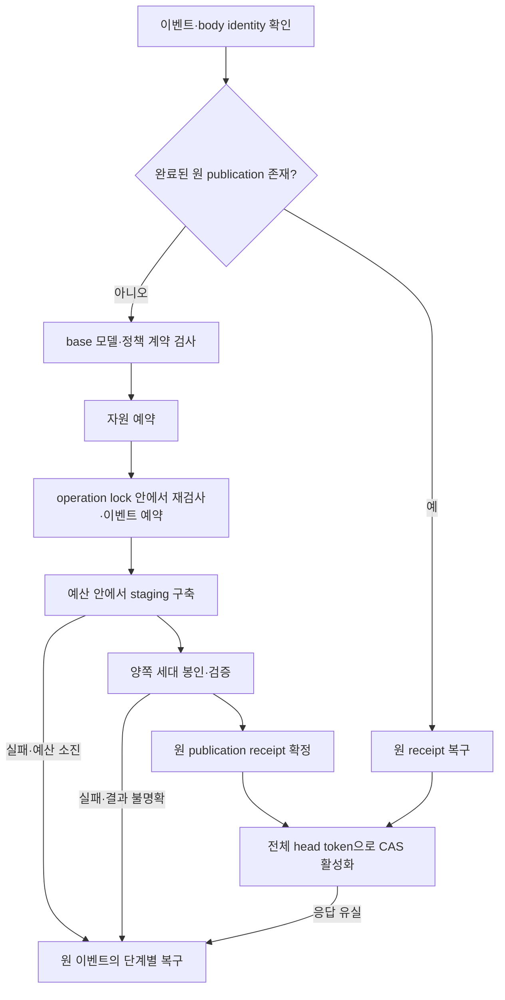
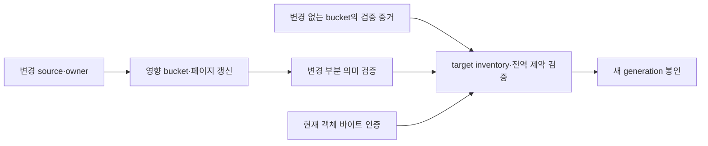

# 증분 색인 정확성·복구·검증 비용 최종 구현 계획

작성일: 2026-10-08. 상태: 구현에 사용할 최종 설계. 제안 변경의 구현·실행 검증은 미완료다.

목표는 기존 Tantivy/Lance 검색 평면을 유지하면서 모델 혼합을 차단하고, 발행·활성화의
실패 결과를 복구하며, 변경하지 않은 데이터의 반복 계산을 줄이는 것이다.
전체 현재 바이트 인증을 유지하는 단계에서는 end-to-end O(변경량)을 주장하지 않는다.
현대 저장 엔진의 불변 객체·증분 메타데이터·원자적 publication 패턴을 적용하지만,
비교 실험 전에는 SOTA 성능이나 특정 지연을 보장하지 않는다.

## 문서와 소유 경계

| 문서 | 역할 |
| --- | --- |
| 이 문서 | 설계 결정, 변경 범위, 소유 모듈, 의존성과 구현 순서 |
| [VALIDATION.md](VALIDATION.md) | 독립 oracle, 장애·동시성·자원·성능 합격 조건 |
| [REFERENCES.md](REFERENCES.md) | 현재 소스, 기존 증거, 외부 1차 레퍼런스와 적용 한계 |
| [기존 잔여 작업 인덱스](../oct-4-parallel-closure/tickets/INDEX.md) | 전체 프로젝트 상태와 다른 작업의 통합 경계 |

이 폴더는 해당 잔여 작업의 상세 구현 명세다. 기존 인덱스·ADR의 완료 증거를 복제하거나
SDK preparation/publication 작업을 별도 제품 API로 다시 만들지 않는다.
영구 계약과 실제 완료 결과는 해당 owner의 기존 ADR에 연결한다.

Semantica는 semantic 상태·fact resolution·projection·producer outbox를 소유한다.
Index는 입력 계약 검증·embedding/build·generation·publication·activation·storage를 소유한다.
원 93.969초 및 후속 Index 직접 진단을 Semantica Runtime 비용으로 귀속하지 않는다.

## 기준 소스와 중복 방지

- 최초 감사: `09387a9af4267293cc7c7ede50823e29320e9e2e`.
- 문서화 시 재대조: `c850223552111cf6c666dd61c4c98a547e4614a1`.
- 두 기준 사이 semantic/lexical/repomap/search-plane 및 관련 core/embed/contract 소스의
  변경은 없었다. SDK에는 독립 preparation과 관련 소비자·테스트 변경이 추가됐다.
  이 사실은 새 HEAD의 테스트 실행이나 전체 저장소 재감사를 뜻하지 않는다.
- 최초 문서화에서는 기존 dirty `OCT-04-003-source-preparation-sdk.md`와 잔여 작업
  `INDEX.md`를 보존했다. Oct-10 통합 대조와 잔여 목록은 기존 인덱스가 소유한다.
- 아래 표의 기존 구현은 새 작업 완료량에 중복 산입하지 않는다.

| 이미 있는 구현 또는 증거 | 이번 작업에서 유지할 경계 |
| --- | --- |
| Tantivy/Lance 파일 재사용, F15 changed-bucket publication | 물리 재사용과 전체 검증·집계·디렉터리 순회 비용을 구분 |
| Publication 범위 typed proof와 현재 객체 재인증 | mtime/inode/성공 bool로 현재 바이트 인증을 대체하지 않음 |
| `4647097d`의 file-authority plan 재사용 | publication 안의 중복 plan 파생을 다시 구현하지 않음 |
| `dfbf9213`의 publication-only 검증 output | query materialization과 admission proof를 분리한 기존 canonical verifier 유지 |
| Query 모델 ID/revision 검사 | 별도 중복 validator 대신 같은 semantic 계약 소유권으로 확장 |
| 원 publication/receipt 보존 및 replay CAS 수리 | Index SDK와 repo-local 소비자는 `3aeebae8`로 main에 통합됨. Semantica 수신 후보의 Runtime 검증은 별도이며 SDK를 다시 구현하지 않음 |
| Frozen `703d0e68` XL 진단 | delta 40.970795167초, 내부 proof envelope 6회 합계 32.609455209초. 현재 HEAD 성능으로 재표기하지 않음 |

XL의 내부 span은 중첩되어 있으므로 합산해 총시간에 더하지 않는다. 단일 shared-macOS
진단은 최적화 우선순위 근거이며 반복 비교·최대 RSS·실제 I/O·설치 제품 성능 증명이 아니다.
상세 수치는 [기존 비용 ADR](../../adr/OCT-05-004-cost-capacity-and-qualification-boundaries.md#post-repair-matching-xl-diagnostic)이 소유한다.

## 보장할 동작

| 계약 | 합격 조건 |
| --- | --- |
| 정확성 | 다른 모델·공통 정책의 base를 상속하지 않으며, 논리 데이터와 삭제 결과가 전체 재구축 oracle과 일치 |
| 원자성 | 미완성 lexical/semantic 조합을 활성화하지 않고 하나의 candidate/head 관계로 전환 |
| 재시도 | 동일 이벤트·body의 원 publication을 복구; 관측 실패를 새 ingest 성공/실패로 추측하지 않음 |
| 자원 | admission과 실행 중 예약으로 동시 작업을 제한; 회계값·RSS·물리 디스크는 별도 측정 |
| 수명 | reader/rollback/pending이 참조하는 객체와 이력을 보존; 퇴역 후 신규 acquire 차단 |
| 진행 가능성 | dependency 회복, 자원 확보, 공정한 실행 기회, 예산에 맞는 작업 단위 또는 재개 checkpoint가 있어야 재시도로 전진 |

provider 영구 장애나 저장소 고장에서도 완료한다는 보장은 없다. 그 경우에는 잘못된
활성화·중복 실행·복구 상태 유실을 막는다. native 호출을 중간에 끊을 수 없다면 deadline은
협력적 중단 기준이며, 실행 시간의 절대 상한과 구분한다.

Replay는 입력 identity와 접근 권한 검사를 우회하지 않는다. 완료된 원 publication에는
신규 구축용 현재 모델 검사를 적용해 재구축을 유발하지 않는다. CAS와 활성화 가능 여부는
복구된 원 candidate를 기준으로 별도 검증한다.

## A — 모델·정책 호환성

Owner: semantic adapter와 기존 semantic port. SearchCorpus는 이를 호출한다.

1. base→target 공통 계약 검증기를 semantic owner에 하나만 둔다.
   SearchCorpus preflight 및 operation lock 내부에서 이벤트 예약 전에 호출한다.
   직접 SemanticAdapter 호출도 첫 `next_window()`와 provider 호출 전에 검사한다.
2. 모델 ID·revision·차원·거리·정규화와 generation 공통 정책을 영속화하고 상속 시 비교한다.
   공개 계약의 `policy_digest`, `view_policy_digest`가 저장 계약에서 사라지지 않게 한다.
   불일치는 기존 `SEM_MODEL_MISMATCH`로 거절하고 모델 변경은 전체 교체로 수행한다.
3. 모델 revision, tokenizer/pooling, 입력 처리·정규화 변경을 어떤 계약 필드가 식별하는지
   명시한다. provider가 불변 revision을 보장하지 못하면 동일성을 증명한 것으로 취급하지 않는다.
4. 문서 벡터의 상속 동등성과 query–document 호환성을 분리한다. 서로 다른 query/document
   prefix를 허용하는 모델은 명시된 호환 조합으로 관리하며 모든 policy digest의 무조건 동등성을
   요구하지 않는다. row별 render policy는 별도 coverage 규칙을 유지한다.
5. 필수 계약이 없는 기존 세대는 자동 호환시키지 않고 재구축 대상으로 거절한다.
   현재 검사를 추가해도 과거에 혼합된 벡터의 출처를 소급 복원할 수 없다.

완료 조건: [A01–A04](VALIDATION.md#모델과정책). Query 검사·manifest·직접 adapter·SearchCorpus
입구를 같은 계약 변경에 포함한다.

## B — 발행·복구·장기 이력

Owner: activation catalog, source event, SDK. Producer 이벤트 변경은 Semantica와 결합한다.

| 상황 | 처리 |
| --- | --- |
| Publish 응답 유실 | 동일 이벤트·body replay로 원 publication/receipt 회수 |
| Activation ACK 유실, 같은 incarnation·정확한 candidate·예상 sequence+1 | 현재 목표 상태를 확인한 복구 결과; 원 ACK나 해당 요청의 단독 성공으로 표현하지 않음 |
| 후속 활성화·rollback·incarnation 변경 | 기존 owner 이력으로 판정하거나 명시적인 미확정/충돌; 현재 head만으로 과거 결과 추론 금지 |
| 같은 이벤트 ID, 다른 body | 충돌 거절; 새 작업으로 실행하지 않음 |
| 만료된 epoch/이벤트 | 명시적 만료 거절; receipt 삭제를 신규 실행 허가로 해석하지 않음 |

기존 head 변경과 source event의 Active 전환이 공유하는 repository persist 경계를 유지한다.
별도 영구 journal이나 두 번째 public SDK API를 일괄 추가하지 않는다. Main에 통합된
Index SDK explicit-publication 계약과 [기존 통합 경계](../../adr/OCT-05-003-active-query-and-runtime-lifecycle.md#explicit-publication-and-activation-candidate)를 따르며,
Semantica 수신 후보의 수용 조건은 기존 잔여 작업 인덱스에서 확인한다.

이력 rollover는 `(repository, stream, epoch, event identity)`와 body binding, pending,
retained receipt, retired epoch의 재실행 차단을 하나의 계약으로 정의한다. high-water만
사용하려면 순차 완료·공백 없음의 전제가 필요하다. 역순 도착을 지원하면 미완료 구간을 보존한다.
기존 rollback/reader/GC 참조는 유지한다. pending을 안전하게 정리할 수 없는 경우에는
backpressure 또는 typed refusal을 사용하고 계속 증가하는 무제한 보관으로 우회하지 않는다.

예산 소진 후 복구는 durable 단계에 맞춘다. Commit 중단의 결과가 불명확하면
"적용 안 됨"을 반환하지 않고 원 journal로 확인한다. 반복 retry가 처음부터 같은 일을
하다 예산을 소진하지 않도록 재개 가능한 단위 또는 이를 완료할 수 있는 profile을 선택한다.

완료 조건: [B01–B06](VALIDATION.md#발행과이력), [R01–R04](VALIDATION.md#자원과중단).

## C — 증분 검증과 저장 메타데이터

Owner: lexical/file-authority proof, semantic commitment, 각 저장 형식의 기존 owner.

### C1 — 현재 무결성 계약을 유지한 계산 감소

- Canonical verifier 내부의 중복 decode·정규화·posting 계산·할당을 줄인다.
- bucket 검증 결과를 정확한 source 목록/ID/언어/admission, pack·posting 객체 digest/길이,
  정책, 정규화·검증 알고리즘 버전에 결속한다. 해시 입력은 길이·순서·종류를 구분한다.
- bucket 내용의 검증 증거와 target generation 소속 증거를 분리한다. cache key를 전체
  generation/root로만 구성해 다음 세대의 변경 없는 bucket까지 무효화하지 않는다.
- target 조합 시 전체 inventory 완전성, 전역 중복 ID, 삭제, source↔posting 관계,
  pinned object identity 및 총량 정책을 확인한다. 부분 증명이 전체 증명을 대신하지 않는다.
- 현재 객체 바이트의 hash는 유지한다. 캐시는 바이트 상한과 eviction을 갖는 기존
  publication owner의 증거로 관리하며 source 본문 전체를 상주시킬 이유로 쓰지 않는다.
- miss·재시작·검증 버전 변경 시 독립 full proof로 돌아간다. 초기 단계에서 영구 proof cache를
  새 저장 형식으로 추가하지 않는다. cold query open과 scrub의 독립 검증도 유지한다.

### C2 — 제한된 인증 페이지

F15 flat source root와 전체 chunk checkpoint를 변경 페이지 중심의 구조로 전환한다.
기존 paged term directory와 paged text authority를 다시 구현하는 작업이 아니다.

페이지는 최대 encoded/decoded bytes·행 수·트리 깊이·검증 scratch를 제한한다.
고정 256 bucket만으로 편중 입력의 작업량 상한을 주장하지 않는다. 분할·병합·삭제·빈 root,
키 범위와 개수, child digest, 전역 중복 여부를 검증할 수 있는 구조를 선택한다.
변경 leaf와 조상 경로를 갱신하고 각 generation root에서 독립 복구 가능하게 한다.
복구 시 이전 generation의 무제한 delta 체인을 재생하게 만들지 않는다.

논리 데이터 commitment와 물리 페이지 배치는 구분한다. 이력에 따라 페이지 분할이 달라질 수
있다면 물리 root 동일성을 rebuild parity의 oracle로 사용하지 않는다. 페이지 공유는 GC의
도달 가능성/참조 보존 계약에 반영한다. 최소 reader/writer 형식, 구형 형식의 typed refusal,
전환 중 crash recovery를 함께 반영하고 내부 IR을 두 벌로 유지하지 않는다.

### C3 — Lance와 장기 비용

현재 `inherit_dataset_tree()`는 전체 디렉터리를 순회하며 hardlink를 만든다. 데이터 복사량
절약과 metadata 작업량 절약은 다르다. `N`(코퍼스), `Δ`(변경량), `F`(물리 파일/fragment 수),
`H`(누적 갱신·보존 이력)를 별도로 계측한다.

- 순회 entry·hardlink·fragment·manifest bytes, 전체 row 집계량, compaction 대기량을 계측한다.
- Semantic 증분 commitment는 실제 사용 버전에서 immutable fragment, 삭제, row ID,
  index coverage, compaction/remap의 계약을 먼저 검증한 뒤 도입한다.
- 현재 Lance 의존성은 7.0.0이다. 공식 Fragment Metadata Tree는 릴리스 지원이 없는 제안으로
  표시돼 있으므로 즉시 도입 가능한 기능으로 전제하지 않는다. 최신 문서의 기능은 고정된
  의존성 버전·옵션에서 사용 가능함을 먼저 확인한다.
- 반복 delta로 작은 파일·fragment가 누적되는 경우 기존 엔진의 maintenance를 우선 검토한다.
  foreground ingest와 compaction의 CPU/I/O/메모리/디스크를 같은 예산에 포함한다.
  bounded history·maintenance 정책의 효과를 측정한 뒤 추가 저장 구조 변경을 결정한다.

전체 현재 바이트 인증을 유지하면 읽기 하한은 남는다. 감소시킬 계산량과 계속 읽는
바이트 수를 별도 counter로 보고한다. 완료 조건: [C01–C06](VALIDATION.md#증분검증과저장형식).

## D — 읽기 수명과 GC

Owner: RepoMap store/pin/object lifecycle. 외부 daemon 장애가 이미 재현됐다는 주장은 하지 않는다.

획득 허용 확인과 pin 확보를 같은 수명주기 경계로 묶는다. 퇴역은 신규 획득 차단 후
기존 pin이 0임을 확인한 경우에만 unlink한다. 활성화·재발행·GC의 lock 순서를 명시하고,
공유 객체가 다른 generation에서 도달 가능한지도 보존 계약에 포함한다.

현재 process-local pin이 보장하는 범위를 명시한다. 동일 state root를 여러 프로세스가
사용할 수 있다면 기존 프로세스 배타 소유권으로 이를 막거나 프로세스 간 lifecycle 보호가
필요하다. in-process lock만으로 다중 프로세스 GC까지 안전하다고 주장하지 않는다.

Panic 테스트는 획득 성공과 pin=1을 먼저 확인하고, 의도한 panic payload/도달 표식을
검증한 뒤 unwind 후 pin=0 및 GC 가능을 확인한다. 실패한 acquire의 `expect` panic을
성공으로 취급하지 않는다. 완료 조건: [D01–D03](VALIDATION.md#읽기수명과동시성).

## 자원 예산

기존 한도는 범위가 서로 다르다. 다음 값의 합을 프로세스 메모리 상한이라고 해석하지 않는다.

| 범위 | 기존 기준 | 변경할 동작 |
| --- | --- | --- |
| 호출자 대기 | IPC 기본 30초 | 응답 유실/timeout 결과와 durable 실행 결과 분리; 원 요청 복구 |
| 서버 실행 | dispatch 기본 120초, ingest 입장 검사 | 하나의 실행 deadline을 안전한 단계와 provider에 전달; client disconnect와 owner 실행 수명 구분 |
| Provider | HTTP 시도당 60초, 기본 재시도 3회 | `embed_batch_within`에 남은 예산 전달; retry/backoff/window 모두 같은 예산 소비 |
| Inline 배치 | 100,000 records, text/source 각각 해당 64MiB 제한, vector 환산 256MiB | 기존 scope 유지; staged upload와 완전 DTO materialization의 한계를 별도 취급 |
| Semantic window | 1,024 owner scopes / 32MiB vector | 동시에 살아 있는 window·provider 버퍼까지 예약 |
| F15 generation | 32,768 files / source 128MiB / root 16MiB / bucket scratch 128MiB | 초기 지원 범위 유지; 페이지화·별도 profile 검증 후 확대 |
| 프로세스 | 기본 선언 회계 envelope 2GiB, RSS gate 기본 없음 | 누락된 집계·proof·engine/maintenance·serving 메모리 포함; RSS 보장과 구분 |
| 디스크 | sealed retention과 upload admission 등 부분별 한도 | 기존 객체·staging·compaction·핀 보류·journal/복구 공간의 동시 피크 예약 |
| Repository 이력 | 8,192 events / 256 streams / 256 roots / envelope 16MiB | 안전한 rollover·만료·pending 보존; 단순 cap 확대 금지 |

메모리 예약은 큰 할당 전에 확보하고 owner 간 인계하며 완료·실패 시 반환한다.
요청별 제한 외에 프로세스 전체 동시성, 제한된 대기열, 유지보수와 serving 여유를 포함한다.
공유 버퍼·hardlink는 중복 회계하지 않되 이후 COW/compaction의 새 할당 공간은 예약한다.
OS/filesystem의 실제 RSS·allocated bytes는 별도 관측한다. 엔진 soft limit을 hard cap으로
표기하지 않는다. 디스크 예약과 자원 경쟁도 원자적으로 처리한다.

`B_wait`, `B_exec`, `B_recover`는 목적이 다르다. 새로운 profile은 각 예산, 동시성, RSS·디스크
상한, interrupt 불가능 구간과 초과 허용 범위를 실행 전에 명시해야 한다. 재시도마다 전체
operation 예산을 무한 재설정하지 않는다. 이 숫자는 단일 XL 결과로 확정하지 않는다.

## 구현 순서와 통합

| 단계 | 작업 | 의존성·종료 조건 |
| --- | --- | --- |
| 1 | A 모델 검사, D pin/panic, B 기존 복구 경계 검증, C1 계산 감소 | 소유 파일이 분리된 구현은 병렬 가능; 기존 구현·candidate와 먼저 대조 |
| 2 | 공통 계약 영속화, bucket 증거 조합, 동적 자원 예약·안전한 중단 | integration owner가 port/core/형식/CI 변경 직렬 반영; focused 회귀 통과 |
| 3 | 실제 daemon 응답 유실·재시작·동시성 검증 | 모델 거절·원 publication 복구·pin 보호를 실제 경계에서 확인 |
| 4 | B rollover, C2 페이지화, C3 측정으로 확인된 저장 비용 개선 | Semantica 이벤트 계약 변경은 producer/consumer 전체 묶음; 형식 전환·장기 반복 검증 |
| 5 | 동일 조건 자원·성능 비교 | 전체 validation matrix와 사전 profile 통과; 성능·검색 품질·운영 비용을 함께 판정 |

이 표는 구현을 시작할 때의 작업 분할이며 현재 agent 실행 상태를 뜻하지 않는다.
공통 타입·저장 형식·Cargo/CI·public API는 한 integration owner가 통합한다.
각 breaking 계약은 실제 producer/consumer를 한 묶음으로 전환한다. 완료된 Index
repo-local SDK 통합과 아직 미완료인 Semantica native/product 수용을 같은 gate로
취급하지 않는다. Semantica의 결합된 수신 후보는 전체 consumer 검증 후 반영한다.
빌드·대형 벤치는 공유 호스트에서 직렬화하고, 동일 입력을 충족하는 기존 바이너리·증거는
재사용한다. 완료된 XL capture를 상태 보고 목적으로 반복하지 않는다.

완료 선언은 [검증 매트릭스](VALIDATION.md)의 실제 실행 범위에 한정한다.
구현 전인 항목, focused 통과, daemon E2E, producer 통합, 정식 성능 qualification을
한 개의 완료율 또는 성공 bool로 합치지 않는다.
