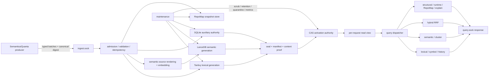

# quanta-index 상세 아키텍처 및 셀프 감사

이 문서는 `quanta-index`의 현재 구현을 기준으로 전체 데이터 파이프라인, 검색 알고리즘,
저장·정합성 기법, 성능·확장성 설계, 운영 경계와 남은 위험을 한곳에 정리한다.

- 감사 기준 소스: `main` / `aeec3e1f20f16ec17e2540b761bb4a6f5d1b8c20`
- 감사일: 2026-09-21
- 증거 수준: 정적 소스 감사. 이 문서 작성 과정에서는 빌드, 테스트, 벤치마크, 실제 daemon,
  외부 embedding provider를 실행하지 않았다.
- 판독 규칙: `구현`은 현재 소스에 도달 가능한 production path가 있다는 뜻이다. `부분 구현`은
  유효한 하위 집합만 지원하거나 운영 완결성이 부족하다는 뜻이다. `비범위`는 설계상 제공하지
  않는다는 뜻이다.
- 소스가 이 문서와 충돌하면 소스가 우선한다. 특히 과거 계획서와 감사 문서는 현재 HEAD의
  상태를 보장하지 않는다.

## 1. 한 문장 정의

`quanta-index`는 Semantica/Quanta 생산자가 만든 코드·심볼·이력·구조·런타임·RepoMap 사실을
typed contract로 받아, 세대별 lexical/semantic 보조 구조를 만들고 봉인한 뒤, 명시적으로
활성화된 immutable snapshot에 대해 로컬 UDS 검색을 제공하는 외부 search-plane이다.

핵심 경계는 다음과 같다.

- 생산자 권위: 소스 바이트, chunk/symbol, git history, parse tree, runtime/dirty facts,
  semantic-source record, provenance, RepoMap graph.
- `quanta-index` 권위: wire validation, 검색용 물질화, embedding 실행과 model contract,
  lexical/semantic generation, seal/readiness, activation, query planning, ranking/fusion,
  pagination, retention, integrity scrub, quarantine.
- 소비자 경계: `quanta-index-sdk`와 `searchctl`이 query/control/ingest UDS를 사용한다.

이 프로젝트는 원본 코드 분석기나 graph fact 생산자가 아니다. 생산자가 만든 사실을 검색 가능한
물리 구조로 바꾸고, 어떤 세대가 질의 가능한지 통제하는 serving 시스템이다.

## 2. 시스템 컨텍스트와 전체 파이프라인

### 2.1 부팅

1. process umask를 강화한다.
2. `state_root`를 canonicalize하고 process-exclusive file lease를 잡는다. lock file은 symlink를
   따라 열지 않으며, 다른 runtime이 같은 root를 동시에 쓰는 것을 막는다.
3. SQLite catalog에 `WAL`, `synchronous=FULL`, `fullfsync=ON`, foreign key enabled를 설정하고,
   최소 `journal_mode`와 `synchronous`는 다시 읽어 검증한다.
4. lexical, semantic, history text, RepoMap, activation/history authority를 연다.
5. auxiliary catalog row로 in-memory persistent snapshots를 복구한다.
6. active lexical+semantic pair를 실제 storage door로 다시 열어 검증하고 snapshot registry에
   승격한다. 손상된 active pair는 socket bind 전에 부팅을 실패시킨다.
7. query/control/ingest UDS를 각각 bind하고 maintenance timer를 시작한다.

주요 owner:

- `crates/quanta-index-searchd-runtime/src/lib.rs`
- `crates/quanta-index-searchd/src/app/runtime.rs`
- `crates/quanta-index-search-plane/src/search_corpus_lifecycle.rs`
- `crates/quanta-index-catalog/src/connection.rs`

### 2.2 ingest

1. producer가 typed batch를 만들고 canonical batch digest를 찍는다.
2. CBOR frame을 `ingest.sock`으로 전송한다.
3. transport가 frame 크기, peer credential, connection/dispatch slot, I/O timeout을 검사한다.
4. dispatcher가 wire body를 다시 canonical digest로 계산해 caller의 digest와 비교한다.
5. route별 구조, canonical order, identity, resource envelope를 storage mutation 전에 검증한다.
6. SQLite idempotency catalog에서 신규 요청, 진행 중 요청, 완료 replay, body conflict를 구분한다.
7. lexical, semantic, history/runtime/structural, RepoMap owner로 mutation을 보낸다.
8. durable mutation과 seal이 끝난 뒤 receipt를 finalization하고 원 retry에는 같은 receipt를 돌려준다.

검색 corpus batch는 `ReplaceGeneration`과 `Delta`를 지원한다. delta는 active generation을 제자리
수정하지 않고 새 target generation의 staging surface를 만든다.

### 2.3 lexical 물질화

- Tantivy generation directory를 만든다.
- chunk와 symbol document를 typed schema로 기록한다.
- 공유 text normalizer로 NFC, case mode, token boundary를 고정한다.
- phrase position, byte-trigram, raw text authority, metadata overlay를 generation sidecar로 만든다.
- delta에서는 prior generation을 기초로 변경 scope를 retire/upsert한다.
- text authority는 doc-id 범위당 2,048개인 shard로 나누고, 변경되지 않은 shard는 재사용한다.
- writer를 commit하고 background merge가 끝난 뒤 schema/normalizer/sidecar identity를 봉인한다.

### 2.4 semantic 물질화

- batch 전체를 첫 provider call 전에 검증한다.
- typed semantic source를 우선 사용하고, 설정된 migration mode에 따라 legacy chunk text를
  fallback으로 사용할 수 있다.
- owner scope를 bounded window로 잘라 한 window의 text를 한 provider batch로 embedding한다.
- model id, model revision, dimension, L2 normalization, cosine metric, render/view policy digest를
  generation contract에 고정한다.
- owner-scoped replace/tombstone을 LanceDB dataset에 적용한다.
- 행 수가 작으면 exact lane, 충분히 크면 IVF-HNSW-SQ ANN index를 봉인한다.
- semantic row root, cluster membership root, dataset/index lineage를 manifest에 기록한다.

### 2.5 seal, readiness, activation

- lexical과 semantic은 각각 sealed identity와 manifest를 가진다.
- seal은 schema/version, row counts, sidecar inventory, content digest, ANN contract를 검증한다.
- composite search corpus authority는 lexical+semantic identity와 semantic content roots를 하나의
  immutable generation record로 보관한다.
- activation은 준비된 pair를 다시 열어 증명한 다음, expected-active와 비교하는 CAS로 serve head를
  바꾼다.
- activation file은 staging write, file sync, rename, parent-directory sync 순서로 교체한다.
- parent fsync가 실패하면 현재 process는 durable head가 불명확하다고 보고 fail closed한다.
- 정상 activation은 generation을 단조 증가시킨다. 과거 generation 복귀는 별도 rollback CAS다.

### 2.6 query

1. request의 explicit generation, generation selector, active generation 순서로 pin을 결정한다.
2. route와 normalized plan이 필요로 하는 lexical, semantic, history, runtime, structural,
   RepoMap domain을 선언한다.
3. 한 요청의 `ReadView`가 generation pin과 auxiliary epochs, immutable handles를 잡는다.
4. snapshot registry hit이면 열린 handle을 재사용하고, miss이면 같은 key의 cold open을 single-flight로
   합친다.
5. route가 budget/deadline/cancellation 아래에서 실행된다.
6. 결과는 deterministic order, keyset cursor, response byte budget을 적용해 반환된다.

### 2.7 유지보수

- idle lexical writer 회수.
- lexical/semantic disk usage gauge 갱신.
- generation별 bounded, resumable integrity scrub.
- seal과 불일치한 generation의 durable quarantine receipt 생성.
- active/candidate/newest를 보존하는 count+byte retention과 physical GC.
- snapshot handle이 query에서 참조 중이면 GC가 삭제하지 않도록 retirement fence 적용.
- query/ingest/cache/writer/scrub/IPC metrics 집계.

## 3. 주요 유즈케이스

| 유즈케이스 | 입력 | 처리 | 결과 |
|---|---|---|---|
| 코드 텍스트 검색 | native LQ 또는 Sourcegraph syntax | normalize → plan → Tantivy/sidecar 실행 | ranked text candidates |
| 심볼 검색 | symbol name/kind/filter | symbol index와 typed filter | symbol candidates |
| 정확 구문 검색 | phrase | positional postings adjacency | exact phrase candidates |
| 부분 문자열 검색 | raw string | trigram posting 교집합 → exact byte verify | substring matches |
| 정규식 검색 | bounded regex | dialect check → HIR/NFA estimate → trigram prefilter → exact verify | regex matches |
| 의미 검색 | query text + corpus filters | query embedding → model gate → LanceDB exact/ANN | semantic candidates |
| 하이브리드 검색 | text + semantic request | 독립 lexical/dense lane → typed identity dedup → RRF | fused candidates |
| corpus별 semantic seed | lexical seed + per-corpus budget | corpus별 dense lane → stable owner collapse → multi-lane RRF | owner-oriented candidates |
| git history 검색 | commits/refs/diff hunks | durable history authority + history text BM25 | recency/relevance results |
| runtime/dirty 검색 | catalog/dirty facts | pinned auxiliary snapshot + lexical leaves | runtime metadata results |
| 구조 검색 | producer parse-tree facts + pattern | bounded structural lowering/matcher | bindings 포함 structural results |
| RepoMap 탐색 | typed graph bundle/query | heuristic projection + indexed snapshot query | file/symbol importance rows |
| 결과 설명 | candidate + original query | index를 다시 읽어 score/lane/fusion 재계산 | explain trace/provenance |
| generation 운영 | prepare/activate/rollback/status | seal validation + CAS | active composite generation |
| 장애 격리 | inventory/discard | scrub/boot finding → quarantine | typed inventory/controlled deletion |
| 운영 관측 | metrics request | 모든 metric source 합성 | JSON/Prometheus text |

Wire query variant의 현재 집합은 `Text`, `Symbol`, `Semantic`, `Hybrid`, `HybridSeed`,
`History`, `RuntimeMetadata`, `Structural`, `RepoMapQuery`, `Explain`,
`ClusterMembershipRead`이다.

## 4. 아키텍처 기법

### 4.1 Hexagonal architecture / ports and adapters — 구현

- `quanta-index-core`는 vendor-neutral domain policy와 port trait를 가진다.
- Tantivy, LanceDB, SQLite, CBOR, UDS 상세는 adapter crate에 격리된다.
- concrete adapter를 조립하는 곳은 `searchd` composition root다.
- query/control/ingest dispatcher는 trait object를 받아 storage vendor를 직접 알지 않는다.

효과:

- 검색 정책과 storage engine을 분리해 단위 테스트와 교체 가능성을 높인다.
- vendor type이 contract/core로 전파되는 것을 막는다.
- storage-specific failure를 typed domain failure로 변환하는 위치가 분명하다.

### 4.2 CQRS 유사 plane 분리 — 구현

- query socket: 읽기와 ranking.
- ingest socket: batch publication과 materialization.
- control socket: activation, rollback, readiness/status, metrics, quarantine.

완전한 CQRS/event sourcing은 아니다. durable authority는 generation files, SQLite catalog,
activation roots에 있고, 모든 변화를 append-only event log로 재생하는 구조는 아니다.

### 4.3 Immutable generation + MVCC/read-view 유사 모델 — 구현

- write는 새 generation에 수행하고 sealed generation은 불변으로 취급한다.
- active pointer만 CAS로 교체한다.
- query는 full generation pin과 auxiliary epoch snapshot을 보유한다.
- `Arc` snapshot handle은 cache eviction/activation 이후에도 진행 중 query를 살린다.
- GC는 registry retirement와 참조 수를 확인한다.

이는 전통 DB의 MVCC와 동일 구현은 아니지만, “immutable version + atomic head + pinned reader”라는
동일한 concurrency control 원리를 사용한다.

### 4.4 Copy-on-write persistent snapshot — 구현

history/runtime/structural auxiliary state는 `imbl::OrdMap` 기반 persistent map을 사용한다. epoch를
보유한 이전 snapshot은 변경되지 않은 tree node를 현재 snapshot과 공유한다. 따라서 retained epoch
비용은 전체 state 복사보다 변경 경로에 가까워진다.

### 4.5 Single writer + striped serialization — 구현

- state-root file lease가 process 단위 concurrent writer를 막는다.
- control/ingest server는 serial dispatch policy를 사용한다.
- search-corpus lifecycle은 repo/revision pair를 stripe lock으로 직렬화한다.
- SQLite catalog는 한 connection+mutex를 사용한다.

이 설계는 local authority의 단순성과 결정성을 얻는 대신 한 state root의 write scale-out을 제한한다.

### 4.6 Fail-closed typed contract — 구현

- unknown enum variant, malformed value, duplicate required field, missing required field를 typed decode
  failure로 처리한다. 기존 query/control struct의 일부 visitor는 forward compatibility를 위해 unknown
  field를 무시하므로, 모든 unknown field를 전역적으로 거부한다고 해석하면 안 된다.
- generation, schema, normalizer, model, dimension, digest가 맞지 않으면 다른 generation이나 빈 결과로
  fallback하지 않는다.
- unsupported query shape와 cap 초과는 stable typed error code를 낸다.
- manual serde 구현으로 wire shape와 duplicate/missing-field 처리를 명시한다.

### 4.7 Content-addressed and domain-separated identity — 구현

- canonical batch body digest.
- idempotency row digest.
- auxiliary row/track digest.
- semantic row root와 membership root.
- sealed file inventory/content root.
- embedding cache namespace와 key.

각 digest는 domain tag, field separator 또는 length commitment를 사용해 다른 종류의 byte sequence가
같은 의미로 해석되지 않도록 한다.

## 5. 검색·랭킹 알고리즘

### 5.1 Query language pipeline

1. native LQ 또는 Sourcegraph syntax를 parsing한다.
2. AST에 source span을 보존해 오류 위치를 추적한다.
3. canonical normalization과 limit validation을 수행한다.
4. canonical CBOR/SHA-256 query identity를 만들 수 있다.
5. lexical/semantic/structural/history route로 lowering한다.
6. planner가 leaf별 engine과 filter execution을 결정한다.

관련 crate:

- `quanta-index-lq-norm`: tokenizer/parser/AST/normalizer/hash/limits.
- `quanta-index-lq-bridge`: Sourcegraph → LQ translation.
- `quanta-index-lexical`: physical lexical planner/executor.
- `quanta-index-search-plane`: route selection, read view, cross-domain execution.

### 5.2 Unicode text normalization

- Unicode NFC.
- default case-insensitive mode는 locale-independent Unicode lowercase mapping.
- token은 alphanumeric, underscore, combining mark의 최대 run.
- overlong token은 position을 소비하지만 index term으로 내지 않는다.
- keyword/phrase는 token semantics, raw-string/regex는 normalized text의 substring semantics다.
- normalizer version을 sealed generation에 기록하며 불일치 generation은 rebuild 요구로 거부한다.

명시적 한계:

- diacritic stripping, width folding, stemming, stopword 제거가 없다.
- CJK/Thai dictionary segmentation이 없다.
- camelCase/snake_case sub-token expansion이 없다.
- locale-specific Turkic I, final sigma, `ß → ss` 처리가 없다.

### 5.3 Keyword와 history relevance: inverted index + BM25

- Tantivy inverted index를 사용한다.
- text candidate에는 BM25 계열 score가 적용된다.
- history text index도 commit message/diff text에 BM25를 사용한다.
- generation schema와 analyzer pair를 open 시 strict compare한다.
- deterministic tie-breaker를 적용해 같은 score의 page 순서를 고정한다.

### 5.4 Phrase: positional inverted index

- `(term, doc) → sorted positions` posting을 저장한다.
- exact phrase는 연속 position run을 찾는다.
- adjacency는 bounded token window를 검사한다.
- stopword 제거를 하지 않으므로 phrase 의미가 숨게 넓어지지 않는다.
- postings는 delta upsert/remove와 cross-generation inheritance를 지원한다.

### 5.5 Raw substring: byte trigram filter + exact verification

- normalized document byte stream에서 3-byte gram posting을 만든다.
- needle의 trigram posting을 교집합해 candidate를 줄인다.
- `memchr` 기반 exact substring verification이 최종 truth다.
- 3 byte보다 짧거나 cap을 넘는 query는 full scan으로 조용히 downgrade하지 않고 typed refusal한다.
- sharded posting source와 single index는 같은 결과 순서를 유지한다.

평균적인 selective needle은 전체 문서 scan 대신 작은 posting intersection과 candidate verification으로
줄어든다. 최악 복잡도는 흔한 trigram이나 낮은 선택도에서 여전히 corpus 크기에 접근할 수 있으므로
candidate cap과 request budget이 함께 필요하다.

### 5.6 Regex: RE2-class bounded pipeline

1. `regex-syntax` HIR parse.
2. dialect walk로 lookaround, backreference, inline mode-switch 등 금지 syntax 거부.
3. 예상 NFA state를 계산하고 100,000 state cap 적용.
4. mandatory literal alternation을 추출해 trigram prefilter.
5. `regex::bytes::Regex`로 candidate를 exact verify.
6. loop 내부에서 cancellation/deadline checkpoint 확인.

prefilter를 만들 수 없는 pattern은 명시적 verify-only 정책이 필요하며, hidden fallback은 허용하지 않는다.
compiled/match 결과는 bounded regex cache와 doc-id bitmap으로 재사용한다.

### 5.7 Filter planning과 pushdown

- repo/path/language/type/metadata 같은 filter를 planner에서 typed predicate로 분류한다.
- Tantivy term/filter와 RoaringBitmap doc-id restriction을 사용한다.
- semantic native metadata는 LanceDB query filter로 pushdown한다.
- dense row에 직접 적용할 수 없는 lexical filter는 같은 compiled lexical plan으로 candidate admission을
  수행한다.
- 어떤 lane에서도 의미를 보존할 수 없는 filter는 hybrid를 lexical-only로 조용히 바꾸지 않고 거부한다.

### 5.8 Semantic retrieval

현재 provider profile:

- `hash-dev`: deterministic FNV-1a feature hashing + L2 normalization. 테스트/개발용이며 학습된
  semantic model이 아니다.
- `openai`: batched embedding API, operator-pinned model revision, dimension/model validation,
  bounded retry/backoff/timeout/concurrency.
- `unavailable`: semantic query를 typed refusal하는 degraded profile.

storage/query:

- vector는 L2 unit을 요구하고 cosine similarity로 비교한다.
- 256 rows 미만 generation은 ANN을 만들지 않는 exact lane이다.
- 큰 generation은 LanceDB `IVF_HNSW_SQ`를 사용한다.
- 현재 index policy의 주요 값은 target partition rows `2^20`, max partitions `4096`, IVF sample
  rate `256`, HNSW `M=20`, construction `ef=300`, query `nprobes=20`, query ef floor `64`,
  refine factor `2`다.
- SQ approximate result는 refine 단계에서 원 vector로 cosine을 다시 계산한다.
- delta는 inherited dataset/index를 append 재사용할 수 있고, append ratio/row/segment policy를 넘으면
  재학습한다.
- sealed manifest가 index 종류, library/version, indexed rows, segment lineage를 기록하고 open 때
  실제 dataset statistics와 대조한다.

### 5.9 Hybrid: Reciprocal Rank Fusion

- lexical과 semantic lane을 독립적으로 실행한다.
- 각 lane 내부의 첫 stable identity만 fusion rank로 인정한다.
- 현재 상수 `k=60`으로 `score(d) = Σ 1 / (60 + rank_lane(d))`를 계산한다.
- 두 lane의 raw score scale을 직접 섞지 않으므로 BM25와 cosine calibration이 필요 없다.
- 동점은 stable identity 기반 deterministic ordering으로 해소한다.
- 결과에 각 lane의 rank/raw score/provenance를 보존한다.
- explain route는 payload를 oracle로 믿지 않고 index에서 lane과 RRF를 재실행해 reconciliation한다.

RRF의 장점은 score calibration 없이 heterogeneous ranker를 결합하는 단순성과 안정성이다. 한계는
고정 `k`와 동일 lane weight이며, 학습된 fusion이나 query-adaptive weighting은 없다.

### 5.10 Structural search

- producer의 parse-tree authority를 입력으로 사용하며 source를 재parse하지 않는다.
- pattern node, metavariable capture, inside/outside context, contiguous sibling sequence,
  variadic hole을 bounded IR로 표현한다.
- pattern node 256, depth 16, metavariable 32 cap을 둔다.
- Rust/Python/TypeScript/JavaScript/Go의 closed language set을 가진다.

현재는 Tree-sitter native walker가 아니라 `TruthfulSubsetAuthorityMatcher`가 유효한 subset을 처리한다.
lexical과 structural candidate envelope는 bindings 손실을 막기 위해 분리되어 있으며 cross-family ranking은
비범위다.

### 5.11 RepoMap projection

- file/symbol/chunk node와 call/import edge를 materialized projection으로 바꾼다.
- importance, utility, freshness, evidence priority, graph degree, symbol/chunk signal을 정수
  millipoint로 결합한다.
- score 순서 뒤 stable subject identity로 정렬한다.
- query는 in-memory indexed snapshot의 `Arc`를 pin해 실행 중 snapshot lifetime을 보존한다.

이 ranking은 명시적 heuristic scoring이다. 학습-to-rank, PageRank, GNN은 사용하지 않는다.

## 6. 저장 아키텍처

| 데이터 | 물리 저장 | 수명/키 | 정합성 장치 |
|---|---|---|---|
| lexical corpus | Tantivy mmap directory + sidecars | repo/revision/generation | schema+normalizer+sealed manifest |
| text authority | 2,048 doc-id range CBOR shards | lexical generation | shard digest/inventory, unchanged shard reuse |
| semantic corpus | LanceDB/Arrow dataset | repo/revision/generation | semantic manifest, row/membership roots, ANN contract |
| activation head | JSON composite root files | repo/revision | staging+fsync+rename+parent fsync, CAS |
| sealed history | CBOR authority records | repo/revision/generation | immutable digest conflict check, count+byte retention |
| idempotency | SQLite `WITHOUT ROWID` | kind/repo/revision/generation/digest | IMMEDIATE tx, self-digested row, monotonic sequence |
| auxiliary authority | SQLite rows/tracks | domain/full generation/family/key | row digest, one transaction, epoch row |
| auxiliary read state | `imbl::OrdMap` snapshots | generation/domain/epoch | structural sharing, durable-before-visible |
| history text | immutable Tantivy epoch dirs | history epoch | normalizer/manifest contract |
| embedding cache | content-addressed files | model/revision/dim/normalization/text | checksum, vector validation, atomic write, LRU/age/byte caps |
| RepoMap | checksummed JSON snapshots + activation files | repo/revision/generation | atomic whole-file write, boot quarantine |
| scrub/quarantine | generation-local CBOR receipts | generation | resumable byte cursor, typed discard |

### 6.1 Crash consistency

공통 durable file write protocol:

1. final file과 같은 directory에 unique temporary 생성.
2. 전체 byte write.
3. temporary `fsync`.
4. final path로 atomic rename.
5. parent directory `fsync`.

SQLite mutation은 `IMMEDIATE` transaction과 `synchronous=FULL`을 사용한다. durable mutation 후에만
in-memory ledger/read snapshot을 교체한다.

### 6.2 Seal과 scrub의 역할 분리

- query door는 빠르게 manifest/identity/sidecar contract를 검증한다.
- 전체 dataset byte hashing은 serving hot path가 아니라 maintenance scrub에서 quota 단위로 수행한다.
- scrub cursor는 큰 generation을 여러 tick에 나눠 처리한다.
- mismatch는 durable quarantine receipt를 남겨 다음 boot와 모든 open에서 동일하게 거부한다.

이는 매 query의 전체 checksum 비용을 피하면서 eventual full-content verification을 유지하는
산업적 trade-off다.

### 6.3 Retention과 GC

- pair별 active, current candidate, newest/predecessor window를 필수 보존한다.
- generation count와 실제 on-disk inode-set byte를 동시에 제한한다.
- hard-link로 공유된 파일은 generation별 합산이 아니라 retained set의 실제 inode 비용으로 측정한다.
- state-root 전체 pair/byte ceiling도 검사한다.
- snapshot registry가 아직 참조하는 generation은 삭제하지 않는다.
- idempotency와 auxiliary row도 generation reclamation과 함께 제거한다.

## 7. 데이터 견고성 기법

### 7.1 입력 전 검증

- canonical order, duplicate scope, replace+tombstone conflict.
- repo/revision/generation/track identity 일치.
- non-empty and canonical digest token.
- semantic model dimension/normalization/distance contract.
- parse tree가 알려진 chunk를 참조하는지 확인.
- history parent/ref가 알려진 commit을 가리키는지 확인.
- batch record/text/vector byte resource envelope.

검증은 provider call과 storage mutation 전에 수행하는 것이 기본 원칙이다.

### 7.2 Idempotency와 replay

- key: operation kind + repo + revision + generation + canonical batch digest.
- 동일 key+동일 body의 finalized retry는 recorded receipt를 반환한다.
- 동일 digest가 다른 body를 가리키면 `BATCH_DIGEST_CONFLICT`로 거부한다.
- finalization sequence는 catalog-wide unique/monotonic하게 transaction 안에서 배정된다.
- row는 key, body digest, state, receipt, sequence 전체를 SHA-256으로 commit한다.

이는 transport retry를 exactly-once network delivery로 만들지는 않는다. 대신 at-least-once delivery를
storage-level idempotent effect와 stable receipt로 수렴시킨다.

### 7.3 Generation 불변식

- active generation을 직접 patch하지 않는다.
- seal 전 generation과 seal 후 generation을 구분한다.
- 같은 logical generation에 다른 digest가 오면 authority conflict로 거부한다.
- query resolution 실패 시 빈 결과나 다른 generation으로 fallback하지 않는다.
- lexical/semantic pair가 모두 물리적으로 열리고 identity가 맞아야 activation한다.

### 7.4 Read consistency

- request route가 필요한 domain set을 실행 전에 선언한다.
- 한 read view가 generation pin과 auxiliary epoch를 고정한다.
- immutable lexical/semantic handle과 persistent auxiliary snapshot을 보유한다.
- activation, cache eviction, retention이 중간에 일어나도 query가 잡은 handle은 유지된다.

### 7.5 Corruption containment

- open 시 malformed/digest-mismatch state를 typed corruption으로 판정한다.
- inactive 손상 generation은 quarantine할 수 있다.
- active pair 손상은 boot를 fail closed한다.
- 하나의 잘못된 RepoMap file은 quarantine로 옮기고 나머지 store는 연다.
- operator는 inventory에서 본 exact target만 discard할 수 있다.

## 8. 성능 기법

| 기법 | 줄이는 비용 | 추가 비용/한계 |
|---|---|---|
| Tantivy inverted index | keyword 검색의 full scan | index build/merge와 mmap residency |
| trigram prefilter | substring/regex exact verify 대상 | 저선택도 gram은 candidate가 커짐 |
| positional postings | phrase document scan | position sidecar storage |
| RoaringBitmap restriction | set intersection과 filter membership | bitmap materialization 비용 |
| 2,048-doc text shards | delta sidecar rewrite를 변경 shard로 제한 | manifest/shard 관리 복잡성 |
| generation file reuse/hard link | unchanged immutable bytes 재작성 제거 | inode/lifecycle 추적 필요 |
| semantic streamed windows | batch 전체 vector 동시 residency 방지 | provider 호출/window orchestration |
| provider batching+concurrency | HTTP round-trip overlap | rate-limit과 residual request 관리 필요 |
| content-addressed embedding cache | 동일 model/text 재embedding 제거 | disk/manifest/LRU 유지 비용 |
| LanceDB exact/ANN 이중 정책 | 작은 corpus의 ANN overhead 회피, 큰 corpus 가속 | threshold와 ANN recall tuning 필요 |
| ANN append/retrain policy | 작은 delta마다 full retrain 방지 | 누적 segment/recall 관리 필요 |
| storage filter pushdown | unfiltered ANN 결과 확대 방지 | 지원 가능한 predicate만 pushdown |
| snapshot registry | 매 query sealed generation reopen/redecode 제거 | resident memory 필요 |
| single-flight cold open | 동시 cache miss의 N회 open 제거 | 첫 opener latency를 waiters가 공유 |
| entry+byte LRU | cache memory 상한 | eviction 뒤 cold reopen |
| bounded writer cache | generation writer 재open 감소 | heap envelope와 idle sweep 필요 |
| keyset pagination | deep offset scan/retention 제거 | cursor/order contract가 복잡해짐 |
| response byte budget | oversized CBOR/frame/메모리 방지 | 요청 top-k보다 적은 page 가능 |
| one maintenance timer | writer/scrub/disk thread 중복 제거 | tick 내 작업을 quota로 제한해야 함 |
| manual serde | proc-macro compile cost와 wire drift 감소 | 구현 코드량 증가 |
| consolidated nextest suites | 중복 compile/link/process 제거 | suite isolation을 authority catalog로 관리 |
| external target cache+sccache | 반복 clean build 감소 | cache hygiene와 source binding 필요 |

### 8.1 요청 자원 상한

- CBOR frame: 16 MiB.
- query socket 기본: 64 connections, 4 dispatch slots, repo당 3 slots, queue wait 2s,
  dispatch budget 20s, I/O timeout 30s.
- control/ingest: serial dispatch, 64 connections, queue wait 10s, dispatch budget 120s.
- ingest 기본: 100,000 records, 64 MiB embedding text, 256 MiB vector residency.
- embedding dimension hard ceiling: 8,192.
- snapshot registry 기본: track당 16 handles, 1 GiB resident estimate.
- process declared-memory envelope 기본: 2 GiB. optional RSS gate는 새 lexical writer 개방을 막는다.
- response payload: frame보다 작은 별도 budget.
- regex, lexical examined candidates, semantic scope/window, scrub step도 각각 별도 cap이 있다.

### 8.2 복잡도 추정

아래는 소스 구조에 따른 점근적 추정이며 benchmark 결과가 아니다. `N`은 문서/행 수, `Δ`는 변경
문서, `C`는 prefilter candidate, `K`는 반환 수, `D`는 vector dimension, `P`는 retained pair,
`G`는 retained generation이다.

| 작업 | 기대 비용 | 최악/주의점 |
|---|---|---|
| keyword | posting traversal + top-K | 흔한 term이면 posting이 N에 접근 |
| phrase | term postings + positional merge | 흔한 term/긴 postings |
| raw substring | trigram intersection + O(C) verify | 저선택도에서 C≈N |
| regex | HIR/NFA plan + trigram + O(C) verify | usable literal 부재 시 제한된 verify-only 정책 |
| exact vector | O(ND) | 256 row 미만 lane 또는 index bypass |
| ANN vector | IVF/HNSW 탐색 + refine | recall/latency는 corpus와 tuning 의존 |
| RRF | lane rows 집계·정렬 | bounded probe window에 비례 |
| lexical delta sidecar | 변경 shard 수와 Δ | Tantivy segment merge는 engine 정책 의존 |
| auxiliary delta | O(Δ log N) persistent-map/SQLite updates | route validation에 추가 scan 가능 |
| authority admission | O(P+G) + retained index metadata walk | state-root가 커지면 ingest latency 증가 |
| scrub | step당 configured byte quota | 전체 pass 시간은 dataset bytes에 비례 |

## 9. 확장성 설계

### 9.1 현재 지원하는 확장 축

- repository/revision/generation을 storage identity에 포함해 다중 corpus를 한 daemon에서 분리한다.
- query dispatch slots와 per-repo cap으로 hot repository가 모든 query slot을 독점하지 못하게 한다.
- query는 병렬, control/ingest mutation은 직렬화한다.
- immutable generation과 reader handle 공유로 read concurrency를 높인다.
- count/byte/age/namespace 단위 정책으로 memory/disk growth를 제한한다.
- adapter port로 lexical/vector backend를 교체할 수 있다.
- corpus별 semantic budgets와 stable owner identity로 semantic corpus 종류를 추가할 수 있다.
- typed variant inventory와 public API snapshot으로 contract 확장을 reviewable하게 만든다.

### 9.2 현재 scale unit

실제 scale unit은 `한 process + 한 state_root + 로컬 UDS`다. state-root lease 때문에 같은 root에
active writer daemon을 여러 개 둘 수 없다. horizontal read replica, distributed activation consensus,
remote object store, cross-node cache coherence, online resharding은 구현되어 있지 않다.

즉 현재 설계는 단일 호스트에서 bounded vertical scaling과 repository-level workload fairness를
목표로 한다. node를 늘리는 분산 확장은 상위 orchestration이 서로 다른 state root/repository set을
배치해야 하며, 이 repository 자체는 그 control plane을 제공하지 않는다.

### 9.3 수평 확장에 필요한 추가 설계

현재 구현을 multi-node로 확장하려면 최소한 다음이 별도 필요하다.

- globally unique generation/operation sequence authority.
- replicated manifest/object storage와 content-addressed immutable artifacts.
- activation consensus 또는 linearizable metadata store.
- shard placement/rebalancing과 query fan-out/merge.
- replica readiness, lag, failover, fencing token.
- cross-node idempotency와 quarantine/GC ownership.
- network authentication, authorization, encryption, tenant isolation.

이들은 현재 구현된 기능이 아니라 확장 방향이다.

## 10. 보안·운영·관측

### 10.1 구현된 보안 경계

- UDS only; TCP listener가 없다.
- private socket `0600`, group shared `0660`, uid allow-list mode `0666` + accept-time check.
- Linux `SO_PEERCRED`, BSD/macOS `getpeereid`로 effective uid/gid를 확인한다.
- credential을 읽지 못하면 허용하지 않는다.
- state root와 socket directory mode를 부팅 시 검사한다.
- state-root lock file을 no-follow로 연다.
- OpenAI API key는 provider 안에 보관하고 `Debug`에서 redaction한다.
- Rust workspace는 `unsafe_code = forbid`, panic/unwrap/todo 계열 lint를 deny한다.

### 10.2 관측

- query latency/outcome/engine/dimension의 bounded recent ring.
- counter/histogram aggregate는 ring eviction과 별도로 유지된다.
- socket connections, overload, cancellations, frame failures.
- snapshot hit/miss/coalesced/eviction/cold-open time.
- writer cache, regex cache, embedding cache, resident bytes.
- ingest admitted/refused/peak footprint.
- seal hashed/inherited bytes, scrub progress/quarantine.
- generation disk use와 GC reclaimed/deferred bytes.
- `searchctl metrics --output prometheus`가 node_exporter textfile collector용 출력을 만든다.

repository/generation/query text를 unbounded metric label로 쓰지 않아 cardinality 폭발을 피한다.

## 11. 검증·품질 방법론

### 11.1 테스트 층

- owner-local unit tests.
- property tests: codec roundtrip, idempotent upsert, delete invariant, deterministic ordering,
  parser/translator totality.
- storage integration: text shards, sealed manifests, LanceDB generation lifecycle.
- daemon E2E: activation concurrency, restart, crash matrix, exact count, keyset cursor, filters,
  full corpus, budgets, socket access, quarantine, GC, explain.
- fuzz: query/control/ingest decoder의 malformed byte fail-closed.
- heavy rails: Miri, sanitizers, careful, mutants, udeps, public API/module snapshots.
- performance/chaos: cold/warm latency, regex/trigram rejection recovery, ANN incremental seal,
  process envelope.

### 11.2 구조·공급망 gate

- core vendor import 금지와 hexagonal boundary 검사.
- module cycle, module facade, Cargo manifest hygiene.
- serde derive 금지와 derive allow-list.
- LLVM-line monomorphization budget.
- contract/SDK public API snapshot.
- wire variant와 on-disk format inventory.
- silent fallback semgrep rules.
- cargo-deny 기반 advisory/license/source policy.

### 11.3 테스트 실행 최적화

- target authority를 `tools/ci/test-authority.toml`에서 관리한다.
- integration/CLI/daemon scope마다 하나의 nextest process를 사용해 중복 Cargo startup과 link를 줄인다.
- daemon scenario source를 fast/risk/extended suite binary로 묶는다.
- storage-heavy lexical/semantic lane을 분리해 변경 surface에 맞는 최소 rail을 선택한다.
- shared-surface validation은 한 번 compile한 graph를 여러 bounded selection이 재사용한다.
- unrelated Cargo/rustc가 있으면 timing rail을 authoritative evidence로 실행하지 않는다.
- build cache를 repository 밖에 두고 optional repository-isolated `sccache`를 사용한다.
- proof source binding은 frozen Git snapshot과 batched/streamed hashing을 재사용한다.

## 12. 셀프 감사: 잘 되어 있는 부분

| 영역 | 판정 | 근거 |
|---|---|---|
| producer/search-plane 권위 분리 | 구현 | shared typed contract, source/git/parse-tree fallback 금지 |
| vendor 격리 | 구현 | core port와 lexical/semantic/catalog/ipc adapter 분리 |
| generation 격리 | 구현 | staging build, seal, composite CAS activation, pinned read view |
| lexical 알고리즘 | 구현 | BM25, positions, trigram, regex budgets, filters, deterministic pages |
| semantic storage | 구현 | persisted LanceDB, exact/ANN policy, model/index contract validation |
| hybrid semantics | 구현 | independent lanes, dense filter admission, typed identity RRF/provenance |
| retry 안정성 | 구현 | canonical digest + SQLite idempotency receipt |
| crash consistency | 구현 | fsync/rename/parent sync, SQLite FULL, boot reconciliation |
| corruption 격리 | 구현 | sealed manifests, scrub receipts, quarantine/inventory/discard |
| memory/backpressure | 구현 | connection/slot/repo/batch/cache/writer/response/scrub bounds |
| reader concurrency | 구현 | immutable handles, single-flight, LRU, retirement fence |
| auxiliary incremental state | 구현 | durable row deltas, epochs, persistent maps |
| build/test 효율 | 구현 | scoped profiles, consolidated nextest suites, external cache, source-bound proof |

## 13. 셀프 감사: 현재 위험과 한계

다음은 현재 HEAD 정적 소스에서 확인되는 항목이다. 과거 감사 결과를 그대로 복사한 것이 아니라,
현재 owner path에서 다시 확인한 것이다.

### 13.1 RepoMap generation authority가 search corpus보다 약함 — 높음

`RepoMapGenerationStore::insert_snapshot`은 같은 `(repo, revision, generation)` key에 다른 snapshot을
넣을 때 content identity를 비교하지 않고 persistence와 in-memory map을 교체한다.
`activate_generation`은 request `manifest_digest`가 비어 있지 않은지만 확인하고, 저장된 snapshot의
manifest/authority/content digest와 exact compare하지 않는다. activation record도 generation만 가진다.

영향:

- active RepoMap generation content가 새 CAS 없이 바뀔 수 있다.
- activation receipt가 어떤 body를 승인했는지 강하게 증명하지 못한다.
- main lexical+semantic generation의 immutable/CAS 수준과 불균형하다.

필요 보완:

- sealed RepoMap identity에 canonical body/manifest/authority/snapshot digest를 포함한다.
- same-generation exact replay만 허용하고 다른 body는 typed conflict로 거부한다.
- activation request와 ack를 stored sealed identity에 결속한다.
- active generation overwrite를 금지한다.

Owner: `crates/quanta-index-repomap/src/store.rs`,
`crates/quanta-index-repomap/src/persistence.rs`.

### 13.2 RepoMap compiler의 validation/resource envelope 부족 — 높음

`RepoMapMaterializer::materialize`은 `Result`가 아니며 map/filter/saturating arithmetic으로 graph를
projection한다. ingest entry의 선행 검증은 non-empty digest/nodes 수준이다. node identity uniqueness,
edge referential integrity, graph cardinality와 materialized text/entry byte ceiling이 main corpus만큼
명시적으로 강제되지 않는다.

필요 보완:

- typed graph validator를 materialization 전에 둔다.
- duplicate identity, unknown edge endpoint, owner/type mismatch를 거부한다.
- node/edge/text/output-entry/CPU-memory envelope를 둔다.
- heuristic saturation을 허용할 field와 corruption으로 볼 field를 구분한다.

Owner: `crates/quanta-index-repomap/src/materializer.rs`,
`crates/quanta-index-repomap/src/store.rs`.

### 13.3 daemon 종료와 plane supervision 미완결 — 높음

production `run`은 `AtomicBool(false)`를 만든 뒤 `drive`에 전달하지만 signal handler가 이 flag를
설정하는 경로가 현재 보이지 않는다. `drive`는 flag가 바뀔 때까지 sleep하고 그 뒤에만 plane을
shutdown/join한다. query/control/ingest thread가 먼저 종료되거나 panic해도 main loop가 즉시 감지하지
않고, shutdown join에도 hard deadline/escalation이 없다.

영향:

- SIGINT/SIGTERM graceful drain이 production entry에서 완결되지 않는다.
- 한 plane만 죽은 partial-alive process가 남을 수 있다.
- stuck request가 process shutdown을 무기한 지연시킬 수 있다.

필요 보완:

- production signal wiring.
- plane/maintenance exit supervisor와 global readiness.
- startup partial-spawn rollback.
- cooperative request deadline과 별도 process hard-drain deadline.

Owner: `crates/quanta-index-searchd-runtime/src/lib.rs`,
`crates/quanta-index-searchd/src/app/searchd.rs`.

### 13.4 control read/mutate 권한 분리 부족 — 중간~높음

한 control socket에 status/metrics/inventory read와 activate/rollback/discard mutation이 같이 있다.
socket access는 peer uid/gid를 판정하지만 dispatcher에 operation capability가 전달되지 않는다.
따라서 metrics를 읽을 수 있는 shared principal은 control mutation도 호출할 수 있다.

필요 보완: read-only/admin socket 분리 또는 operation-level capability ACL과 negative authorization
matrix.

### 13.5 외부 embedding egress governance 부족 — 중간~높음

OpenAI provider는 TLS, key redaction, batching, timeout, retry, model identity를 구현한다. 그러나 어떤
source/query text가 외부 provider로 나갈 수 있는지에 대한 data classification, tenant consent,
redaction, region/retention, base-URL allow-list가 deployment authority로 강제되지는 않는다.

필요 보완: egress policy를 release profile에 결속하고 provider 호출 전 typed policy gate와 audit
receipt를 둔다.

### 13.6 blocking provider cancellation의 residual work — 중간

request budget은 provider attempt를 polling해 caller에게 cancellation/deadline을 반환할 수 있다.
하지만 blocking transport attempt 자체는 abandon 후 별도 thread에서 끝날 수 있다. call당 concurrency는
bounded지만 process-wide detached attempt/thread/FD/cost ceiling과 shutdown drain authority는 명확하지 않다.

필요 보완: process-global provider work semaphore, residual attempt registry, shutdown drain/cancel policy,
실제 provider usage/cost metric.

### 13.7 structural engine은 의도적 subset — 중간

Tree-sitter native per-language walker는 cold-build cost 때문에 deferred다. 현재 matcher는 producer
parse-tree 위의 truthful subset만 제공하고 lexical/structural cross-family ranking은 없다. 지원하지
않는 shape는 typed refusal하므로 correctness fallback 문제는 아니지만 capability 범위는 제한된다.

### 13.8 local-only scale과 보안 경계 — 중간

- UDS 외 transport가 없다.
- TLS/network authn/authz가 없다.
- replication/sharding/failover가 없다.
- 하나의 state root는 single active writer다.

로컬 sidecar/host search-plane에는 합리적이지만 shared remote service로 간주하면 안 된다.

### 13.9 observability exporter/readiness 범위 — 중간

metrics snapshot과 Prometheus textfile rendering은 있으나 daemon 자체의 production exporter는 없다.
또한 socket plane/maintenance thread의 liveness를 하나의 readiness verdict로 감독하는 구조가
13.3의 supervision 공백과 연결되어 있다.

### 13.10 semantic migration fallback — 낮음~중간

기본 derivation mode는 typed semantic source를 우선하되 비어 있으면 legacy chunk text를 사용할 수
있다. migration 중 availability에는 유리하지만 semantic-source-only completeness를 요구하는 배포에서는
`semantic_only`와 별도 activation card가 필요하다. fallback 사용 여부를 release/receipt에서 분명히
구분해야 한다.

## 14. 구현 상태 요약

| 항목 | 상태 | 주의 |
|---|---|---|
| lexical generation build/open/query | 구현 | storage/perf 실측은 별도 rail 필요 |
| persisted semantic generation | 구현 | OpenAI live-network proof는 별도 |
| search-owned semantic derivation | 구현 | 기본 migration fallback 존재 |
| lexical+semantic composite activation | 구현 | RepoMap은 별도 약한 authority |
| history/runtime/structural auxiliary authority | 구현 | structural matcher는 subset |
| hybrid/hybrid-seed/explain | 구현 | learned fusion은 없음 |
| crash-safe local storage | 구현 | backup/restore 운영 절차는 별도 검증 필요 |
| bounded query/ingest/cache resources | 구현 | provider residual work는 process-global gap |
| integrity scrub/quarantine/GC | 구현 | 실제 장기 soak는 이 문서에서 미검증 |
| UDS peer authentication | 구현 | operation-level authorization 부족 |
| graceful signal shutdown/supervision | 부분 구현 | production flag wiring/hard deadline 부족 |
| distributed serving | 비범위 | single-host/state-root architecture |
| production metrics exporter | 부분 구현 | textfile collector workflow 사용 |
| production semantic quality | 미증명 | model/corpus별 offline+online evaluation 필요 |

## 15. 성능·정확성 평가 시 반드시 분리할 지표

이 시스템은 다음을 하나의 “빠르다/정확하다” 수치로 합치면 안 된다.

- cold build: full lexical/semantic generation materialization.
- delta build: 변경 scope만 반영하는 비용과 inherited byte 비율.
- seal: hashed bytes와 inherited bytes.
- cold open: sealed proof+native open+sidecar decode.
- warm query: snapshot-registry hit latency.
- lexical quality: golden truth recall/precision/order.
- ANN quality: exact baseline 대비 recall@K와 latency.
- hybrid quality: lexical-only/semantic-only/RRF의 독립 relevance comparison.
- ingest robustness: retry/crash/restart/duplicate/conflict matrix.
- memory: writer/cache/snapshot/vector window/RSS peak.
- disk: generation bytes, hard-link 공유, retention/GC reclaim.
- operations: shutdown bound, partial-plane failure, scrub completion/quarantine recovery.

정적 구현은 최적화 의도를 증명하지만 실제 latency, throughput, recall, resident memory를 증명하지
않는다. 해당 수치는 exact HEAD, corpus digest, config, model revision, host profile에 결속된 benchmark
artifact로만 주장해야 한다.

## 16. 주요 코드 owner map

| 책임 | owner |
|---|---|
| typed DTO / wire contract | `crates/quanta-index-contract*` |
| domain policy / ports | `crates/quanta-index-core` |
| CBOR framing / UDS admission | `crates/quanta-index-ipc` |
| lexical planner/storage/query | `crates/quanta-index-lexical` |
| semantic LanceDB storage/query | `crates/quanta-index-semantic` |
| embedding/cache/provider | `crates/quanta-index-embed` |
| durable catalog | `crates/quanta-index-catalog` |
| ingest/query/control orchestration | `crates/quanta-index-search-plane` |
| RepoMap projection/store/query | `crates/quanta-index-repomap` |
| daemon composition/process | `crates/quanta-index-searchd`, `quanta-index-searchd-runtime` |
| public Rust facade | `crates/quanta-index-sdk` |
| operator CLI | `crates/quanta-index-searchctl` |
| native DSL | `crates/quanta-index-lq-norm` |
| Sourcegraph syntax bridge | `crates/quanta-index-lq-bridge` |
| text/trigram/position/regex/structural primitives | `crates/quanta-index-lq-*` |
| E2E/bench harness | `crates/quanta-index-searchd-harness` |
| test/profile authority | `tools/ci/test-authority.toml`, `Justfile`, `scripts/run-rust-profile.sh` |

## 17. 결론

현재 `quanta-index`의 중심 설계는 다음 다섯 축으로 요약된다.

1. 생산자 사실과 검색 물리 구조의 권위 분리.
2. immutable generation, seal, CAS activation, pinned read view.
3. Tantivy lexical + LanceDB semantic + RRF hybrid의 다중 검색 엔진.
4. digest/idempotency/fsync/SQLite/scrub/quarantine 기반 fail-closed local durability.
5. admission, budgets, sharding, incremental reuse, caches, single-flight 기반 bounded performance.

main lexical+semantic corpus 경로는 데이터 정합성과 bounded execution을 상당히 체계적으로 구현했다.
반면 RepoMap authority는 동일 수준의 immutable content binding이 부족하고, daemon supervision/shutdown,
control capability 분리, embedding egress policy, distributed operation은 production 완결성의 주요 남은
경계다. 따라서 현재 시스템을 “단일 호스트의 강한 generation search-plane”으로 보는 것은 타당하지만,
“다중 tenant 분산 검색 서비스” 또는 “모든 운영 gate가 닫힌 production service”로 해석하면 안 된다.
