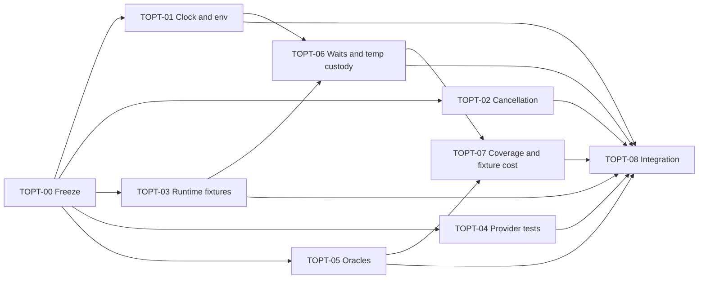

# TOPT — SEP-22 Test Optimization Structural Remediation

Status: `implementation integrated; current-source qualification blocked`

Current actionable ledger: [SEP25-CURRENT-CLOSEOUT.md](SEP25-CURRENT-CLOSEOUT.md).

Historical integration receipt: [RCA-2026-09-23-current-source.md](RCA-2026-09-23-current-source.md#committed-tree-integration-receipt). The 18 finding owners have code changes; this is not a current-source performance or full-workspace-green claim. TOPT-00 and TOPT-08 remain open on the exact gates in the current ledger.

Latest shared-checkout gate follow-up: [SEP23-GATE-FOLLOWUP.md](SEP23-GATE-FOLLOWUP.md).

Source base: `23bd3d7fa7af1122f904e59f1f514935bd5ffe7e`

Audit input: `docs/bugbash/sep-22-test-optimization/00-plan.md` and its five
owner documents. The audit documents and this packet are worktree changes, not
implementation or qualification receipts.

## Goal

Remove the 18 retained findings by repairing their owning abstractions rather
than adding test-only sleeps, permissive helpers, shared mutable runtimes, or
one-off compatibility paths.

The target state is:

1. time, environment, cancellation, and wakeup are explicit capabilities;
2. waits are event-driven, with deadlines used only for failure containment;
3. one owner constructs each runtime/process fixture and owns cleanup;
4. every property and E2E assertion has an independent, fail-closed oracle;
5. heavy coverage exists only at the lowest layer that proves the invariant,
   plus one composition proof where wiring matters;
6. timing claims are captured on an uncontended host with source, selector,
   cache, and execution-count metadata.

This packet does not replace the existing S21 tickets. It closes testability and
test-cost seams inside their owners:

- S21-04: durable idempotency/lease time authority;
- S21-05/S21-09: cancellation, peer watch, process lifecycle;
- S21-07: SDK config/binding and frontdoor evidence;
- S21-08: provider retry/concurrency behavior;
- S21-11: backup/cutover completeness proof;
- S21-13: source-bound evidence and final qualification boundary.

## Tickets

| Ticket | Owner outcome | Findings | Depends on |
|---|---|---|---|
| [TOPT-00](TOPT-00-authority-freeze-and-metrics.md) | freeze source, ownership, selectors, and timing protocol | foundation | none |
| [TOPT-01](TOPT-01-explicit-clock-and-env-ports.md) | explicit clock/env ports at core, catalog, and SDK composition edges | PO-1, PO-2, PO-3 | 00 |
| [TOPT-02](TOPT-02-event-driven-cancellation.md) | event-driven PeerWatch and single-flight cancellation | R4, PO-4 | 00 |
| [TOPT-03](TOPT-03-runtime-fixture-ownership.md) | one runtime/process fixture owner with event-driven lease release | D1, D2, R1 | 00 |
| [TOPT-04](TOPT-04-deterministic-provider-tests.md) | provider tests use injected delay policy and structural concurrency barriers | R2, R3 | 00 |
| [TOPT-05](TOPT-05-independent-oracles.md) | fail-closed trigram, smoke-query, and migration-completeness oracles | WA-1, WA-2, WA-3 | 00 |
| [TOPT-06](TOPT-06-fail-closed-waits-and-temp-custody.md) | timeout is typed failure; temporary socket custody is RAII | TH-1, TH-2, TH-3 | 01, 03 |
| [TOPT-07](TOPT-07-coverage-relocation-and-fixture-amortization.md) | remove one redundant daemon case and amortize immutable filter fixtures | R5, TH-4 | 05, 06 |
| [TOPT-08](TOPT-08-integration-and-qualification.md) | same-source integration, timing delta, and honest closeout | all | 01-07 |

## Dependency graph

## Execution waves and writer safety

| Wave | Lanes | Rule |
|---|---|---|
| W0 | TOPT-00 | serial admission; no implementation before selectors and baseline protocol are frozen |
| W1 | TOPT-01, 02, 03, 04, 05 | may run in parallel only with exact path leases below |
| W2 | TOPT-06 | starts after SDK config and runtime-fixture ownership are released by TOPT-01/03 |
| W3 | TOPT-07 | coverage movement only after strengthened oracles and fail-closed helpers land |
| W4 | TOPT-08 | serial integration on one source; no source edits during evidence capture |

Primary path leases:

- TOPT-01: core timeref/idempotency, catalog idempotency/connection, SDK config;
- TOPT-02: IPC `PeerWatch` and search-plane single-flight;
- TOPT-03: searchd-runtime process fixtures and harness runtime configuration;
- TOPT-04: embed OpenAI provider/retry test seams;
- TOPT-05: trigram property, matrix smoke, state-migration proof;
- TOPT-06: SDK-frontdoor/process-envelope helpers and SDK binding fixture;
- TOPT-07: filter-execution and ingest-resource E2Es.

If a lane needs another lane's leased path, stop and re-plan the merge order.
Do not solve overlap with a second helper or compatibility wrapper.

## Finding crosswalk

| Finding | Ticket | Required terminal evidence |
|---|---|---|
| D1 runtime fixture misses ingest override | TOPT-03 | long-path three-socket proof |
| D2 umask lifecycle fork/kill race | TOPT-03 | already-exited child cleanup proof |
| R1 fixed three-second lease hold | TOPT-03 | acknowledged release, no happy-path sleep |
| R2 retry tests sleep real jitter | TOPT-04 | zero-delay test policy; production bounds unchanged |
| R3 concurrency oracle uses 25 ms overlap | TOPT-04 | barrier-driven four-way overlap proof |
| R4 PeerWatch poll/join and sleep compensation | TOPT-02 | explicit wake; sleep-free cancellation scenarios |
| R5 redundant resource-envelope daemon case | TOPT-07 | lower owners green; one wiring E2E retained |
| WA-1 trigram errors count as success | TOPT-05 | mutation makes each property fail |
| WA-2 smoke accepts wrong in-corpus row | TOPT-05 | exact candidate identity/set oracle |
| WA-3 backup completeness checks non-empty | TOPT-05 | manifest/object digest equivalence |
| TH-1 SDK observation timeout returns `Ok` | TOPT-06 | never-ready script returns typed timeout |
| TH-2 scrape timeout returns stale `Ok` | TOPT-06 | never-true predicate returns typed timeout |
| TH-3 pid-only persistent socket directory | TOPT-06 | RAII tempdir and stale-path immunity |
| TH-4 repeated sealed filter fixtures | TOPT-07 | table-driven family fixtures with row context |
| PO-1 relative timeref owns wall clock | TOPT-01 | exact fixed-time unit/boundary matrix |
| PO-2 SDK config owns ambient env | TOPT-01 | injected precedence/error matrix |
| PO-3 catalog lease owns wall clock | TOPT-01 | `<`, `==`, `>` deadline state-machine matrix |
| PO-4 single-flight cancellation polls 20 ms | TOPT-02 | cancellation wake without real-time quantum |

Coverage must remain exactly one row per retained finding. Adding a finding
requires updating both the audit owner document and this crosswalk.

## Global prohibitions

- no shorter sleeps as the fix;
- no process-global `set_var` test serialization as the permanent seam;
- no global shared mutable daemon fixture;
- no error-to-skip/default/empty conversion;
- no production jitter disablement;
- no removal of lower-layer authority to justify E2E deletion;
- no raw timeout maximum presented as observed performance;
- no edits to `tools/ci/proof-authority.toml` from these lanes; registry work,
  if actually required, belongs to the serial S21 proof owner.

## Stop and reopen conditions

- source or audit-input digest changes after TOPT-00 admission;
- a lane encounters foreign dirty changes in an owned path;
- a proposed fix changes public wire/persistence semantics rather than only the
  named capability or test seam;
- a deterministic proof still needs elapsed-time luck after the proposed fix;
- deleting/merging a heavy test would leave no owner-level boundary oracle;
- an expected target is absent from `tools/ci/test-authority.toml` or executes
  zero selected tests.

Stop the affected lane, preserve its evidence, and update the owning ticket.
Do not continue under an assumption or broaden another lane's write scope.

## Packet closure

The packet is complete only when TOPT-08 records all 18 findings as fixed on one
source, all focused and broader required rails pass, timing evidence is clean,
and remaining exclusions are explicit. `planned`, a code diff, or focused green
alone is not closure.
